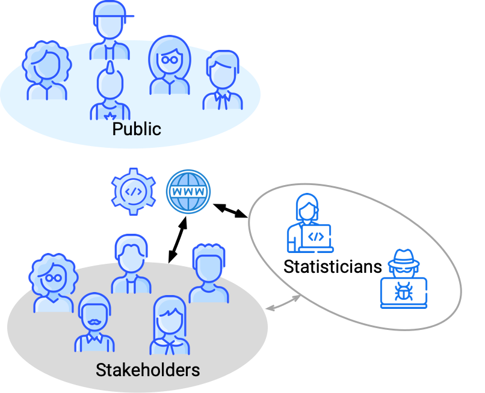
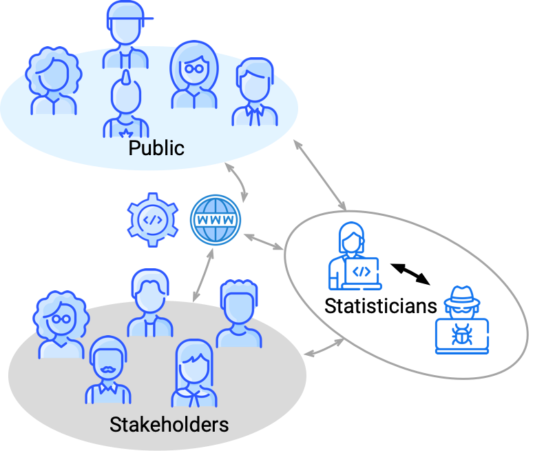
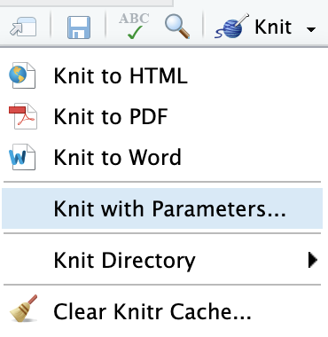
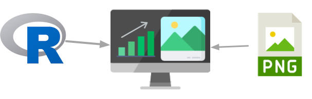
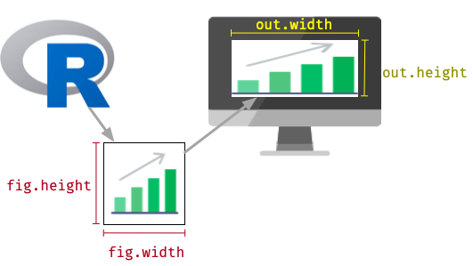

```{r setup, include = FALSE}
library(tidyverse)
library(haven)
current_file <- knitr::current_input()
filter <- dplyr::filter
knitr::opts_chunk$set(
  fig.path = paste0("images/", fs::path_ext_remove(current_file), "/")
)

engage <- function() {
  "<span class='animated pulse' style='background-color:#027EB6;padding:10px;font-size:14pt;border:1pt solid black;color:white;font-weight:bold;display:inline-block;'>🥠 Engagement opportunity</span>"
}
```
```{r, include = FALSE, eval = F}
# doesn't work
input <- fs::path_ext_set(current_file, "html")
pagedown::chrome_print(input = input, format = "pdf", wait = 20)
```
```{r titleslide, child="assets/titleslide.Rmd"}
```

---

# 👩🏻‍🏫 ETC5523 Teaching Team

.grid[
.item.border-right.center[

### Emi Tanaka

<br>
<center>

</center>
<br>

*Lecturer Wk 1-6*

*Chief Examiner*

]
.item.border-right.center[

### Stuart Lee

<br>

<br><br>

*Lecturer Wk 7-12*

]
.item.center[

### Mitchell O'Hara-Wild

<br>
<center>

</center>
<br>

*Tutor*

]
]

<div class="info-box center" style="position:absolute;bottom:5%;left:28%;width:45%;">
<i class="fas fa-envelope"></i> ETC5523.Clayton-x@monash.edu
<br><br>
<i>for confidential matters</i>
</div>

---

# 🎯 ETC5523 Learning Objectives

<br>
.info-box.wider-list.width70[
1. Effectively communicate data analysis, using a blog, reports and presentation.
2. Learn how to build a web app to provide an interactive data analysis.
3. Learn to construct a data story.
]


---


# 🗣 Communicating 

<br>

<blockquote>
To effectively communicate, we must realize that we are all different in the way we perceive the world and use this understanding as a guide to our communication with others.
<br><br>

<footer>—Anthony Robbins</footer>
</blockquote>

--

<br>

Your engagement with your peers will be critical to form your understanding and become a better communicator.

---

# 📈 Communicating *with Data*

<br>

<blockquote>
The two words 'information' and 'communication' are often used interchangeably, but they signify quite different things. Information is giving out; communication is getting through.  
<br><br>

<footer>—Sydney J. Harris</footer>
</blockquote>

--

<br>

In this course, you will construct narratives from your number-crunching to tell a compelling data story.

---

.grid[.item[


]
.item.pad10[

# *Who* do we communicate with as analysts, statisticians, or data scientists?

]
]

---

.grid[.item[


]
.item.pad10[

## Statisticians 
## &emsp;&emsp; <i class="fas fa-arrows-alt-v"></i>
## Stakeholders

<br>

* Stakeholders can have a span from zero to proficient statistical knowledge.
* They may be technicians, domain-knowledge experts, managers, decision-makers and so on.

]
]

---

.grid[.item[


]
.item.pad10[

## Statisticians 
## &emsp;&emsp; <i class="fas fa-arrows-alt-v"></i>
## Stakeholders

<br>

* You may not directly interact with the stakeholders but rather through product (e.g. reports or tools) that you provide the stakeholders.

]
]

---

.grid[.item[


]
.item.pad10[

## Statisticians 
## &emsp;&emsp; <i class="fas fa-arrows-alt-v"></i>
## General Public

<br>

* Reports, blogs, social media posts, tools and so on may also be consumed by the general public.
* The general public will have a variety of statistical background.

]
]

---

.grid[.item[


]
.item.pad10[

## Statisticians 
## &emsp;&emsp; <i class="fas fa-arrows-alt-v"></i>
## General Public

<br>

* You may directly communicate with public as well (presentations, workshops, outreach and so on)


]
]

---

.grid[.item[


]
.item.pad10[

## Statistician
## &emsp;&emsp; <i class="fas fa-arrows-alt-v"></i>
## Statistician

<br>

* You also talk to your peers (directly or indirectly)


]
]

---

.grid[.item[


]
.item.pad10[

## &emsp;&nbsp;&nbsp;&nbsp;You 
## &emsp;&emsp; <i class="fas fa-arrow-down"></i>
## &nbsp;&nbsp;&nbsp;Future You

<br>

* Future you also needs to understand what past you did!

]
]

---

.grid[.item[


]
.item.pad10[

## &emsp;&nbsp;&nbsp;&nbsp;You 
## &emsp;&emsp; <i class="fas fa-arrows-alt-v"></i>
## &nbsp;&nbsp;&nbsp;Another Party

<br>

* All communications are represented as two-way here <span class="font_small">(with one exception, as you can't travel back in time to talk to past self)</span>
* Ideally you want the communication to be two-way, but in practice, communication may only be possible one-way.

]
]

---

class:  nostripheader

# .monash-blue[Communication isn't just between humans]

Computer systems communicate with each other. 

<br>

<center>

</center>

You'll learn about web and data technologies next week.

---

# 🤝 Key Ingredient of a Successful Communication 

--

<br><br><br>


<div class="animated tada" style="text-align:center">
<span style="font-size:100pt!important; font-weight:900;">TRUST </span>
</div>

---

count: false
class: center

# 🤝 Key Ingredient of a Successful Communication 

<span style="font-size:100pt!important; font-weight:900;">TRUST </span>

Trust in the **data collection process**

--

Trust in the **data entry**

--

Trust in the **data processing**

--

Trust in the **number crunching**

--

Trust in **your skills**

--

Trust **assumptions are reasonable**


--

Trust in the **software**

--

Trust in **interpretations**


$\vdots$


---

# 👍 Building Trust 


# Minimise errors 

* We are all **prone to errors** no matter how skilled we are.
* Adopting **reproducible practices** (e.g. git + R Markdown) helps to **minimise this error**. .font_small[(note: it does not completely eradicate it)]

--

# Be transparent

* Share code and data (where you can). This not only builds trust in the results, this gives opportunities for others to correct any errors. .font_small[See also about [open science](https://en.wikipedia.org/wiki/Open_science), [open-source software](https://en.wikipedia.org/wiki/Open-source_software) and [open-data](https://en.wikipedia.org/wiki/Open_data).]
* Give credit and acknowledgement where due.

--

# Interrogate your data, tools and sources

* Use trusted software (preferably with proper testing). 
* Sanity check your data, tools and sources. 


---

class: question middle

What statistical software do you use and why?

`r countdown::countdown(3, class="clock", right = "30px", play_sound = TRUE)`


---


# 📅 Unit Structure 

<br>

#  <i class="fas fa-chalkboard-teacher"></i> 2 hour lectures 
## Tues 4.00-6.00PM

<br>

# <i class="fas fa-wrench"></i> 1.5 hour tutorials 
you can only attend the one that you are allocated in 
## Weds 4.00-5.30PM OR Thu 5.00-6.30PM

<br><br>

*Attendances are recorded.*


---

# 📚 Resources

<br>

# <i class="fa fa-home"></i> Course homepage 
this is where you find the course materials <br>(lecture slides, tutorials and tutorial solutions)
# https://cwd.numbat.space/

<br>

# <i class="fa fa-archive"></i> Moodle 
this is where you find discussion forum, zoom links, assignments and marks
# https://lms.monash.edu/course/view.php?id=81235


---


# 💯 Assessment .font_small[Part 1/3]

# Engagement (total 10%)

* Lecture and tutorial participation will contribute to this.
* If you have some clashes for lecture or tutorial, there are other opportunities to show your engagement, including:
  * posting in the Moodle discussion forum, 
  * github commits (more on this later in the course), 
  * peer reviewing (more on this later in the course), and 
  * online submissions (see Tutorial Q1C for example). 
* There should be **at least 3 measurable and meaningful engagement activities each week** (contributing to 1% of your final mark capped to 10% over the whole semester; in other words, you can miss 2 weeks, .font_small[or 4 weeks counting mid-semester break although harder to gain engagement marks over that period], without impacting your mark). 

---

# 💯 Assessment .font_small[Part 2/3]

# Take Home Assessment (15%)

* Will be made available at Thu 20 Aug 7PM. 
* You will have 24 hours (i.e. **due Fri 21 Aug 7PM**) to complete the assessment. 
* You will be given an document that you have to reproduce using R Markdown.

# Blog Entries (20%)

* You will have 4 blog entries featuring a data story  **due Fri 4 Sep 2020**, **Fri 18 Sep 2020**, **Fri 16 Oct 2020** and  **Fri 30 Oct 2020**.
* You will write these blogs using R Markdown.

---

# 💯 Assessment .font_small[Part 3/3]


# Assignment 1: Making a Shiny web app (20%)

* You will make an interactive web application to communicate a data story using `shiny`
* The app will be **due Fri 9 Oct**

# Assignment 2: Making an R-package (25%)

* You will make an R-package that has clear documentation, vignettes, consistent coding style, and robust functions (as demonstrated by testing).
* The R-package will be **due Fri 23 Oct**

# Group Presentation (10%)

* Group of 3-4 to present 5 minutes at **Tue 3 Nov 4PM**

---

# 🔶 Expectations .font_small[Part 1/3]

* Lectures are recorded but you are expected to have either attended the lecture, or watched the recordings fully, prior to the tutorial for the week.
* Tutorials may not be recorded, and attendance is expected.
* Questions related to the course should be raised at moodle discussion forum.
* For personal or private administrative issues, the email contact is: ETC5523.Clayton-x@monash.edu
* If you register after the start of the semester or if you miss a lecture/tutorial, it is your responsibility to catch up with missed material, learn about due dates for material to be turned in, and getting assigned to a group for team work, as necessary.
* All times are given in AEST (Melbourne time).

---

# 🔶 Expectations .font_small[Part 2/3]

* The computer software [R](https://www.r-project.org/) and [RStudio IDE](https://rstudio.com/products/rstudio/download/) will be used for the unit. 
* You will need to install latest versions of all necessary software (below is not an exhaustive list for this course). 

```{r, eval = FALSE}
install.packages(c("tidyverse", "rmarkdown", "shiny", "broom", 
  "skimr", "blogdown", "distill", "knitr", "kableExtra", "feasts",
  "devtools", "usethis", "testthat", "roxygen2", "knitr", "fable",
  "shinydashboard", "flexdashboard", "DT", "xaringan", "tsibble",
  "stargazer", "htmlwidgets", "bookdown", "pagedown", "magick",
  "crosstalk", "plotly", "colorspace", "pkgdown", "posterdown", 
  "glue", "lme4", "agridat", "catdata", "gganimate", "htmltools", 
  "leaflet", "linl", "patchwork", "shinytest", "shinyjs", 
  "tinytex", "xaringanthemer", "lmerTest", "DBI", "dbplyr", 
  "RMySQL", "RPostgreSQL", "RSQLite", "bigrquery", "odbc", 
  "rvest", "nycflights13", "palmerpenguins", "eechidna"))
```

---

# 🔶 Expectations .font_small[Part 3/3]

* **ETC5513 is prerequisite**. Some of you may have exemption (due to evidence of equivalent knowledge to ETC5513) or gone through the bridging course instead. 
* It's expected that you know how to use **git**, **github** and basic **R Markdown** (as taught in ETC5513). 
* The priority of the ETC5523 teaching team is to support you in ETC5523 material.
* It's essential in this course that you have a [GitHub](https://github.com/), [RPubs](https://rpubs.com/), [shinyapps.io](https://www.shinyapps.io/) and [Netlify](https://www.netlify.com/) (connected to your GitHub account) accounts. All are free to register.


---

# GitHub Classroom

We are going to use GitHub Classroom to keep track of your repos and distribute templates. 

`r engage()`

1. Start with the test assignment by clicking on the link given in [Moodle](https://lms.monash.edu/course/view.php?id=81235) **before Fri 7 Aug 11PM** and make sure you identify yourself by connecting your name to the roster.
2. Once you have accepted it .font_small[(note: some browsers do not work well with GitHub Classroom so use Chrome or Firefox)], you can find your repo here:
<center>
<a href="https://github.com/etc5523-2020">https://github.com/etc5523-2020</a>
</center>
3. If you don't recall how to connect this repo locally, check [this guide](https://github.com/jfiksel/github-classroom-for-students).
4. Make some small changes to your repo and make sure these changed are pushed to GitHub.

---

class: nostripheader middle

# Questions?


---


class: transition middle

# R Markdown

## Case Studies


--

There are more features in R Markdown than we can show you.

--

<br>

The aim for you should be to independently search and find your solution.


---

# Case study .circle[1] `knitr::opts_chunk$set` 

.grid[.item.border-right[
* Repeating chunk options can be painful in your workflow. 
* If you are say writing `echo = FALSE` for every single chunk, you might as well set the default chunk option to `echo = FALSE`. 
* Remember **don't repeat yourself** (DRY) every time.
* In order to change the default chunk options you can use 

```{r, eval = F}
knitr::opts_chunk$set(echo = FALSE)
```
]
.item[

{{content}}
]
]

--

* You can get the current default by using the following command:

```{r}
str(knitr::opts_chunk$get())
```

---

# ⚙️ Setting Chunk Options


* You can always overwrite the default for each chunk.

````md
`r ''````{r, message = FALSE, warning = FALSE}
library(tidyverse)
```
````

* For chunk options, check out https://yihui.name/knitr/options/.

# <i class="fas fa-broom"></i> Organising your Rmd file

* <i class="fas fa-cog monash-ruby2"></i> It is good practice to .monash-ruby2[set default chunk options at the beginning of your Rmd file] just as it is good practice to .monash-ruby2[load all packages needed at the beginning]. 
* <i class="fas fa-eye monash-ruby2"></i> This makes it easier to quickly see what the expected behaviour of the chunks for anyone (including yourself) looking at the file.

---

# Case Study .circle[2] Parameterized R Markdown Reports .font_small[Part 1/2]

.grid[.item[
````md
---
title: "Parameterized Report"
params:
*  year: 2019
output: html_document
---

`r ''````{r, message = FALSE, warning = FALSE}
library(dplyr)
library(eechidna) # get the tcp data
*df <- get(paste0("tcp", substr(params$year, 3, 4)))
df %>% 
  filter(Elected == "Y") %>% 
  group_by(PartyNm) %>% 
  tally() %>% 
  arrange(desc(n)) %>% 
* knitr::kable(caption = paste("Election", params$year))
```
````

]
.item[

<iframe src="lecture-01suppA.html" height="100%" width="100%"></iframe>

]]

---

# Case Study .circle[2] Parameterized R Markdown Reports .font_small[Part 2/2]

.grid[.item[
````md
---
title: "Parameterized Report"
params:
  year: 
    label: "Year"
    value: 2019
    input: radio
    choices: [2001, 2004, 2007, 2010, 2013, 2016, 2019]
output: html_document
---
````

]
.item[




See more input type [here](https://bookdown.org/yihui/rmarkdown/params-knit.html#tab:params-types).

]]

---


# Case Study .circle[3]  Render Rmd via Command Line

.grid[.item.border-right[
`lecture-01suppA.Rmd`
````md
---
title: "Parameterized Report"
params:
   year: 2019
output: html_document
---
`r ''````{r, message = FALSE, warning = FALSE}
library(dplyr)
library(eechidna) # get the tcp data
df <- get(paste0("tcp", substr(params$year, 3, 4)))
df %>% 
  filter(Elected == "Y") %>% 
  group_by(PartyNm) %>% 
  tally() %>% 
  arrange(desc(n)) %>% 
  knitr::kable(caption = paste("Election", params$year))
```
````

]
.item[

You can knit this file via R command by
using the render function:

```r
library(rmarkdown)
render("lecture-01suppA.Rmd")
```
<br>

You can overwrite the YAML values
by supplying arguments to render:

```r
library(rmarkdown)
render("lecture-01suppA.Rmd",
  output_format = "pdf_document",
  params = list(year = 2016)))
```

]
]

---

# Case Study .circle[4] `theme` for `html_document` 

<!-- The Modal -->
<div id="myModal" class="modal">
  <div id="caption"></div>
  <span class="close" onclick="document.getElementById('myModal').style.display='none'">&times;</span>
  <iframe class="modal-content" id="img01"></iframe><br>
</div>

You can change the look of the html document by specifying themes:
.grid[
.item[

]
.item[

* `default`  
* `cerulean`  
* `journal`   
* `flatly`  
* `darkly`  
* `readable`  
* `spacelab`  
* `united`  

]

.item[


* `cosmo`  
* `lumen`  
* `paper`  
* `sandstone`  
* `simplex`  
* `yeti`  
* `NULL`   

]

.item[


```markdown
output: 
  html_document:
    theme: cerulean
```

These [bootswatch](https://bootswatch.com/) themes attach the whole bootstrap library which makes your html file size larger.

]

]


---

# 🖼️ Figures in R 

In R, we can classify pictures into two types:
  1. Figures constructed using R with result communicated to a specific [graphical device](https://stat.ethz.ch/R-manual/R-patched/library/grDevices/html/Devices.html).
  2. Images already existing as a filie elsewhere with extensions such as `bmp`, `eps`, `gif`, `jpeg`, `pdf`, `png`, `psd`, `svg`, `tex`, `tiff`, or `wmf`.
  
<center>

</center>

---

# Case Study .circle[5] Figures in R Markdown


* Some figure chunk options are only for plots created by R, e.g. <i class="fas fa-cog"></i>  `fig.width`, `fig.height`, and  `fig.process`. 

<center>

</center>

* Some are for all, e.g. <i class="fas fa-cog"></i> `out.width`, `out.height`, and `fig.link`.
* Some are output specific, e.g. <i class="fas fa-cog"></i> **LaTeX**: `fig.env`, `fig.scap`, `fig.pos`, `fig.ncol`, `fig.sep`, **tikz**: `resize.width`, `resize.height`, `external`, `sanitize`, **HTML**: `fig.retina`.

---

# Case Study .circle[6] `fig.process`

.grid[
.item[

`lecture-01suppC.Rmd`

.scroll-fit50[
````yaml
```{r, results="asis", echo = FALSE}
rmdeg <- readLines("lecture-01suppC.Rmd")
line_yaml_start <- which(rmdeg=="---")[1]
line_yaml_end <- which(rmdeg=="---")[2]
cat(rmdeg[line_yaml_start:line_yaml_end], sep = "\n")
```
````
````r
```{r, results="asis", echo = FALSE}
cat(rmdeg[(line_yaml_end + 1):length(rmdeg)], sep = "\n")
```
````
]]
.item[
`lecture-01suppC.html`

<iframe src="lecture-01suppC.html" height="100%" width="100%"></iframe>


]]


---

class: center

# Case Study .circle[7] Code Snippets

<br><br><br>

# .animated.flash[Live Demo]


---

class: center


# Case Study .circle[8] Sharing HTML reports 

<br><br><br>


# .animated.flash[Live Demo]


---

class: nostripheader middle

# Share your R Markdown findings or tips

## in the [Moodle discussion forum](https://lms.monash.edu/mod/forum/discuss.php?d=2117202)


<br><br>

`r engage()`

---

```{r endslide, child="assets/endslide.Rmd"}
```
