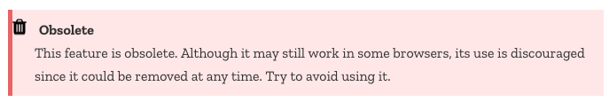

```{r setup, include = FALSE}
library(tidyverse)
library(timevis)
library(widgetframe)
library(htmltools)
current_file <- knitr::current_input()
filter <- dplyr::filter
knitr::opts_chunk$set(
  fig.path = paste0("images/", fs::path_ext_remove(current_file), "/")
)

engage <- function() {
  "<span class='animated pulse' style='background-color:#027EB6;padding:10px;font-size:14pt;border:1pt solid black;color:white;font-weight:bold;display:inline-block;'>🥠 Engagement opportunity</span>"
}
```
```{r, include = FALSE, eval = F}
# times out
input <- fs::path_ext_set(current_file, "html")
pagedown::chrome_print(input = input, format = "pdf", wait = 20)
```
```{r titleslide, child="assets/titleslide.Rmd"}
```


---

name: web-tech
class: transition middle

# Introduction to 
# .yellow[Web Technologies]

---

# 🌐  World Wide Web (WWW) 

* WWW (or the **Web**) is the information system where documents (web pages) are identified by Uniform Resource Locators (**URL**s)
* A web page consists of:
  * <i class="fab fa-html5 orange"></i> **HTML** provides the basic structure of the web page
  * <i class="fab fa-css3-alt blue"></i> **CSS** controls the look of the web page (optional)
  * <span class='fa-layers'> <i class='fas fa-square black' data-fa-transform='shrink-2'></i><i class='fab fa-js-square yellow'></i></span> **JS** is a programming language that can modify the behaviour of elements of the web page (optional)
  

--


* Keep in mind that you are not a web developer .font_small[(or maybe you are)] so you don't need to know these in-depth, but you require some knowledge in web technologies if you want to do some low-level customisation of HTML documents.

---

# 🔨 Web Documents are Handy

* HTML documents are really handy for including interactive elements and supported in almost all computer devices.
* Naturally, this ties in well with interactive data visualisation.
* Below is an interactive timeline visualisation of historical developments of HTML/CSS/JS:

```{r, echo = FALSE}
data <- tribble(~id, ~content, ~start, ~end, ~style,
                1, "CSS 1", "1996-12-17", NA, "font-size:10pt",
                2, "CSS 2", "1998-05-01", NA, "font-size:10pt",
                3, "CSS <span class='fa-layers fa-fw'> <i class='fas fa-square white' data-fa-transform='shrink-5'></i><i class='fab fa-css3-alt blue' data-fa-transform='grow-10'></i></span>", "1999-06-01", NA, "font-size:10pt;",
                4, "HTML", "1989-01-01", NA, "font-size:10pt",
                5, "HTML 2", "1995-11-24", NA, "font-size:10pt",
                6, "HTML 3", "1997-01-14", NA, "font-size:10pt",
                7, "HTML 4", "1997-12-18", NA, "font-size:10pt",
                8, "HTML <i class='fab fa-html5 orange' data-fa-transform='grow-10'></i>", "2014-10-28", NA, "font-size:10pt",
                9, "CSS", "1994-10-10", NA, "font-size:10pt",
                10, "JS&nbsp;&nbsp;<span class='fa-layers'><i class='fas fa-square black' data-fa-transform='grow-4'></i><i class='fab fa-js-square yellow' data-fa-transform='grow-10'></i></span>", "1995-12-04", NA, "font-size:10pt"
                
)
dep <- htmltools::htmlDependency(
    "font-awesome", "5.0.13", c(href="libs"),
    stylesheet = "css/font-awesome.min.css"
)
widget <- timevis(data, width = "100%", height = "300px")
# note the widget gets placed in fig.path/widgets
# omg emi, you  made this way too complicated!
frameWidget(appendContent(widget,
                           tagList(tag("script", 
                                       list("", src="fontawesome-5.0.13/js/fontawesome-all.min.js")),
                                   tag("link",
                                       list(rel="stylesheet",
                                            href="custom.css",
                                            type="text/css")),
                                   tag("link",
                                       list(rel="stylesheet",
                                            href="ninjutsu.css",
                                            type="text/css")))))

```


---

class: question middle


# So what exactly is HTML, CSS, and JS?

`r countdown::countdown(3, class="clock")`

---

name: html

```{r, include= FALSE}
seetext <- '<span class="bg-orange white" style="padding:5px;font-size:18pt;vertical-align: middle;border:1px dashed black;"><i class="fas fa-eye"></i><i class="fas fa-font" ></i></span>'
seehtml <- '<span class="bg-orange white" style="padding:5px;font-size:18pt;vertical-align: middle;border:1px dashed black;"><i class="fas fa-eye"></i><i class="far fa-window-maximize"></i></span>'
```


#  <span class="fa-layers fa-fw"> <i class="fas fa-square white" data-fa-transform="shrink-5"></i><i class="fab fa-html5 orange"></i></span> Hypertext Markup Language (HTML)

* HTML files have the extension `.html`.
* HTML files are often rendered using a web browser via an URL.
* HTML files are just text files that follows a special syntax that alerts web browsers how to render it.


.center[
<a href="lecture-02-simple-example.html" download><i class="fas fa-download"></i></a> `lecture-02-simple-example.html`
]

.grid[
.item.border-right[
##  As seen via a *web browser* `r seehtml`

<center>

</center>

]
.item[
##  As seen via a *text editor* `r seetext`
<center>

</center>
]
]

---

# <span class="fa-layers fa-fw"> <i class="fas fa-square white" data-fa-transform="shrink-5"></i><i class="fab fa-html5 orange"></i></span> HTML Structure

```html
<!DOCTYPE html>

<html>
<!--This is a comment and ignored by web client.-->
<head>
  <!--This section contains web page metadata.-->
  <title>Communicating with Data</title>
  <meta name="author" content="Emi Tanaka">
  <link rel="stylesheet" href="css/styles.css">
</head>

<body>
<!--This section contains what you want to display on your web page.-->
<h1>I'm a first level header</h1>
<p>This is a paragraph.</p>
</body>
</html>

```


---

# <span class="fa-layers fa-fw"> <i class="fas fa-square white" data-fa-transform="shrink-5"></i><i class="fab fa-html5 orange"></i></span> HTML Syntax

`r seetext` `<span style="color:blue;">Author content</span>`<br>
`r seehtml` <span style="color:blue;">Author content</span>

<span style="margin-top:30px;margin-bottom:30px;margin-left:-50px;">The breakdown of this syntax:</span>

<table style="width:100%">
<tr>
<td style="text-align:right;padding-right:30px;">start tag:</td><td><span class="remark-code" style="font-size:16pt"><span class="red">&lt;span style="color:blue;"&gt;</span><span class="gray">Author content&lt;/span&gt;</span></span> </td>
</tr>
<tr>
<td style="text-align:right;padding-right:30px;">end tag: </td><td> <span class="remark-code" style="font-size:16pt"><span class="gray">&lt;span style="color:blue;"&gt;Author content<span class="red">&lt;/span&gt;</span></span> </td>
</tr>
<tr>
<td style="text-align:right;padding-right:30px;">content: </td><td> <span class="remark-code" style="font-size:16pt"><span class="gray">&lt;span style="color:blue;"&gt;</span><span class="red">Author content</span><span class="gray">&lt;/span&gt;</span></span> </td>
</tr>
<tr>
<td style="text-align:right;padding-right:30px;">element name: </td><td> <span class="remark-code" style="font-size:16pt"><span class="gray">&lt;</span><span class="red">span</span><span class="gray"> style="color:blue;"&gt;Author content&lt;/span&gt;</span></span> </td>
</tr>
<tr>
<td style="text-align:right;padding-right:30px;">attribute: </td><td> <span class="remark-code" style="font-size:16pt"><span class="gray">&lt;span <span class="red">style="color:blue;"</span><span class="gray">&gt;Author content&lt;/span&gt;</span> </td>
</tr>
<tr>
<td style="text-align:right;padding-right:30px;">attribute name: </td><td> <span class="remark-code" style="font-size:16pt"><span class="gray">&lt;span <span class="red">style</span><span class="gray">="color:blue;"&gt;Author content&lt;/span&gt;</span> </td>
</tr>
<tr>
<td style="text-align:right;padding-right:30px;">attribute value: </td><td> <span class="remark-code" style="font-size:16pt"><span class="gray">&lt;span style=</span><span class="red">"color:blue;"</span><span class="gray">&gt;Author content&lt;/span&gt;</span> </td>
</tr>
</table>

--

<span style="margin-top:30px;margin-bottom:30px;margin-left:-50px;">Not all HTML tags have an end tag:</span>

`r seetext` <span style="font-size:20pt;">``</span><br>
`r seehtml` 


---

# <span class="fa-layers fa-fw"> <i class="fas fa-square white" data-fa-transform="shrink-5"></i><i class="fab fa-html5 orange"></i></span> Some HTML elements

<table>
<tr>
<td style="text-align:right;padding-right:30px;">block element:</td><td><span class="remark-code red" style="font-size:16pt">&lt;div><span class="gray">content</span>&lt;/div></span></td>
</tr>
<tr>
<td style="text-align:right;padding-right:30px;">inline element:</td><td><span class="remark-code red" style="font-size:16pt">&lt;span><span class="gray">content</span>&lt;/span></span></td>
</tr>
<tr>
<td style="text-align:right;padding-right:30px;">paragraph:</td><td><span class="remark-code red" style="font-size:16pt">&lt;p><span class="gray">content</span>&lt;/p></span></td>
</tr>
<tr>
<td style="text-align:right;padding-right:30px;">header level 1:</td><td><span class="remark-code red" style="font-size:16pt">&lt;h1><span class="gray">content</span>&lt;/h1></span></td>
</tr>
<tr>
<td style="text-align:right;padding-right:30px;">header level 2:</td><td><span class="remark-code red" style="font-size:16pt">&lt;h2><span class="gray">content</span>&lt;/h2></span> (note: only up to 6 levels)</td></td>
</tr>
<tr>
<td style="text-align:right;padding-right:30px;">italic:</td><td><span class="remark-code red" style="font-size:16pt">&lt;i><span class="gray">content</span>&lt;/i></span></td>
</tr>
<tr>
<td style="text-align:right;padding-right:30px;">emphasised text:</td><td><span class="remark-code red" style="font-size:16pt">&lt;em><span class="gray">content</span>&lt;/em></span></td>
</tr>
<tr>
<td style="text-align:right;padding-right:30px;">bold:</td><td><span class="remark-code red" style="font-size:16pt">&lt;b><span class="gray">content</span>&lt;/b></span></td>
</tr>
<tr>
<td style="text-align:right;padding-right:30px;">strong importance:</td><td><span class="remark-code red" style="font-size:16pt">&lt;strong><span class="gray">content</span>&lt;/strong></span></td>
</tr>
<tr>
<td style="text-align:right;padding-right:30px;">link:</td><td><span class="remark-code red" style="font-size:16pt">&lt;a href="https://cwd.numbat.space/"><span class="gray">content</span>&lt;/a></span></td>
</tr>
<tr>
<td style="text-align:right;padding-right:30px;">insert new line:</td><td><span class="remark-code red" style="font-size:16pt">&lt;br></span></td>
</tr>
<tr>
<td valign="top" style="text-align:right;padding-right:30px;">unordered list:</td><td><span class="remark-code red" style="font-size:16pt">&lt;ul><br>&lt;li><span class="gray">item 1</span>&lt;/li><Br>&lt;li><span class="gray">item 2</span>&lt;/li><Br>&lt;/ul></span></td>
</tr>
</table>

How these are rendered to the browser depends on the browser default style values, style attribute or CSS...


---

name: css

```{r, include = FALSE}
css <- '<span class="fa-layers fa-fw"> <i class="fas fa-square white" data-fa-transform="shrink-5"></i><i class="fab fa-css3-alt blue"></i></span>'
```


# `r css` Cascading Style Sheet (CSS)

* CSS files have the extension `.css` .font_small[and styles also XHTML, plain XML, SVG and XUL].
* There are 3 ways to style elements in HTML:
  * **inline** by using the `style` attribute inside HTML start tag:
  <center>
  <span class="remark-code gray" style="font-size:14pt;">&lt;h1 <span class="monash-blue">style="color:blue;"</span>>Blue Header&lt;/h1></span>
  </center>
  * **externally** by using the `<link>` element:
  <center>
  <span class="remark-code monash-blue" style="font-size:14pt;">&lt;link rel="stylesheet" href="styles.css"></span>
  </center>
  * **internally** by defining within `<style>` element:

<div style="margin-left:300px; width:350px;">
```html
<style type="text/css">
h1 { color: blue; }
</style>
```
</div>
* By convention, the `<style>` and `<link>` elements tend to go into the `<head>` section of the HTML document.

---

# `r css` CSS Syntax

<div class="grid" style="height:200px;width:1200px;padding-left:30px;">
<div class="item border-right bg-gray">
`r seetext`
<span class = "remark-code" style="font-size:16pt;line-height:1;">
&nbsp;&lt;style type="text/css"><br>
&nbsp;&nbsp;&emsp;&emsp;&emsp;h1 { color: blue; }<br>
&nbsp;&emsp;&emsp;&emsp;&lt;/style><Br>
&nbsp;&emsp;&emsp;&emsp;&lt;h1>This is a header&lt;/h1>
</span>
</div>
<div class="item" style="padding-left:30px;">
`r seehtml`
<h1 style="color:blue">This is a header</h1>
</div>
</div>

<span style="margin-top:30px;margin-bottom:30px;margin-left:-50px;">The breakdown of the CSS syntax:</span>

<table style="width:100%">
<tr>
<td style="text-align:right;padding-right:30px;">selector:</td><td><span class="remark-code" style="font-size:16pt"><span class="red">h1</span><span class="gray"> { color: blue; }</span></span> </td>
</tr>
<tr>
<td style="text-align:right;padding-right:30px;">property:</td><td><span class="remark-code gray" style="font-size:16pt;">h1 { <span class="red">color: blue;</span> }</span> </td>
</tr>
<tr>
<td style="text-align:right;padding-right:30px;">property name:</td><td><span class="remark-code gray" style="font-size:16pt;">h1 { <span class="red">color</span>: blue; } </span></td>
</tr>
<tr>
<td style="text-align:right;padding-right:30px;">property value:</td><td><span class="remark-code gray" style="font-size:16pt;">h1 { color: <span class="red">blue</span>; } </span></td>
</tr>
</table>

--

<span style="margin-top:30px;margin-bottom:30px;margin-left:-50px;">You may have multiple properties for a single selector:</span>


```css
h1 {
  color: blue;
  font-size: 16pt;
}
```

---

# `r css` Some CSS properties 

<center>
<div class="remark-code">&lt;div> Sample text &lt;/div></div>
</center>

<table style="width:100%">
<tr>
<td style="text-align:right;padding-right:30px;">background color:</td>
<td><span class="remark-code gray" style="font-size:16pt">div { <span class="red">background-color: yellow;</span> }</span> </td>
<td>
<div style="background-color: yellow;">Sample text</div>
</td>
</tr>
<tr>
<td style="text-align:right;padding-right:30px;">text color:</td>
<td><span class="remark-code gray" style="font-size:16pt">div { <span class="red">color: purple;</span> }</span> </td>
<td>
<div style="color: purple;">Sample text</div>
</td>
</tr>
<tr>
<td style="text-align:right;padding-right:30px;">border:</td>
<td><span class="remark-code gray" style="font-size:16pt">div { <span class="red">border: 1px dashed brown;</span> }</span> </td>
<td>
<div style="border: 1px dashed brown;">Sample text</div>
</td>
</tr>
<tr>
<td style="text-align:right;padding-right:30px;">left border only:</td>
<td><span class="remark-code gray" style="font-size:16pt">div { <span class="red">border-left: 10px solid pink;</span> }</span> </td>
<td>
<div style="border-left: 10px solid pink;">Sample text</div>
</td>
</tr>
<tr>
<td style="text-align:right;padding-right:30px;">text size:</td>
<td><span class="remark-code gray" style="font-size:16pt">div { <span class="red">font-size: 10pt;</span> }</span> </td>
<td>
<div style="font-size:10pt;">Sample text</div>
</td>
</tr>
<tr>
<td valign="top" style="text-align:right;padding-right:30px;">padding:</td>
<td  valign="top"><span class="remark-code gray" style="font-size:16pt">div { background-color: yellow; <br>
&emsp;&emsp;&emsp;&nbsp;<span class="red">padding: 10px;</span> }</span> </td>
<td>
<div style="background-color: yellow;padding:10px;">Sample text</div>
</td>
</tr>
<tr>
<td valign="top" style="text-align:right;padding-right:30px;">margin:</td>
<td  valign="top"><span class="remark-code gray" style="font-size:16pt">div { background-color: yellow; <br>
&emsp;&emsp;&emsp;&nbsp;<span class="red">margin: 10px;</span> }</span> </td>
<td>
<div style="background-color: yellow;margin:10px;">Sample text</div>
</td>
</tr>
<tr>
<td valign="top" style="text-align:right;padding-right:30px;">horizontally center text:</td>
<td  valign="top"><span class="remark-code gray" style="font-size:16pt">div { background-color: yellow; <br>
&emsp;&emsp;&emsp;&nbsp;padding-top: 20px;<br>
&emsp;&emsp;&emsp;&nbsp;<span class="red">text-align: center;</span> }</span> </td>
<td>
<div style="background-color: yellow;text-align: center;padding-top: 20px;">Sample text</div>
</td>
</tr>
<tr>
<td valign="top" style="text-align:right;padding-right:30px;">font family:</td>
<td  valign="top"><span class="remark-code gray" style="font-size:16pt">div { <span class="red">font-family: Marker Felt, times;</span> }</span> </td>
<td>
<div style="font-family: Marker Felt, times;">Sample text</div>
</td>
</tr>
<tr>
<td valign="top" style="text-align:right;padding-right:30px;">strike:</td>
<td  valign="top"><span class="remark-code gray" style="font-size:16pt">div { <span class="red">text-decoration: line-through;</span> }</span> </td>
<td>
<div style="text-decoration: line-through;">Sample text</div>
</td>
</tr>
<tr>
<td valign="top" style="text-align:right;padding-right:30px;">underline:</td>
<td  valign="top"><span class="remark-code gray" style="font-size:16pt">div { <span class="red">text-decoration: underline;</span> }</span> </td>
<td>
<div style="text-decoration: underline;">Sample text</div>
</td>
</tr>
<tr>
<td valign="top" style="text-align:right;padding-right:30px;">opacity:</td>
<td  valign="top"><span class="remark-code gray" style="font-size:16pt">div { <span class="red">opacity: 0.3</span> }</span> </td>
<td>
<div style="opacity: 0.3;">Sample text</div>
</td>
</tr>

</table>

---

name: selector

# `r css` CSS Selector

.grid[
.item.border-right[
<table class="gray" style="width:98%;margin-left:10px;margin-right:10px;">
<tr class="monash-blue">
<td class="remark-code">* </td><td>&nbsp;&nbsp;</td><td>selects all elements</td>
</tr>
<tr>
<td class="remark-code">div</td><td>&nbsp;&nbsp;</td><td>selects all <span class="remark-code" style="font-size:16pt">&lt;div></span> elements</td>
</tr>
<tr>
<td class="remark-code">div, p</td><td>&nbsp;&nbsp;</td><td>selects all <span class="remark-code" style="font-size:16pt">&lt;div></span> and <span class="remark-code" style="font-size:16pt">&lt;p></span> elements</td>
</tr>
<tr>
<td class="remark-code">div p</td><td>&nbsp;&nbsp;</td><td>selects all <span class="remark-code" style="font-size:16pt">&lt;p></span> within <span class="remark-code" style="font-size:16pt">&lt;div></span></td>
</tr>
<tr>
<td class="remark-code">div > p</td><td>&nbsp;&nbsp;</td><td>selects all <span class="remark-code" style="font-size:16pt">&lt;p></span> one level deep in <span class="remark-code" style="font-size:16pt">&lt;div></span></td>
</tr>
<tr valign="top">
<td class="remark-code">div + p</td><td>&nbsp;&nbsp;</td><td>selects all <span class="remark-code" style="font-size:16pt">&lt;p></span> immediately after a <span class="remark-code" style="font-size:16pt">&lt;div></span></td>
</tr>
<tr>
<td class="remark-code">div ~ p</td><td>&nbsp;&nbsp;</td><td>selects all <span class="remark-code" style="font-size:16pt">&lt;p></span> preceded by a <span class="remark-code" style="font-size:16pt">&lt;div></span></td>
</tr>
<tr>
<td class="remark-code" valign="top">.classname</td><td>&nbsp;&nbsp;</td><td>selects all elements with the attribute <span class="remark-code" style="font-size:16pt">class="classname"</span>. </td>
</tr>
<tr>
<td class="remark-code" valign="top">.c1.c2</td><td>&nbsp;&nbsp;</td><td>selects all elements with <em>both</em> <span class="remark-code" style="font-size:16pt">c1</span> and <span class="remark-code" style="font-size:16pt">c2</span> within its class attribute. </td>
</tr>
<tr>
<td class="remark-code" valign="top">.c1 .c2</td><td>&nbsp;&nbsp;</td><td>selects all elements with  class <span class="remark-code" style="font-size:16pt">c2</span> that is a descendant of an element with class <span class="remark-code" style="font-size:16pt">c1</span>. </td>
</tr>
<tr>
<td class="remark-code" valign="top">#idname</td><td>&nbsp;&nbsp;</td><td>selects all elements with the attribute <span class="remark-code" style="font-size:16pt">id="idname"</span>. </td>
</tr>
</table>

<div style="font-size:16pt;padding-left:10px;">
Note attribute <span class="remark-code" style="font-size:16pt">class="class1 class2"</span> is the same as having attributes <span class="remark-code"  style="font-size:16pt">class="class1"</span> AND <span class="remark-code" style="font-size:16pt">class="class2"</span>.
</div>
]
.item[
<pre style="font-size: 16pt;overflow:scroll;height:530px;" class="monash-blue">
&lt;body>
&lt;h1>This is a sample html&lt;/h1>

&lt;blockquote>
&lt;p>Maybe stories are just data with a soul.&lt;/p>
&lt;footer>—Brene Brown&lt;/footer>
&lt;/blockquote>

&lt;div id="p1" class="parent">
Hmm
&lt;p>Hi!&lt;/p>
How are you? 
&lt;div class="child nice">
  &lt;p>Hello!&lt;/p>
&lt;/div>
&lt;/div>

&lt;p>Household 1&lt;/p>

&lt;div class="parent">
&lt;p>Hi!&lt;/p>
&lt;blockquote class="child rebel">
  &lt;p>Don't talk to me!&lt;/p>
&lt;/blockquote>
&lt;/div>

&lt;span class="child">
&lt;span class="parent child rebel">
  &lt;p>Clean your room!&lt;/p>
&lt;/span>
&lt;/span>

&lt;p>End of households&lt;/p>

&lt;/body>
</pre>
<center>
scroll<br>
<i class="fas fa-angle-double-down"></i>
</center>
]
]

---

count: false
# `r css` CSS Selector

.grid[
.item.border-right[
<table class="gray" style="width:98%;margin-left:10px;margin-right:10px;">
<tr >
<td class="remark-code">* </td><td>&nbsp;&nbsp;</td><td>selects all elements</td>
</tr>
<tr class="monash-blue">
<td class="remark-code">div</td><td>&nbsp;&nbsp;</td><td>selects all <span class="remark-code" style="font-size:16pt">&lt;div></span> elements</td>
</tr>
<tr>
<td class="remark-code">div, p</td><td>&nbsp;&nbsp;</td><td>selects all <span class="remark-code" style="font-size:16pt">&lt;div></span> and <span class="remark-code" style="font-size:16pt">&lt;p></span> elements</td>
</tr>
<tr>
<td class="remark-code">div p</td><td>&nbsp;&nbsp;</td><td>selects all <span class="remark-code" style="font-size:16pt">&lt;p></span> within <span class="remark-code" style="font-size:16pt">&lt;div></span></td>
</tr>
<tr>
<td class="remark-code">div > p</td><td>&nbsp;&nbsp;</td><td>selects all <span class="remark-code" style="font-size:16pt">&lt;p></span> one level deep in <span class="remark-code" style="font-size:16pt">&lt;div></span></td>
</tr>
<tr valign="top">
<td class="remark-code">div + p</td><td>&nbsp;&nbsp;</td><td>selects all <span class="remark-code" style="font-size:16pt">&lt;p></span> immediately after a <span class="remark-code" style="font-size:16pt">&lt;div></span></td>
</tr>
<tr>
<td class="remark-code">div ~ p</td><td>&nbsp;&nbsp;</td><td>selects all <span class="remark-code" style="font-size:16pt">&lt;p></span> preceded by a <span class="remark-code" style="font-size:16pt">&lt;div></span></td>
</tr>
<tr>
<td class="remark-code" valign="top">.classname</td><td>&nbsp;&nbsp;</td><td>selects all elements with the attribute <span class="remark-code" style="font-size:16pt">class="classname"</span>. </td>
</tr>
<tr>
<td class="remark-code" valign="top">.c1.c2</td><td>&nbsp;&nbsp;</td><td>selects all elements with <em>both</em> <span class="remark-code" style="font-size:16pt">c1</span> and <span class="remark-code" style="font-size:16pt">c2</span> within its class attribute. </td>
</tr>
<tr>
<td class="remark-code" valign="top">.c1 .c2</td><td>&nbsp;&nbsp;</td><td>selects all elements with  class <span class="remark-code" style="font-size:16pt">c2</span> that is a descendant of an element with class <span class="remark-code" style="font-size:16pt">c1</span>. </td>
</tr>
<tr>
<td class="remark-code" valign="top">#idname</td><td>&nbsp;&nbsp;</td><td>selects all elements with the attribute <span class="remark-code" style="font-size:16pt">id="idname"</span>. </td>
</tr>
</table>

<div style="font-size:16pt;padding-left:10px;">
Note attribute <span class="remark-code" style="font-size:16pt">class="class1 class2"</span> is the same as having attributes <span class="remark-code"  style="font-size:16pt">class="class1"</span> AND <span class="remark-code" style="font-size:16pt">class="class2"</span>.
</div>
]
.item[
<pre style="font-size: 16pt;overflow:scroll;height:530px;">
&lt;body>
&lt;h1>This is a sample html&lt;/h1>

&lt;blockquote>
&lt;p>Maybe stories are just data with a soul.&lt;/p>
&lt;footer>—Brene Brown&lt;/footer>
&lt;/blockquote>

<span class="monash-blue">&lt;div id="p1" class="parent">
Hmm
&lt;p>Hi!&lt;/p>
How are you? 
&lt;div class="child nice">
  &lt;p>Hello!&lt;/p>
&lt;/div>
&lt;/div></span>

&lt;p>Household 1&lt;/p>

<span class="monash-blue">&lt;div class="parent">
&lt;p>Hi!&lt;/p>
&lt;blockquote class="child rebel">
  &lt;p>Don't talk to me!&lt;/p>
&lt;/blockquote>
&lt;/div></span>

&lt;span class="child">
&lt;span class="parent child rebel">
  &lt;p>Clean your room!&lt;/p>
&lt;/span>
&lt;/span>

&lt;p>End of households&lt;/p>

&lt;/body>
</pre>
<center>
scroll<br>
<i class="fas fa-angle-double-down"></i>
</center>
]
]

---

count: false
# `r css` CSS Selector

.grid[
.item.border-right[
<table class="gray" style="width:98%;margin-left:10px;margin-right:10px;">
<tr >
<td class="remark-code">* </td><td>&nbsp;&nbsp;</td><td>selects all elements</td>
</tr>
<tr class="monash-blue">
<td class="remark-code">blockquote</td><td>&nbsp;&nbsp;</td><td>selects all <span class="remark-code" style="font-size:16pt">&lt;blockquote></span> elements</td>
</tr>
<tr>
<td class="remark-code">div, p</td><td>&nbsp;&nbsp;</td><td>selects all <span class="remark-code" style="font-size:16pt">&lt;div></span> and <span class="remark-code" style="font-size:16pt">&lt;p></span> elements</td>
</tr>
<tr>
<td class="remark-code">div p</td><td>&nbsp;&nbsp;</td><td>selects all <span class="remark-code" style="font-size:16pt">&lt;p></span> within <span class="remark-code" style="font-size:16pt">&lt;div></span></td>
</tr>
<tr>
<td class="remark-code">div > p</td><td>&nbsp;&nbsp;</td><td>selects all <span class="remark-code" style="font-size:16pt">&lt;p></span> one level deep in <span class="remark-code" style="font-size:16pt">&lt;div></span></td>
</tr>
<tr valign="top">
<td class="remark-code">div + p</td><td>&nbsp;&nbsp;</td><td>selects all <span class="remark-code" style="font-size:16pt">&lt;p></span> immediately after a <span class="remark-code" style="font-size:16pt">&lt;div></span></td>
</tr>
<tr>
<td class="remark-code">div ~ p</td><td>&nbsp;&nbsp;</td><td>selects all <span class="remark-code" style="font-size:16pt">&lt;p></span> preceded by a <span class="remark-code" style="font-size:16pt">&lt;div></span></td>
</tr>
<tr>
<td class="remark-code" valign="top">.classname</td><td>&nbsp;&nbsp;</td><td>selects all elements with the attribute <span class="remark-code" style="font-size:16pt">class="classname"</span>. </td>
</tr>
<tr>
<td class="remark-code" valign="top">.c1.c2</td><td>&nbsp;&nbsp;</td><td>selects all elements with <em>both</em> <span class="remark-code" style="font-size:16pt">c1</span> and <span class="remark-code" style="font-size:16pt">c2</span> within its class attribute. </td>
</tr>
<tr>
<td class="remark-code" valign="top">.c1 .c2</td><td>&nbsp;&nbsp;</td><td>selects all elements with  class <span class="remark-code" style="font-size:16pt">c2</span> that is a descendant of an element with class <span class="remark-code" style="font-size:16pt">c1</span>. </td>
</tr>
<tr>
<td class="remark-code" valign="top">#idname</td><td>&nbsp;&nbsp;</td><td>selects all elements with the attribute <span class="remark-code" style="font-size:16pt">id="idname"</span>. </td>
</tr>
</table>

<div style="font-size:16pt;padding-left:10px;">
Note attribute <span class="remark-code" style="font-size:16pt">class="class1 class2"</span> is the same as having attributes <span class="remark-code"  style="font-size:16pt">class="class1"</span> AND <span class="remark-code" style="font-size:16pt">class="class2"</span>.
</div>
]
.item[
<pre style="font-size: 16pt;overflow:scroll;height:530px;">
&lt;body>
&lt;h1>This is a sample html&lt;/h1>

<span class="monash-blue">&lt;blockquote>
&lt;p>Maybe stories are just data with a soul.&lt;/p>
&lt;footer>—Brene Brown&lt;/footer>
&lt;/blockquote></span>

&lt;div id="p1" class="parent">
Hmm
&lt;p>Hi!&lt;/p>
How are you? 
&lt;div class="child nice">
  &lt;p>Hello!&lt;/p>
&lt;/div>
&lt;/div>

&lt;p>Household 1&lt;/p>

&lt;div class="parent">
&lt;p>Hi!&lt;/p>
&lt;blockquote class="child rebel">
  &lt;p>Don't talk to me!&lt;/p>
&lt;/blockquote>
&lt;/div>

&lt;span class="child">
&lt;span class="parent child rebel">
  &lt;p>Clean your room!&lt;/p>
&lt;/span>
&lt;/span>

&lt;p>End of households&lt;/p>

&lt;/body>
</pre>
<center>
scroll<br>
<i class="fas fa-angle-double-down"></i>
</center>
]
]

---

count: false
# `r css` CSS Selector

.grid[
.item.border-right[
<table class="gray" style="width:98%;margin-left:10px;margin-right:10px;">
<tr >
<td class="remark-code">* </td><td>&nbsp;&nbsp;</td><td>selects all elements</td>
</tr>
<tr>
<td class="remark-code">div</td><td>&nbsp;&nbsp;</td><td>selects all <span class="remark-code" style="font-size:16pt">&lt;div></span> elements</td>
</tr>
<tr class="monash-blue">
<td class="remark-code">div, p</td><td>&nbsp;&nbsp;</td><td>selects all <span class="remark-code" style="font-size:16pt">&lt;div></span> and <span class="remark-code" style="font-size:16pt">&lt;p></span> elements</td>
</tr>
<tr>
<td class="remark-code">div p</td><td>&nbsp;&nbsp;</td><td>selects all <span class="remark-code" style="font-size:16pt">&lt;p></span> within <span class="remark-code" style="font-size:16pt">&lt;div></span></td>
</tr>
<tr>
<td class="remark-code">div > p</td><td>&nbsp;&nbsp;</td><td>selects all <span class="remark-code" style="font-size:16pt">&lt;p></span> one level deep in <span class="remark-code" style="font-size:16pt">&lt;div></span></td>
</tr>
<tr valign="top">
<td class="remark-code">div + p</td><td>&nbsp;&nbsp;</td><td>selects all <span class="remark-code" style="font-size:16pt">&lt;p></span> immediately after a <span class="remark-code" style="font-size:16pt">&lt;div></span></td>
</tr>
<tr>
<td class="remark-code">div ~ p</td><td>&nbsp;&nbsp;</td><td>selects all <span class="remark-code" style="font-size:16pt">&lt;p></span> preceded by a <span class="remark-code" style="font-size:16pt">&lt;div></span></td>
</tr>
<tr>
<td class="remark-code" valign="top">.classname</td><td>&nbsp;&nbsp;</td><td>selects all elements with the attribute <span class="remark-code" style="font-size:16pt">class="classname"</span>. </td>
</tr>
<tr>
<td class="remark-code" valign="top">.c1.c2</td><td>&nbsp;&nbsp;</td><td>selects all elements with <em>both</em> <span class="remark-code" style="font-size:16pt">c1</span> and <span class="remark-code" style="font-size:16pt">c2</span> within its class attribute. </td>
</tr>
<tr>
<td class="remark-code" valign="top">.c1 .c2</td><td>&nbsp;&nbsp;</td><td>selects all elements with  class <span class="remark-code" style="font-size:16pt">c2</span> that is a descendant of an element with class <span class="remark-code" style="font-size:16pt">c1</span>. </td>
</tr>
<tr>
<td class="remark-code" valign="top">#idname</td><td>&nbsp;&nbsp;</td><td>selects all elements with the attribute <span class="remark-code" style="font-size:16pt">id="idname"</span>. </td>
</tr>
</table>

<div style="font-size:16pt;padding-left:10px;">
Note attribute <span class="remark-code" style="font-size:16pt">class="class1 class2"</span> is the same as having attributes <span class="remark-code"  style="font-size:16pt">class="class1"</span> AND <span class="remark-code" style="font-size:16pt">class="class2"</span>.
</div>
]
.item[
<pre style="font-size: 16pt;overflow:scroll;height:530px;">
&lt;body>
&lt;h1>This is a sample html&lt;/h1>

&lt;blockquote>
<span class="monash-blue">&lt;p>Maybe stories are just data with a soul.&lt;/p></span>
&lt;footer>—Brene Brown&lt;/footer>
&lt;/blockquote>

<span class="monash-blue">&lt;div id="p1" class="parent">
Hmm
&lt;p>Hi!&lt;/p>
How are you? 
&lt;div class="child nice">
  &lt;p>Hello!&lt;/p>
&lt;/div>
&lt;/div></span>

<span class="monash-blue">&lt;p>Household 1&lt;/p></span>

<span class="monash-blue">&lt;div class="parent">
&lt;p>Hi!&lt;/p>
&lt;blockquote class="child rebel">
  &lt;p>Don't talk to me!&lt;/p>
&lt;/span>
&lt;/div></span>

&lt;span class="child">
&lt;span class="parent child rebel">
  <span class="monash-blue">&lt;p>Clean your room!&lt;/p></span>
&lt;/span>
&lt;/span>

<span class="monash-blue">&lt;p>End of households&lt;/p></span>

&lt;/body>
</pre>
<center>
scroll<br>
<i class="fas fa-angle-double-down"></i>
</center>
]
]

---

count: false
# `r css` CSS Selector

.grid[
.item.border-right[
<table class="gray" style="width:98%;margin-left:10px;margin-right:10px;">
<tr >
<td class="remark-code">* </td><td>&nbsp;&nbsp;</td><td>selects all elements</td>
</tr>
<tr>
<td class="remark-code">div</td><td>&nbsp;&nbsp;</td><td>selects all <span class="remark-code" style="font-size:16pt">&lt;div></span> elements</td>
</tr>
<tr>
<td class="remark-code">div, p</td><td>&nbsp;&nbsp;</td><td>selects all <span class="remark-code" style="font-size:16pt">&lt;div></span> and <span class="remark-code" style="font-size:16pt">&lt;p></span> elements</td>
</tr>
<tr class="monash-blue">
<td class="remark-code">div p</td><td>&nbsp;&nbsp;</td><td>selects all <span class="remark-code" style="font-size:16pt">&lt;p></span> within <span class="remark-code" style="font-size:16pt">&lt;div></span></td>
</tr>
<tr>
<td class="remark-code">div > p</td><td>&nbsp;&nbsp;</td><td>selects all <span class="remark-code" style="font-size:16pt">&lt;p></span> one level deep in <span class="remark-code" style="font-size:16pt">&lt;div></span></td>
</tr>
<tr valign="top">
<td class="remark-code">div + p</td><td>&nbsp;&nbsp;</td><td>selects all <span class="remark-code" style="font-size:16pt">&lt;p></span> immediately after a <span class="remark-code" style="font-size:16pt">&lt;div></span></td>
</tr>
<tr>
<td class="remark-code">div ~ p</td><td>&nbsp;&nbsp;</td><td>selects all <span class="remark-code" style="font-size:16pt">&lt;p></span> preceded by a <span class="remark-code" style="font-size:16pt">&lt;div></span></td>
</tr>
<tr>
<td class="remark-code" valign="top">.classname</td><td>&nbsp;&nbsp;</td><td>selects all elements with the attribute <span class="remark-code" style="font-size:16pt">class="classname"</span>. </td>
</tr>
<tr>
<td class="remark-code" valign="top">.c1.c2</td><td>&nbsp;&nbsp;</td><td>selects all elements with <em>both</em> <span class="remark-code" style="font-size:16pt">c1</span> and <span class="remark-code" style="font-size:16pt">c2</span> within its class attribute. </td>
</tr>
<tr>
<td class="remark-code" valign="top">.c1 .c2</td><td>&nbsp;&nbsp;</td><td>selects all elements with  class <span class="remark-code" style="font-size:16pt">c2</span> that is a descendant of an element with class <span class="remark-code" style="font-size:16pt">c1</span>. </td>
</tr>
<tr>
<td class="remark-code" valign="top">#idname</td><td>&nbsp;&nbsp;</td><td>selects all elements with the attribute <span class="remark-code" style="font-size:16pt">id="idname"</span>. </td>
</tr>
</table>

<div style="font-size:16pt;padding-left:10px;">
Note attribute <span class="remark-code" style="font-size:16pt">class="class1 class2"</span> is the same as having attributes <span class="remark-code"  style="font-size:16pt">class="class1"</span> AND <span class="remark-code" style="font-size:16pt">class="class2"</span>.
</div>
]
.item[
<pre style="font-size: 16pt;overflow:scroll;height:530px;">
&lt;body>
&lt;h1>This is a sample html&lt;/h1>

&lt;blockquote>
&lt;p>Maybe stories are just data with a soul.&lt;/p>
&lt;footer>—Brene Brown&lt;/footer>
&lt;/blockquote>

&lt;div id="p1" class="parent">
Hmm
<span class="monash-blue">&lt;p>Hi!&lt;/p></span>
How are you? 
&lt;div class="child nice">
  <span class="monash-blue">&lt;p>Hello!&lt;/p></span>
&lt;/div>
&lt;/div>

&lt;p>Household 1&lt;/p>

&lt;div class="parent">
<span class="monash-blue">&lt;p>Hi!&lt;/p></span>
&lt;blockquote class="child rebel">
  <span class="monash-blue">&lt;p>Don't talk to me!&lt;/p></span>
&lt;/blockquote>
&lt;/div>

&lt;span class="child">
&lt;span class="parent child rebel">
  &lt;p>Clean your room!&lt;/p>
&lt;/span>
&lt;/span>

&lt;p>End of households&lt;/p>

&lt;/body>
</pre>
<center>
scroll<br>
<i class="fas fa-angle-double-down"></i>
</center>
]
]

---

count: false
# `r css` CSS Selector

.grid[
.item.border-right[
<table class="gray" style="width:98%;margin-left:10px;margin-right:10px;">
<tr >
<td class="remark-code">* </td><td>&nbsp;&nbsp;</td><td>selects all elements</td>
</tr>
<tr>
<td class="remark-code">div</td><td>&nbsp;&nbsp;</td><td>selects all <span class="remark-code" style="font-size:16pt">&lt;div></span> elements</td>
</tr>
<tr>
<td class="remark-code">div, p</td><td>&nbsp;&nbsp;</td><td>selects all <span class="remark-code" style="font-size:16pt">&lt;div></span> and <span class="remark-code" style="font-size:16pt">&lt;p></span> elements</td>
</tr>
<tr class="monash-blue">
<td class="remark-code">p div</td><td>&nbsp;&nbsp;</td><td>selects all <span class="remark-code" style="font-size:16pt">&lt;div></span> within <span class="remark-code" style="font-size:16pt">&lt;p></span></td>
</tr>
<tr>
<td class="remark-code">div > p</td><td>&nbsp;&nbsp;</td><td>selects all <span class="remark-code" style="font-size:16pt">&lt;p></span> one level deep in <span class="remark-code" style="font-size:16pt">&lt;div></span></td>
</tr>
<tr valign="top">
<td class="remark-code">div + p</td><td>&nbsp;&nbsp;</td><td>selects all <span class="remark-code" style="font-size:16pt">&lt;p></span> immediately after a <span class="remark-code" style="font-size:16pt">&lt;div></span></td>
</tr>
<tr>
<td class="remark-code">div ~ p</td><td>&nbsp;&nbsp;</td><td>selects all <span class="remark-code" style="font-size:16pt">&lt;p></span> preceded by a <span class="remark-code" style="font-size:16pt">&lt;div></span></td>
</tr>
<tr>
<td class="remark-code" valign="top">.classname</td><td>&nbsp;&nbsp;</td><td>selects all elements with the attribute <span class="remark-code" style="font-size:16pt">class="classname"</span>. </td>
</tr>
<tr>
<td class="remark-code" valign="top">.c1.c2</td><td>&nbsp;&nbsp;</td><td>selects all elements with <em>both</em> <span class="remark-code" style="font-size:16pt">c1</span> and <span class="remark-code" style="font-size:16pt">c2</span> within its class attribute. </td>
</tr>
<tr>
<td class="remark-code" valign="top">.c1 .c2</td><td>&nbsp;&nbsp;</td><td>selects all elements with  class <span class="remark-code" style="font-size:16pt">c2</span> that is a descendant of an element with class <span class="remark-code" style="font-size:16pt">c1</span>. </td>
</tr>
<tr>
<td class="remark-code" valign="top">#idname</td><td>&nbsp;&nbsp;</td><td>selects all elements with the attribute <span class="remark-code" style="font-size:16pt">id="idname"</span>. </td>
</tr>
</table>

<div style="font-size:16pt;padding-left:10px;">
Note attribute <span class="remark-code" style="font-size:16pt">class="class1 class2"</span> is the same as having attributes <span class="remark-code"  style="font-size:16pt">class="class1"</span> AND <span class="remark-code" style="font-size:16pt">class="class2"</span>.
</div>
]
.item[
<pre style="font-size: 16pt;overflow:scroll;height:530px;">
&lt;body>
&lt;h1>This is a sample html&lt;/h1>

&lt;blockquote>
&lt;p>Maybe stories are just data with a soul.&lt;/p>
&lt;footer>—Brene Brown&lt;/footer>
&lt;/blockquote>

&lt;div id="p1" class="parent">
Hmm
&lt;p>Hi!&lt;/p>
How are you? 
&lt;div class="child nice">
  &lt;p>Hello!&lt;/p>
&lt;/div>
&lt;/div>

&lt;p>Household 1&lt;/p>

&lt;div class="parent">
&lt;p>Hi!&lt;/p>
&lt;blockquote class="child rebel">
  &lt;p>Don't talk to me!&lt;/p>
&lt;/blockquote>
&lt;/div>

&lt;span class="child">
&lt;span class="parent child rebel">
  &lt;p>Clean your room!&lt;/p>
&lt;/span>
&lt;/span>

&lt;p>End of households&lt;/p>

&lt;/body>
</pre>
<center>
scroll<br>
<i class="fas fa-angle-double-down"></i>
</center>
]
]

---


count: false
# `r css` CSS Selector

.grid[
.item.border-right[
<table class="gray" style="width:98%;margin-left:10px;margin-right:10px;">
<tr >
<td class="remark-code">* </td><td>&nbsp;&nbsp;</td><td>selects all elements</td>
</tr>
<tr>
<td class="remark-code">div</td><td>&nbsp;&nbsp;</td><td>selects all <span class="remark-code" style="font-size:16pt">&lt;div></span> elements</td>
</tr>
<tr>
<td class="remark-code">div, p</td><td>&nbsp;&nbsp;</td><td>selects all <span class="remark-code" style="font-size:16pt">&lt;div></span> and <span class="remark-code" style="font-size:16pt">&lt;p></span> elements</td>
</tr>
<tr >
<td class="remark-code">div p</td><td>&nbsp;&nbsp;</td><td>selects all <span class="remark-code" style="font-size:16pt">&lt;p></span> within <span class="remark-code" style="font-size:16pt">&lt;div></span></td>
</tr>
<tr class="monash-blue">
<td class="remark-code">div > p</td><td>&nbsp;&nbsp;</td><td>selects all <span class="remark-code" style="font-size:16pt">&lt;p></span> one level deep in <span class="remark-code" style="font-size:16pt">&lt;div></span></td>
</tr>
<tr valign="top">
<td class="remark-code">div + p</td><td>&nbsp;&nbsp;</td><td>selects all <span class="remark-code" style="font-size:16pt">&lt;p></span> immediately after a <span class="remark-code" style="font-size:16pt">&lt;div></span></td>
</tr>
<tr>
<td class="remark-code">div ~ p</td><td>&nbsp;&nbsp;</td><td>selects all <span class="remark-code" style="font-size:16pt">&lt;p></span> preceded by a <span class="remark-code" style="font-size:16pt">&lt;div></span></td>
</tr>
<tr>
<td class="remark-code" valign="top">.classname</td><td>&nbsp;&nbsp;</td><td>selects all elements with the attribute <span class="remark-code" style="font-size:16pt">class="classname"</span>. </td>
</tr>
<tr>
<td class="remark-code" valign="top">.c1.c2</td><td>&nbsp;&nbsp;</td><td>selects all elements with <em>both</em> <span class="remark-code" style="font-size:16pt">c1</span> and <span class="remark-code" style="font-size:16pt">c2</span> within its class attribute. </td>
</tr>
<tr>
<td class="remark-code" valign="top">.c1 .c2</td><td>&nbsp;&nbsp;</td><td>selects all elements with  class <span class="remark-code" style="font-size:16pt">c2</span> that is a descendant of an element with class <span class="remark-code" style="font-size:16pt">c1</span>. </td>
</tr>
<tr>
<td class="remark-code" valign="top">#idname</td><td>&nbsp;&nbsp;</td><td>selects all elements with the attribute <span class="remark-code" style="font-size:16pt">id="idname"</span>. </td>
</tr>
</table>

<div style="font-size:16pt;padding-left:10px;">
Note attribute <span class="remark-code" style="font-size:16pt">class="class1 class2"</span> is the same as having attributes <span class="remark-code"  style="font-size:16pt">class="class1"</span> AND <span class="remark-code" style="font-size:16pt">class="class2"</span>.
</div>
]
.item[
<pre style="font-size: 16pt;overflow:scroll;height:530px;">
&lt;body>
&lt;h1>This is a sample html&lt;/h1>

&lt;blockquote>
&lt;p>Maybe stories are just data with a soul.&lt;/p>
&lt;footer>—Brene Brown&lt;/footer>
&lt;/blockquote>

&lt;div id="p1" class="parent">
Hmm
<span class="monash-blue">&lt;p>Hi!&lt;/p></span>
How are you? 
&lt;div class="child nice">
  <span class="monash-blue">&lt;p>Hello!&lt;/p></span>
&lt;/div>
&lt;/div>

&lt;p>Household 1&lt;/p>

&lt;div class="parent">
<span class="monash-blue">&lt;p>Hi!&lt;/p></span>
&lt;blockquote class="child rebel">
  &lt;p>Don't talk to me!&lt;/p>
&lt;/blockquote>
&lt;/div>

&lt;span class="child">
&lt;span class="parent child rebel">
  &lt;p>Clean your room!&lt;/p>
&lt;/span>
&lt;/span>

&lt;p>End of households&lt;/p>

&lt;/body>
</pre>
<center>
scroll<br>
<i class="fas fa-angle-double-down"></i>
</center>
]
]

<div style="position:absolute;top:10px;left:10px;width:300px;background-color:white;border:1px solid black;font-size:16pt;padding:10px;">
<i class="fas fa-exclamation-triangle"></i> Ignores inline elements like <code>span</code>, <code>i</code>, <code>b</code>,...
</div>


---

count: false
# `r css` CSS Selector

.grid[
.item.border-right[
<table class="gray" style="width:98%;margin-left:10px;margin-right:10px;">
<tr >
<td class="remark-code">* </td><td>&nbsp;&nbsp;</td><td>selects all elements</td>
</tr>
<tr>
<td class="remark-code">div</td><td>&nbsp;&nbsp;</td><td>selects all <span class="remark-code" style="font-size:16pt">&lt;div></span> elements</td>
</tr>
<tr>
<td class="remark-code">div, p</td><td>&nbsp;&nbsp;</td><td>selects all <span class="remark-code" style="font-size:16pt">&lt;div></span> and <span class="remark-code" style="font-size:16pt">&lt;p></span> elements</td>
</tr>
<tr >
<td class="remark-code">div p</td><td>&nbsp;&nbsp;</td><td>selects all <span class="remark-code" style="font-size:16pt">&lt;p></span> within <span class="remark-code" style="font-size:16pt">&lt;div></span></td>
</tr>
<tr>
<td class="remark-code">div > p</td><td>&nbsp;&nbsp;</td><td>selects all <span class="remark-code" style="font-size:16pt">&lt;p></span> one level deep in <span class="remark-code" style="font-size:16pt">&lt;div></span></td>
</tr>
<tr  valign="top" class="monash-blue">
<td class="remark-code">div + p</td><td>&nbsp;&nbsp;</td><td>selects all <span class="remark-code" style="font-size:16pt">&lt;p></span> immediately after a <span class="remark-code" style="font-size:16pt">&lt;div></span></td>
</tr>
<tr>
<td class="remark-code">div ~ p</td><td>&nbsp;&nbsp;</td><td>selects all <span class="remark-code" style="font-size:16pt">&lt;p></span> preceded by a <span class="remark-code" style="font-size:16pt">&lt;div></span></td>
</tr>
<tr>
<td class="remark-code" valign="top">.classname</td><td>&nbsp;&nbsp;</td><td>selects all elements with the attribute <span class="remark-code" style="font-size:16pt">class="classname"</span>. </td>
</tr>
<tr>
<td class="remark-code" valign="top">.c1.c2</td><td>&nbsp;&nbsp;</td><td>selects all elements with <em>both</em> <span class="remark-code" style="font-size:16pt">c1</span> and <span class="remark-code" style="font-size:16pt">c2</span> within its class attribute. </td>
</tr>
<tr>
<td class="remark-code" valign="top">.c1 .c2</td><td>&nbsp;&nbsp;</td><td>selects all elements with  class <span class="remark-code" style="font-size:16pt">c2</span> that is a descendant of an element with class <span class="remark-code" style="font-size:16pt">c1</span>. </td>
</tr>
<tr>
<td class="remark-code" valign="top">#idname</td><td>&nbsp;&nbsp;</td><td>selects all elements with the attribute <span class="remark-code" style="font-size:16pt">id="idname"</span>. </td>
</tr>
</table>

<div style="font-size:16pt;padding-left:10px;">
Note attribute <span class="remark-code" style="font-size:16pt">class="class1 class2"</span> is the same as having attributes <span class="remark-code"  style="font-size:16pt">class="class1"</span> AND <span class="remark-code" style="font-size:16pt">class="class2"</span>.
</div>
]
.item[
<pre style="font-size: 16pt;overflow:scroll;height:530px;">
&lt;body>
&lt;h1>This is a sample html&lt;/h1>

&lt;blockquote>
&lt;p>Maybe stories are just data with a soul.&lt;/p>
&lt;footer>—Brene Brown&lt;/footer>
&lt;/blockquote>

&lt;div id="p1" class="parent">
Hmm
&lt;p>Hi!&lt;/p>
How are you? 
&lt;div class="child nice">
  &lt;p>Hello!&lt;/p>
&lt;/div>
&lt;/div>

<span class="monash-blue">&lt;p>Household 1&lt;/p></span>

&lt;div class="parent">
&lt;p>Hi!&lt;/p>
&lt;blockquote class="child rebel">
  &lt;p>Don't talk to me!&lt;/p>
&lt;/blockquote>
&lt;/div>

&lt;span class="child">
&lt;span class="parent child rebel">
  <span class="monash-blue">&lt;p>Clean your room!&lt;/p></span>
&lt;/span>
&lt;/span>

&lt;p>End of households&lt;/p>

&lt;/body>
</pre>
<center>
scroll<br>
<i class="fas fa-angle-double-down"></i>
</center>
]
]

<div style="position:absolute;top:10px;left:10px;width:300px;background-color:white;border:1px solid black;font-size:16pt;padding:10px;">
<i class="fas fa-exclamation-triangle"></i> Ignores inline elements like <code>span</code>, <code>i</code>, <code>b</code>,...
</div>

---

count: false
# `r css` CSS Selector

.grid[
.item.border-right[
<table class="gray" style="width:98%;margin-left:10px;margin-right:10px;">
<tr >
<td class="remark-code">* </td><td>&nbsp;&nbsp;</td><td>selects all elements</td>
</tr>
<tr>
<td class="remark-code">div</td><td>&nbsp;&nbsp;</td><td>selects all <span class="remark-code" style="font-size:16pt">&lt;div></span> elements</td>
</tr>
<tr>
<td class="remark-code">div, p</td><td>&nbsp;&nbsp;</td><td>selects all <span class="remark-code" style="font-size:16pt">&lt;div></span> and <span class="remark-code" style="font-size:16pt">&lt;p></span> elements</td>
</tr>
<tr >
<td class="remark-code">div p</td><td>&nbsp;&nbsp;</td><td>selects all <span class="remark-code" style="font-size:16pt">&lt;p></span> within <span class="remark-code" style="font-size:16pt">&lt;div></span></td>
</tr>
<tr>
<td class="remark-code">div > p</td><td>&nbsp;&nbsp;</td><td>selects all <span class="remark-code" style="font-size:16pt">&lt;p></span> one level deep in <span class="remark-code" style="font-size:16pt">&lt;div></span></td>
</tr>
<tr>
<td class="remark-code">div + p</td><td>&nbsp;&nbsp;</td><td>selects all <span class="remark-code" style="font-size:16pt">&lt;p></span> immediately after a <span class="remark-code" style="font-size:16pt">&lt;div></span></td>
</tr>
<tr class="monash-blue">
<td class="remark-code">div ~ p</td><td>&nbsp;&nbsp;</td><td>selects all <span class="remark-code" style="font-size:16pt">&lt;p></span> preceded by a <span class="remark-code" style="font-size:16pt">&lt;div></span></td>
</tr>
<tr>
<td class="remark-code" valign="top">.classname</td><td>&nbsp;&nbsp;</td><td>selects all elements with the attribute <span class="remark-code" style="font-size:16pt">class="classname"</span>. </td>
</tr>
<tr>
<td class="remark-code" valign="top">.c1.c2</td><td>&nbsp;&nbsp;</td><td>selects all elements with <em>both</em> <span class="remark-code" style="font-size:16pt">c1</span> and <span class="remark-code" style="font-size:16pt">c2</span> within its class attribute. </td>
</tr>
<tr>
<td class="remark-code" valign="top">.c1 .c2</td><td>&nbsp;&nbsp;</td><td>selects all elements with  class <span class="remark-code" style="font-size:16pt">c2</span> that is a descendant of an element with class <span class="remark-code" style="font-size:16pt">c1</span>. </td>
</tr>
<tr>
<td class="remark-code" valign="top">#idname</td><td>&nbsp;&nbsp;</td><td>selects all elements with the attribute <span class="remark-code" style="font-size:16pt">id="idname"</span>. </td>
</tr>
</table>

<div style="font-size:16pt;padding-left:10px;">
Note attribute <span class="remark-code" style="font-size:16pt">class="class1 class2"</span> is the same as having attributes <span class="remark-code"  style="font-size:16pt">class="class1"</span> AND <span class="remark-code" style="font-size:16pt">class="class2"</span>.
</div>
]
.item[
<pre style="font-size: 16pt;overflow:scroll;height:530px;">
&lt;body>
&lt;h1>This is a sample html&lt;/h1>

&lt;blockquote>
&lt;p>Maybe stories are just data with a soul.&lt;/p>
&lt;footer>—Brene Brown&lt;/footer>
&lt;/blockquote>

&lt;div id="p1" class="parent">
Hmm
&lt;p>Hi!&lt;/p>
How are you? 
&lt;div class="child nice">
  &lt;p>Hello!&lt;/p>
&lt;/div>
&lt;/div>

<span class="monash-blue">&lt;p>Household 1&lt;/p></span>

&lt;div class="parent">
&lt;p>Hi!&lt;/p>
&lt;blockquote class="child rebel">
  &lt;p>Don't talk to me!&lt;/p>
&lt;/blockquote>
&lt;/div>

&lt;span class="child">
&lt;span class="parent child rebel">
  <span class="monash-blue">&lt;p>Clean your room!&lt;/p></span>
&lt;/span>
&lt;/span>

<span class="monash-blue">&lt;p>End of households&lt;/p></span>

&lt;/body>
</pre>
<center>
scroll<br>
<i class="fas fa-angle-double-down"></i>
</center>
]
]

---

count: false
# `r css` CSS Selector

.grid[
.item.border-right[
<table class="gray" style="width:98%;margin-left:10px;margin-right:10px;">
<tr >
<td class="remark-code">* </td><td>&nbsp;&nbsp;</td><td>selects all elements</td>
</tr>
<tr>
<td class="remark-code">div</td><td>&nbsp;&nbsp;</td><td>selects all <span class="remark-code" style="font-size:16pt">&lt;div></span> elements</td>
</tr>
<tr>
<td class="remark-code">div, p</td><td>&nbsp;&nbsp;</td><td>selects all <span class="remark-code" style="font-size:16pt">&lt;div></span> and <span class="remark-code" style="font-size:16pt">&lt;p></span> elements</td>
</tr>
<tr >
<td class="remark-code">div p</td><td>&nbsp;&nbsp;</td><td>selects all <span class="remark-code" style="font-size:16pt">&lt;p></span> within <span class="remark-code" style="font-size:16pt">&lt;div></span></td>
</tr>
<tr>
<td class="remark-code">div > p</td><td>&nbsp;&nbsp;</td><td>selects all <span class="remark-code" style="font-size:16pt">&lt;p></span> one level deep in <span class="remark-code" style="font-size:16pt">&lt;div></span></td>
</tr>
<tr>
<td class="remark-code">div + p</td><td>&nbsp;&nbsp;</td><td>selects all <span class="remark-code" style="font-size:16pt">&lt;p></span> immediately after a <span class="remark-code" style="font-size:16pt">&lt;div></span></td>
</tr>
<tr>
<td class="remark-code">div ~ p</td><td>&nbsp;&nbsp;</td><td>selects all <span class="remark-code" style="font-size:16pt">&lt;p></span> preceded by a <span class="remark-code" style="font-size:16pt">&lt;div></span></td>
</tr>
<tr class="monash-blue">
<td class="remark-code" valign="top">.parent</td><td>&nbsp;&nbsp;</td><td>selects all elements with the attribute <span class="remark-code" style="font-size:16pt">class="parent"</span>. </td>
</tr>
<tr>
<td class="remark-code" valign="top">.c1.c2</td><td>&nbsp;&nbsp;</td><td>selects all elements with <em>both</em> <span class="remark-code" style="font-size:16pt">c1</span> and <span class="remark-code" style="font-size:16pt">c2</span> within its class attribute. </td>
</tr>
<tr>
<td class="remark-code" valign="top">.c1 .c2</td><td>&nbsp;&nbsp;</td><td>selects all elements with  class <span class="remark-code" style="font-size:16pt">c2</span> that is a descendant of an element with class <span class="remark-code" style="font-size:16pt">c1</span>. </td>
</tr>
<tr>
<td class="remark-code" valign="top">#idname</td><td>&nbsp;&nbsp;</td><td>selects all elements with the attribute <span class="remark-code" style="font-size:16pt">id="idname"</span>. </td>
</tr>
</table>


<div style="font-size:16pt;padding-left:10px;">
Note attribute <span class="remark-code" style="font-size:16pt">class="class1 class2"</span> is the same as having attributes <span class="remark-code"  style="font-size:16pt">class="class1"</span> AND <span class="remark-code" style="font-size:16pt">class="class2"</span>.
</div>

<div style="position:absolute;top:10px;left:10px;width:300px;background-color:white;border:1px solid black;font-size:16pt;padding:10px;">
<i class="fas fa-exclamation-triangle"></i> Note some offspring do not inherit class from their parents.
</div>
]
.item[
<pre style="font-size: 16pt;overflow:scroll;height:530px;">
&lt;body>
&lt;h1>This is a sample html&lt;/h1>

&lt;blockquote>
&lt;p>Maybe stories are just data with a soul.&lt;/p>
&lt;footer>—Brene Brown&lt;/footer>
&lt;/blockquote>

<span class="monash-blue">&lt;div id="p1" class="parent">
Hmm
&lt;p>Hi!&lt;/p>
How are you? 
&lt;div class="child nice">
  &lt;p>Hello!&lt;/p>
&lt;/div>
&lt;/div></span>

&lt;p>Household 1&lt;/p>

<span class="monash-blue">&lt;div class="parent">
&lt;p>Hi!&lt;/p>
&lt;blockquote class="child rebel">
  &lt;p>Don't talk to me!&lt;/p>
&lt;/blockquote>
&lt;/div></span>

&lt;span class="child">
<span class="monash-blue">&lt;span class="parent child rebel"></span>
  &lt;p>Clean your room!&lt;/p>
<span class="monash-blue">&lt;/span></span>
&lt;/span>

&lt;p>End of households&lt;/p>

&lt;/body>
</pre>
<center>
scroll<br>
<i class="fas fa-angle-double-down"></i>
</center>
]
]

---

count: false
# `r css` CSS Selector

.grid[
.item.border-right[
<table class="gray" style="width:98%;margin-left:10px;margin-right:10px;">
<tr >
<td class="remark-code">* </td><td>&nbsp;&nbsp;</td><td>selects all elements</td>
</tr>
<tr>
<td class="remark-code">div</td><td>&nbsp;&nbsp;</td><td>selects all <span class="remark-code" style="font-size:16pt">&lt;div></span> elements</td>
</tr>
<tr>
<td class="remark-code">div, p</td><td>&nbsp;&nbsp;</td><td>selects all <span class="remark-code" style="font-size:16pt">&lt;div></span> and <span class="remark-code" style="font-size:16pt">&lt;p></span> elements</td>
</tr>
<tr >
<td class="remark-code">div p</td><td>&nbsp;&nbsp;</td><td>selects all <span class="remark-code" style="font-size:16pt">&lt;p></span> within <span class="remark-code" style="font-size:16pt">&lt;div></span></td>
</tr>
<tr>
<td class="remark-code">div > p</td><td>&nbsp;&nbsp;</td><td>selects all <span class="remark-code" style="font-size:16pt">&lt;p></span> one level deep in <span class="remark-code" style="font-size:16pt">&lt;div></span></td>
</tr>
<tr>
<td class="remark-code">div + p</td><td>&nbsp;&nbsp;</td><td>selects all <span class="remark-code" style="font-size:16pt">&lt;p></span> immediately after a <span class="remark-code" style="font-size:16pt">&lt;div></span></td>
</tr>
<tr>
<td class="remark-code">div ~ p</td><td>&nbsp;&nbsp;</td><td>selects all <span class="remark-code" style="font-size:16pt">&lt;p></span> preceded by a <span class="remark-code" style="font-size:16pt">&lt;div></span></td>
</tr>
<tr>
<td class="remark-code" valign="top">.classname</td><td>&nbsp;&nbsp;</td><td>selects all elements with the attribute <span class="remark-code" style="font-size:16pt">class="classname"</span>. </td>
</tr>
<tr class="monash-blue">
<td class="remark-code" valign="top">.child.rebel</td><td>&nbsp;&nbsp;</td><td>selects all elements with <em>both</em> <span class="remark-code" style="font-size:16pt">child</span> and <span class="remark-code" style="font-size:16pt">rebel</span> within its class attribute. </td>
</tr>
<tr>
<td class="remark-code" valign="top">.c1 .c2</td><td>&nbsp;&nbsp;</td><td>selects all elements with  class <span class="remark-code" style="font-size:16pt">c2</span> that is a descendant of an element with class <span class="remark-code" style="font-size:16pt">c1</span>. </td>
</tr>
<tr>
<td class="remark-code" valign="top">#idname</td><td>&nbsp;&nbsp;</td><td>selects all elements with the attribute <span class="remark-code" style="font-size:16pt">id="idname"</span>. </td>
</tr>
</table>

<div style="font-size:16pt;padding-left:10px;">
Note attribute <span class="remark-code" style="font-size:16pt">class="class1 class2"</span> is the same as having attributes <span class="remark-code"  style="font-size:16pt">class="class1"</span> AND <span class="remark-code" style="font-size:16pt">class="class2"</span>.
</div>
]
.item[
<pre style="font-size: 16pt;overflow:scroll;height:530px;">
&lt;body>
&lt;h1>This is a sample html&lt;/h1>

&lt;blockquote>
&lt;p>Maybe stories are just data with a soul.&lt;/p>
&lt;footer>—Brene Brown&lt;/footer>
&lt;/blockquote>

&lt;div id="p1" class="parent">
Hmm
&lt;p>Hi!&lt;/p>
How are you?
&lt;div class="child nice">
  &lt;p>Hello!&lt;/p>
&lt;/div>
&lt;/div>

&lt;p>Household 1&lt;/p>

&lt;div class="parent">
&lt;p>Hi!&lt;/p>
<span class="monash-blue">&lt;blockquote class="child rebel">
  &lt;p>Don't talk to me!&lt;/p>
&lt;/blockquote></span>
&lt;/div>

&lt;span class="child">
<span class="monash-blue">&lt;span class="parent child rebel"></span>
  &lt;p>Clean your room!&lt;/p>
<span class="monash-blue">&lt;/span></span>
&lt;/span>

&lt;p>End of households&lt;/p>

&lt;/body>
</pre>
<center>
scroll<br>
<i class="fas fa-angle-double-down"></i>
</center>
]
]

---

count: false
# `r css` CSS Selector

.grid[
.item.border-right[
<table class="gray" style="width:98%;margin-left:10px;margin-right:10px;">
<tr >
<td class="remark-code">* </td><td>&nbsp;&nbsp;</td><td>selects all elements</td>
</tr>
<tr>
<td class="remark-code">div</td><td>&nbsp;&nbsp;</td><td>selects all <span class="remark-code" style="font-size:16pt">&lt;div></span> elements</td>
</tr>
<tr>
<td class="remark-code">div, p</td><td>&nbsp;&nbsp;</td><td>selects all <span class="remark-code" style="font-size:16pt">&lt;div></span> and <span class="remark-code" style="font-size:16pt">&lt;p></span> elements</td>
</tr>
<tr >
<td class="remark-code">div p</td><td>&nbsp;&nbsp;</td><td>selects all <span class="remark-code" style="font-size:16pt">&lt;p></span> within <span class="remark-code" style="font-size:16pt">&lt;div></span></td>
</tr>
<tr>
<td class="remark-code">div > p</td><td>&nbsp;&nbsp;</td><td>selects all <span class="remark-code" style="font-size:16pt">&lt;p></span> one level deep in <span class="remark-code" style="font-size:16pt">&lt;div></span></td>
</tr>
<tr>
<td class="remark-code">div + p</td><td>&nbsp;&nbsp;</td><td>selects all <span class="remark-code" style="font-size:16pt">&lt;p></span> immediately after a <span class="remark-code" style="font-size:16pt">&lt;div></span></td>
</tr>
<tr>
<td class="remark-code">div ~ p</td><td>&nbsp;&nbsp;</td><td>selects all <span class="remark-code" style="font-size:16pt">&lt;p></span> preceded by a <span class="remark-code" style="font-size:16pt">&lt;div></span></td>
</tr>
<tr>
<td class="remark-code" valign="top">.classname</td><td>&nbsp;&nbsp;</td><td>selects all elements with the attribute <span class="remark-code" style="font-size:16pt">class="classname"</span>. </td>
</tr>
<tr>
<td class="remark-code" valign="top">.c1.c2</td><td>&nbsp;&nbsp;</td><td>selects all elements with <em>both</em> <span class="remark-code" style="font-size:16pt">c1</span> and <span class="remark-code" style="font-size:16pt">c2</span> within its class attribute. </td>
</tr>
<tr class="monash-blue">
<td class="remark-code" valign="top">.parent .rebel</td><td>&nbsp;&nbsp;</td><td>selects all elements with  class <span class="remark-code" style="font-size:16pt">rebel</span> that is a descendant of an element with class <span class="remark-code" style="font-size:16pt">parent</span>. </td>
</tr>
<tr>
<td class="remark-code" valign="top">#idname</td><td>&nbsp;&nbsp;</td><td>selects all elements with the attribute <span class="remark-code" style="font-size:16pt">id="idname"</span>. </td>
</tr>
</table>

<div style="font-size:16pt;padding-left:10px;">
Note attribute <span class="remark-code" style="font-size:16pt">class="class1 class2"</span> is the same as having attributes <span class="remark-code"  style="font-size:16pt">class="class1"</span> AND <span class="remark-code" style="font-size:16pt">class="class2"</span>.
</div>
]
.item[
<pre style="font-size: 16pt;overflow:scroll;height:530px;">
&lt;body>
&lt;h1>This is a sample html&lt;/h1>

&lt;blockquote>
&lt;p>Maybe stories are just data with a soul.&lt;/p>
&lt;footer>—Brene Brown&lt;/footer>
&lt;/blockquote>

&lt;div id="p1" class="parent">
Hmm
&lt;p>Hi!&lt;/p>
How are you?
&lt;div class="child nice">
  &lt;p>Hello!&lt;/p>
&lt;/div>
&lt;/div>

&lt;p>Household 1&lt;/p>

lt;div class="parent">
&lt;p>Hi!&lt;/p>
<span class="monash-blue">&&lt;blockquote class="child rebel">
  &lt;p>Don't talk to me!&lt;/p>
&lt;/blockquote></span>
&lt;/div>

&lt;span class="child">
&lt;span class="parent child rebel">
  &lt;p>Clean your room!&lt;/p>
&lt;/span>
&lt;/span>

&lt;p>End of households&lt;/p>

&lt;/body>
</pre>
<center>
scroll<br>
<i class="fas fa-angle-double-down"></i>
</center>
]
]

---

count: false
# `r css` CSS Selector

.grid[
.item.border-right[
<table class="gray" style="width:98%;margin-left:10px;margin-right:10px;">
<tr >
<td class="remark-code">* </td><td>&nbsp;&nbsp;</td><td>selects all elements</td>
</tr>
<tr>
<td class="remark-code">div</td><td>&nbsp;&nbsp;</td><td>selects all <span class="remark-code" style="font-size:16pt">&lt;div></span> elements</td>
</tr>
<tr>
<td class="remark-code">div, p</td><td>&nbsp;&nbsp;</td><td>selects all <span class="remark-code" style="font-size:16pt">&lt;div></span> and <span class="remark-code" style="font-size:16pt">&lt;p></span> elements</td>
</tr>
<tr >
<td class="remark-code">div p</td><td>&nbsp;&nbsp;</td><td>selects all <span class="remark-code" style="font-size:16pt">&lt;p></span> within <span class="remark-code" style="font-size:16pt">&lt;div></span></td>
</tr>
<tr>
<td class="remark-code">div > p</td><td>&nbsp;&nbsp;</td><td>selects all <span class="remark-code" style="font-size:16pt">&lt;p></span> one level deep in <span class="remark-code" style="font-size:16pt">&lt;div></span></td>
</tr>
<tr>
<td class="remark-code">div + p</td><td>&nbsp;&nbsp;</td><td>selects all <span class="remark-code" style="font-size:16pt">&lt;p></span> immediately after a <span class="remark-code" style="font-size:16pt">&lt;div></span></td>
</tr>
<tr>
<td class="remark-code">div ~ p</td><td>&nbsp;&nbsp;</td><td>selects all <span class="remark-code" style="font-size:16pt">&lt;p></span> preceded by a <span class="remark-code" style="font-size:16pt">&lt;div></span></td>
</tr>
<tr>
<td class="remark-code" valign="top">.classname</td><td>&nbsp;&nbsp;</td><td>selects all elements with the attribute <span class="remark-code" style="font-size:16pt">class="classname"</span>. </td>
</tr>
<tr>
<td class="remark-code" valign="top">.c1.c2</td><td>&nbsp;&nbsp;</td><td>selects all elements with <em>both</em> <span class="remark-code" style="font-size:16pt">c1</span> and <span class="remark-code" style="font-size:16pt">c2</span> within its class attribute. </td>
</tr>
<tr>
<td class="remark-code" valign="top">.c1 .c2</td><td>&nbsp;&nbsp;</td><td>selects all elements with  class <span class="remark-code" style="font-size:16pt">c2</span> that is a descendant of an element with class <span class="remark-code" style="font-size:16pt">c1</span>. </td>
</tr>
<tr class="monash-blue">
<td class="remark-code" valign="top">#p1</td><td>&nbsp;&nbsp;</td><td>selects all elements with the attribute <span class="remark-code" style="font-size:16pt">id="p1"</span>. </td>
</tr>
</table>

<div style="font-size:16pt;padding-left:10px;">
Note attribute <span class="remark-code" style="font-size:16pt">class="class1 class2"</span> is the same as having attributes <span class="remark-code"  style="font-size:16pt">class="class1"</span> AND <span class="remark-code" style="font-size:16pt">class="class2"</span>.
</div>
]
.item[
<pre style="font-size: 16pt;overflow:scroll;height:530px;">
&lt;body>
&lt;h1>This is a sample html&lt;/h1>

&lt;blockquote>
&lt;p>Maybe stories are just data with a soul.&lt;/p>
&lt;footer>—Brene Brown&lt;/footer>
&lt;/blockquote>

<span class="monash-blue">&lt;div id="p1" class="parent">
Hmm
&lt;p>Hi!&lt;/p>
How are you?
&lt;div class="child nice">
  &lt;p>Hello!&lt;/p>
&lt;/div>
&lt;/div></span>

&lt;p>Household 1&lt;/p>

lt;div class="parent">
&lt;p>Hi!&lt;/p>
&&lt;blockquote class="child rebel">
  &lt;p>Don't talk to me!&lt;/p>
&lt;/blockquote>
&lt;/div>

&lt;span class="child">
&lt;span class="parent child rebel">
  &lt;p>Clean your room!&lt;/p>
&lt;/span>
&lt;/span>

&lt;p>End of households&lt;/p>

&lt;/body>
</pre>
<center>
scroll<br>
<i class="fas fa-angle-double-down"></i>
</center>
]
]

<div style="position:absolute;top:10px;left:10px;width:300px;background-color:white;border:1px solid black;font-size:16pt;padding:10px;">
<i class="fas fa-exclamation-triangle"></i> Unlike <code style="font-size:16pt">class</code>, you can only have one <code style="font-size:16pt">id</code> value and must be unique in the whole HTML document.
</div>

--

<div style="position:absolute;bottom:100px;right:10px;width:500px;background-color:white;border:1px solid black;padding:10px;">
You cannot use CSS to select a parent or ancestor. You will need to use JS...
</div>

---

name: js

```{r, include = FALSE}
js <- '<span class="fa-layers fa-fw"> <i class="fas fa-square black" data-fa-transform="shrink-2"></i><i class="fab fa-js-square yellow"></i></span>'
```


#  `r js` JavaScript (JS) .font_small.animated.flash[LIVE DEMO]


* JS is a programming language .font_small[(not to be confused with Java)] and enable interactive components in HTML documents.
* You can insert JS into a HTML document in two ways:
  * **internally** by defining within `<script>` element:
  ```html
  <script>
  document.getElementById("p1").innerHTML = "content";
  </script>
  ```
  * **externally** by using the `src` attribute to refer to the external file:
  ```html
  <script src="myjava.js"></script>
  ```
* You are *not* expected to be able to do any JS in this course.

---

# `r css` Inserting CSS in Rmd documents

.grid[.item.border-right[
* There is a `css` engine:
````md
`r ''````{css, echo = FALSE}
h1 { color: red; }
```
````
* This inserts the following output into the document:
````md
```{css, echo = FALSE}
h1 { color: red; }
```
````
* If the output is a HTML document then the defined styles will apply to the output document.

]
.item[
* If you have an external file, say `styles.css`, that you define the styles, then most HTML outputs will support this with YAML argument `css`

<pre><code>
output: 
  html_document: 
    css: ["styles.css"]
</code></pre>

or say 

<pre><code>
output: 
  bookdown::html_document2: 
    css: ["styles.css", "custom.css"]
</code></pre>

]
]

---

# `r js` Inserting JS into Rmd documents

.grid[.item.border-right[
* There is a `js` engine:
````md
`r ''````{js, echo = FALSE}
document.getElementById("p1").innerHTML = "content";
```
````
* This inserts the following output into the document:
````md
```{js, echo = FALSE}
document.getElementById("p1").innerHTML = "content";
```
````


]
.item[
* If you have an external file, say `myjava.js`, then you can directly insert this in the body of the Rmd file as:
```
<script src="myjava.js"></script>
```
* If you need to insert at a specific location within the document then you can use `includes`:

```
output:
  html_document:
    includes: 
      in_header: ["header.html"]
      before_body: ["before_body.html"]
      after_body: ["after_body.html"]
```

]
]

---

# <i class="fas fa-user-friends animated bounce"></i> Community Web Enhancements

*  [Bootstrap](https://getbootstrap.com/) is a free open-source CSS and JS that is widely adopted.  .font_small[Included in the default `rmarkdown::html_document`.]
* [jQuery](https://jquery.com/) is a widely used JS library for object selection and manipulation. .font_small[Included in the default `rmarkdown::html_document`.]
* [MathJax](https://www.mathjax.org/) is a JS library for displaying mathematics.<br>  .font_small[Included in the default `rmarkdown::html_document`.]
* [Font Awesome](https://fontawesome.com/) inserts icons to web using their CSS. <br>.font_small[Sometimes included in certain Rmd HTML documents.]
* [animate.css](https://animate.style/) is a large collection of CSS animations (powering the bouncing animation for the top icon)
* [D3.js](https://d3js.org/) is one of the most popular JS library for interactive data visualisation.   

---

# ☁️  Communication in the Web

* Hypertext Transfer Protocol (**HTTP**)
functions as the communicator in the Web 
* HTTPS is the secure version of HTTP where communications are encrypted

<center>

</center>

--


* <i class="fas fa-exclamation-triangle"></i> Different clients may work differently! E.g. Internet Explorer and Chrome may render the same web page differently.


---


# 📋 Web Standard

* There are 3 major groups that govern the standard for the Web:
  * World Wide Web Consortium (**W3C**) formed in 1994 maintains the [CSS specifications](https://www.w3.org/Style/CSS/) <i class="fab fa-css3-alt blue"></i>
  * Web Hypertext Application Technology Working Group (**WHATWG**) formed in 2004 and is the publisher of the [HTML and DOM standards](https://html.spec.whatwg.org/) <i class="fab fa-html5 orange"></i>
  * **TC39 technical committee** of [Ecma International](http://www.ecma-international.org/publications/standards/Standard.htm), renamed from European Computer Manufacturers Association (ECMA) in 1994, maintains the standards for JS <span class='fa-layers'> <i class='fas fa-square black' data-fa-transform='shrink-2'></i><i class='fab fa-js-square yellow'></i></span>
* These groups consist of Mozilla, <i class="fab fa-apple"></i> Apple, <i class="fab fa-google"></i> Google, <i class="fab fa-microsoft"></i> Microsoft and other invited members.

---

# 📜 MDN Web Docs .font_small.animated.flash[LIVE DEMO]

#  https://developer.mozilla.org/

* Documentation of web standards maintained by the community.
* Includes status of use:
<center>

</center>
* As well as its compatibility with web clients:
<center>

</center>


---


# Writing HTML .animated.flash.font_small[LIVE DEMO]

# You can play at https://htmltidy.net/

<center>

</center>


---

name: cheatsheets

# 📝 Interactive Cheatsheets .font_small.animated.flash[LIVE DEMO]

<br>

# <i class="fab fa-html5 orange"></i> HTML Cheatsheet 
# https://htmlcheatsheet.com/

<br>

# <i class="fab fa-css3-alt blue"></i> CSS Cheatsheet 
# https://htmlcheatsheet.com/css/

<br>

# <span class="fa-layers"> <i class="fas fa-square black" data-fa-transform="shrink-2"></i><i class="fab fa-js-square yellow"></i></span>  JS Cheatsheet 
# https://htmlcheatsheet.com/js/

---

# 🔎 Inspect Element .font_small.animated.flash[LIVE DEMO]

Below GIF shows interactive use of Inspect Element .font_small[(or called Inspect)] available from the menu in most web browsers when you right click on the web page: .font_small[(note: this is for inspection and doesn't actual make changes to the files)]

<center>

</center>


---

name: problem
class: transition middle

# Communicating 
# your problem

---

# 🆘 Asking for help .font_small[Part 1/2]

* Asking for help, requires you to communicate what your problem is to another party.
* How you communicate your problem, can assist you greatly in getting the answer to your problem.

--


* What do you think about the question below?
<center>
<a href="https://stackoverflow.com/questions/63298212/colored-boxes-with-text-in-r-markdown"></a>
</center>

--


* What is the author's problem?

--


* This is a real question from [<i class="fab fa-stack-overflow"></i> stackoverflow](https://stackoverflow.com/questions/63298212/colored-boxes-with-text-in-r-markdown) so feel free to answer it there if you know the answer.

---

# 🆘 Asking for help .font_small[Part 2/2]

.grid[
.item[
* How about the question on the right?
* This is also a question from [<i class="fab fa-stack-overflow"></i> stackoveflow](https://stackoverflow.com/questions/63260448/how-to-plot-line-graph-using-date-as-x-and-freq-as-y-in-r-using-ggplot).
* What makes it *hard* for people to answer the question?
* What would make it *easier* for people to answer the question?

{{content}}

]
.item[
<center>
<a href="https://stackoverflow.com/questions/63260448/how-to-plot-line-graph-using-date-as-x-and-freq-as-y-in-r-using-ggplot"></a>
</center>
]

]

--

* In this example, the author provides the data but it requires work for others to read this data in.


---

# ☝️ Tips for communicating your problem and getting help


* If you want to receive help, you generally want to **make it easier for others to see your problem and what you expect**.

--


* If you have data, is it in a form **easy for others to read the data** in? If your data is big, could you **cull your data** to the minimum amount needed to communicate your problem? If you cannot supply data .font_small[due to privacy issues, etc], you can still supply a dummy data. 

--


* If your problem is code related, could you **cull your code** to the minimum amount required to reproduce your problem? Did you include code to load relevant libraries or packages?


--


* If your question is software related, did you supply the **code to reproduce your example**, your **software version(s)** and your **operating system**?


---

# Session Information 

You can easily get the session information in R using `sessioninfo::session_info()`. .font_small[Scroll to see the packages used to make these slides.]

.scroll-fit50[
```{r, include = FALSE}
options(width = 80)
```

```{r}
sessioninfo::session_info()
```
]


---

# 🎁 Reproducible Example with `reprex` .font_small.animated.flash[LIVE DEMO]

* Copy your **minimum reproducible example** then run
```{r, eval = FALSE}
reprex::reprex(si = TRUE)
```

* Note that `si` argument is deprecated in favour of `session_info` so in future you need to use `session_info = TRUE` instead of `si = TRUE`. 
* Once you run the above command, your clipboard contains the formatted code and output for you to paste into places like [GitHub issues](https://docs.github.com/en/enterprise/2.15/user/articles/creating-an-issue), [Stackoverflow](https://stackoverflow.com/) and forums powered by [Discourse](https://www.discourse.org/), e.g. [RStudio Community](https://community.rstudio.com/).
* For general code questions, I suggest that you post to the community forums rather than Moodle.


---

name: data-tech
class: transition middle

# Introduction to 
# .yellow[Data Technologies]

---

class: nostripheader

# What are these?
<center>

</center>

{{content}}

.footnote[
[Image by George Chernilevsky taken from Wikipedia.](https://en.wikipedia.org/wiki/Floppy_disk#/media/File:Floppy_disk_2009_G1.jpg)
]

--

Do you have a device to read the information from these?

---


# 💾️ Data Storage: Computer memory

* The **bit** (or binary digit) is the smallest unit of data in computer memory.
* **A single bit contains a boolean value**, commonly represented as 0/1, true/false, yes/no, and on/off.
* A collection of 8 bits is called a **byte**.
* A **file** points to a block of computer memory.
* A **file format** signals a way to interpret the information stored in computer memory.

--


* <i class="fas fa-exclamation-triangle"></i> **Backup**: if the hardware that you store your data is damaged, then you may lose your data.
* <i class="fas fa-exclamation-triangle"></i>  **Prosperity**: the hardware you use to store your data may make it hard to extract information from in the future.


---

# 📁 File formats: Plain text formats .font_small[Part 1/2]

* The simplest way to store data is in a plain text format.
* Some **metadata** may be at the beginning of the file.
* Plain text format typically arrange data in rows where each row stores values of variables corresponding to that observational unit. 
* **Delimited formats** have values separated by a special character, called **delimiter**. The most common types are **csv** and **tsv**.

.grid[.item[
comma-separated values
```
car, speed, dist
1, 4, 2
2, 4, 10
3, 7, 4
```

]
.item[
tab-separated values
```
car   speed   dist
1   4   2
2   4   10
3   7   4
```

]
.item[
delimiter is ;
```
car;speed;dist
1;4;2
2;4;10
3;7;4
```
]
]


---

```{r, include = FALSE}
integer_byte <- object.size(c(1L, 2L, 3L)) - object.size(c(1L, 2L))
numeric_byte <- object.size(c(1, 2, 3)) - object.size(c(1, 2))
# character is hard to explain so maybe skip
character_byte <- object.size("A") - object.size(character())
```


# 📁 File formats: Plain text formats .font_small[Part 2/2]

* **Fixed-width formats** have values at fixed positions within every row.
* E.g., below we are told that *variable 1* at positions 1 to 10, *variable 2* at positions 11 to 18, *variable 3* at positions 19 to 22, *variable 4* at position 23. What is the values of variable 3 and 4 for the 4th observational unit?
<pre style="font-size:16pt">
2020/01/01 Sunny   2  5
2020/01/02 Cloudy  10 3
2020/01/03 Raining 10 2
2020/01/04 Raining 1002
</pre>
* White spaces are often trimmed for delimited formats and fixed-width formats.

---

# 📁 File formats: Binary formats

* A computer can interpret a byte as a **binary number**, e.g.
  * `00000001` represents $2^0 = 1$ and
  * `00000011` represents $2^1 + 2^0 = 3$.
* With this a single byte can store integers from 0 to 255.

--


* In a plain text format, each digit is stored by a byte so a value like `23` requires 2 bytes; one to store `2` and the other to store `3`. 
* A binary representation requires only one byte as `00010111` $(2^4 + 2^2 + 2^1 + 2^0 = 23)$.
--


* In practice, 4 bytes are often used to store integers with one bit for the sign that allows to store a value from -2,147,483,647 to 2,147,483,647  $(\pm 2^{31} - 1)$.

---

# 📁 File formats: Binary formats in R

* In R, every element in a vector of integers .font_small[(written by appending an integer with a `L`, e.g. `1L`)] occupies 4 bytes  and an every element in a numerical vector occupies 8 bytes. .font_small[See also [Paul Murrell's notes](https://www.stat.auckland.ac.nz/~paul/ItDT/HTML/node76.html).]
--


* Files with extension `.RData` or its shorthand form `.rda` is a binary format designed for storing selected objects in the workspace that can be loaded back into R. 
```{r, eval = FALSE}
a <- 1L:3L; b <- c(4, 5.2, 3)
save(list = c("a", "b"), file = "data.rda") # to save to binary format
load("data.rda") # to load into R
```
--


* The `.rds` files are also binary format designed for usage with R but stores only a single object.

```{r, eval = FALSE}
saveRDS(a, file = "a.rds"); a <- readRDS("a.rds")
```


---

# 📁 File formats: Proprietary formats

* Some data are stored in **proprietary formats** which means that the data are stored in a particular encoding scheme, designed so that decoding and reading the data is accomplished by particular software or hardware.
* `.rda` and `.rds` are some examples, but common ones include `.xlsx` for Microsoft Excel, `.sav` for SPSS, `.sas7bdat` for SAS, and `.dta` for Stata.
* You can use R packages, like `foreign`, `readxl`, and `haven`, to read these data formats into R.

---

# 💭 What's wrong with this figure?

.grid[
.item[
```{r plot, echo = FALSE, fig.width = 3, fig.height = 3, out.width = "500px", out.height = "500px", fig.align = "center"}
ggplot(cars, aes(speed, dist)) + 
geom_point()
```
]
.item.center[
{{content}}
]

]

--

```{r plot, dev = "svg", echo = FALSE, fig.width = 3, fig.height = 3, out.width = "500px", out.height = "500px", fig.align = "center"}
```

How about now?

--

<div class="bg-white border-box" style="position:absolute;bottom:8%;left:20%;padding:10px;width:900px;">
Both figures used the same code below to produce the figure:<br>

<code>
ggplot(cars, aes(speed, dist)) + 
  geom_point()
</code>
<br>
but I saved one to a <b>png</b> file and the other as a <b>svg</b> file.
</div>


---

# 🖼️ Communicating Figures 

* There are two main formats for graphics: 
  * **Raster formats** contain description of each pixel. Common formats are:
     * `jpg` (or `jpeg`) uses a lossy data compression that results in some loss of information but usually a small file size.
     * `png` uses a lossless data compression and works well if the image has uniform colors.
  * **Vector formats** contain a geometric description and hence render smoothly at any display size. Common formats include `svg`, `pdf` and `eps`. E.g.   [svg](https://raw.githubusercontent.com/numbats/cwd/master/lectures/images/rlogo.svg) and its [source](view-source:https://raw.githubusercontent.com/numbats/cwd/master/lectures/images/rlogo.svg).

--


* A vector format scales well to any display size, however, the file size may become prohibitively big.


---

# <i class="fas fa-chalkboard-teacher bg-white animated bounceIn" style="padding:3px;border:1px dashed #0092EB; color: #0092EB;"></i> Today's main lessons 

# Web Technologies 
* The main components of the Web 
* The syntax and structure for HTML/CSS
* How to insert CSS/JS into Rmd documents

# Communicating your problem
* How to make reproducible examples and ask for technical help

# Data Technologies
* Data and figure storages
* For more, check out [Paul Murrell (2010) Introduction to Data Technologies](https://www.stat.auckland.ac.nz/~paul/ItDT/itdt-2010-11-01.pdf)

---


```{r endslide, child="assets/endslide.Rmd"}
```
