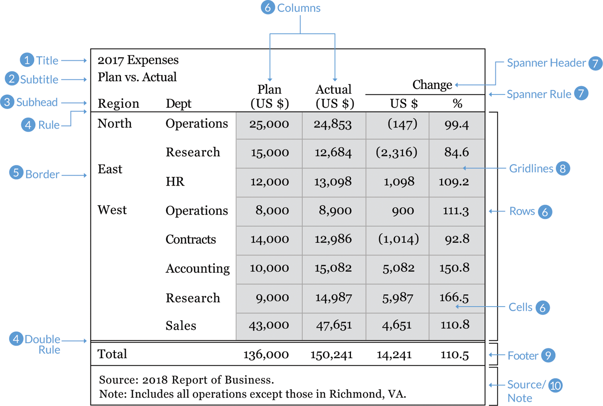

```{r setup, include = FALSE}
library(tidyverse)
library(ggthemes)
current_file <- knitr::current_input()
filter <- dplyr::filter
knitr::opts_chunk$set(
  fig.path = paste0("images/", fs::path_ext_remove(current_file), "/"),
  cache = FALSE, 
  message = FALSE,
  warning = FALSE, 
  fig.align = "center"
)
theme_set(theme_gdocs(base_size = 18) + 
            theme(axis.line.y = element_line(size = 1, 
                                             color = "black",
                                             linetype = "solid"),
                  plot.background = element_blank(),
                  plot.title.position = "plot"))

engage <- function() {
  "<span class='animated pulse' style='background-color:#027EB6;padding:10px;font-size:14pt;border:1pt solid black;color:white;font-weight:bold;display:inline-block;'>🥠 Engagement opportunity</span>"
}
```
```{r, include = FALSE, eval = F}
# times out
input <- fs::path_ext_set(current_file, "html")
pagedown::chrome_print(input = input, format = "pdf", wait = 20)
```
```{r titleslide, child="assets/titleslide.Rmd"}
```

---

class: middle nostripheader

# Housekeeping

* Take-home assessment will be released **Thu 20 Aug 7PM** on Moodle.   
* Instructor's (i.e. me) consultation hour will be shifted to **12.30-1.30PM Thu** for _this week alone_ so any troubleshooting can be sorted out prior to the start of the assessment.


---

# 🎯 What today is _not_ about

* In this lecture, we are _not_ overly concerned with whether the model is the best, good or bad; nor about the correctness of the interpretations of the statistical outputs.
* You learn about: 
  * Bayesian models in ETC5242,
  * forecasting models in ETC5550, 
  * machine learning models in ETC5250 and 
  * advanced statistical models in ETC5580.
  
--
  
# <span class="fa-layers fa-fw"><i class="fas fa-calendar monash-blue"></i><span class="fa-layers-text fa-inverse" data-fa-transform="shrink-9 down-3" style="font-weight:900">Wk3</span></span> So what is today about?

--

<div style="line-height:1.5em;padding-top:10px;padding-left:30px;">
<span class="fa-layers fa-fw blue"><i class="fas fa-circle" data-fa-transform="grow-5"></i><span class="fa-layers-text fa-inverse" data-fa-transform="up-1" style="font-weight:900">1</span></span> Working with model objects<br>
<span class="fa-layers fa-fw blue"><i class="fas fa-circle" data-fa-transform="grow-5"></i><span class="fa-layers-text fa-inverse" data-fa-transform="up-1" style="font-weight:900">2</span></span> Presenting information as a table
</div>

---

# 📈 Statistical models

* All models are approximations of the unknown data generating process - whether how good of an approximation depends on the collected data and the model choice.

--

.grid[
.item[

# &emsp; .blue[Example 1]

```{r, echo = FALSE, fig.height = 4, fig.width = 6}
ggplot(mtcars, aes(wt, mpg)) + 
  geom_point() + 
  labs(y = "Miles per gallon\n(mpg)", x = "Weight\n(wt)", 
       title = "Motor Trend Car Road Tests")
```

<span style="font-size:18pt;padding-left:100px;">
**Aim**: characterise `mpg` in terms of `wt`.
</span>

]
.item[

{{content}}

]
]

--

<Br>

* We fit the model: 

$$\texttt{mpg}_i = \beta_0 + \beta_1\texttt{wt}_i + e_i$$
<details  style="padding-left:40px;font-size:18pt">
<summary>Parameter details</summary>
<ul>
<li> \(\texttt{mpg}_i\) is the miles per gallon of the \(i\)-th car, </li>
<li>\(\texttt{wt}_i\) is the weight of the \(i\)-th car,</li>
<li>\(\beta_0\) is the intercept,</li>
<li>\(\beta_1\) is the slope, and</li>
<li>\(e_i\) is random error, usually assumed \(e_i \sim NID(0, \sigma^2)\)</li>
</ul>
</details>

* In R we fit this as 
```{r}
fit <- lm(mpg ~ wt, data = mtcars)
```
which is the same as 
```{r}
fit <- lm(mpg ~ 1 + wt, data = mtcars)
```

---

# ℹ️ Extracting information from the fitted model .font_small[Part 1/4]

* When you fit a model, there would be a number of information you will be interested in extracting from the fit including:
   * the model parameter estimates,
   * model-related summary statistics, e.g. $R^2$, AIC and BIC,
   * model-related values, e.g. residuals, fitted values and predictions.
--

* So how do you extract these values from the `fit`?
* What does `fit` even contain?
--

* Any programming language will usually have:
   * a function to see the structure of the object, in R this is `str()`, and
   * methods that can be applied to classes of that object.

---

# ℹ️ Extracting information from the fitted model .font_small[Part 2/4] 


.grid[
.item.border-right[
```{r}
fit <- lm(mpg ~ 1 + wt, data = mtcars)
fit
```
.center[
.animated.flash[LIVE DEMO]
]]
.item50[
.scroll-fit50[
```{r}
str(fit)
```
]

<center>
scroll<br>
<i class="fas fa-angle-double-down"></i>
</center>
]
]


---


# ℹ️ Extracting information from the fitted model .font_small[Part 3/4] 


Accessing model parameter estimates:
```{r}
fit$coefficients
# OR using
coef(fit)
```
This gives us the estimates of $\beta_0$ and $\beta_1$. 
--
But what about $\sigma^2$? 
--
```{r}
sigma(fit)^2
```


---

# ℹ️ Extracting information from the fitted model .font_small[Part 4/4] 

.scroll-100[
```{r}
summary(fit)
```
]

<center>
scroll<br>
<i class="fas fa-angle-double-down"></i>
</center>

--

<div class="bg-white border-box" style="position:absolute;right:50px;bottom:50px;width:250px;padding:10px;">
So how do I get these summary values out?
</div>


---

# <i class="fas fa-broom"></i> Model objects to tidy data

.grid[
.item50.border-right[
```{r}
broom::tidy(fit)
broom::glance(fit)
```

]
.item50[
```{r}
broom::augment(fit)
```

]
]


---

# 🐱 Modelling <span style="color:#FFFFBF">cat</span>egorical variables .font_small[Part 1/3]

**Experiment data**: tooth growth in guinea pigs with **two supplement types** (orange juice or ascorbic acid) with **three different doses** (0.5, 1 and 2 mg/day).

```{r}
df <- ToothGrowth %>% mutate(dose = as.factor(dose))
glimpse(df)
```
**Suggested model and its fit**: 
.scroll-20[
```{r}
fitc <- lm(sqrt(len) ~ 1 + supp + dose + supp:dose, data = df)
```
]

---

# 🐱 Modelling <span style="color:#FFFFBF">cat</span>egorical variables .font_small[Part 2/3]

```{r}
broom::tidy(fitc)
```

--

* Where is dose 0.5? And supplementary OJ?
--

* The first levels of `dose` (0.5) and `supp` (OJ) have been constrained to zero; in another words, these are the **reference level** (also called **base-line category**).

---

# 🐱 Modelling <span style="color:#FFFFBF">cat</span>egorical variables .font_small[Part 3/3]

```{r}
broom::tidy(fitc) %>% 
  tidycat::tidy_categorical(fitc) #<<
```

--


<div  style="position:absolute;right:120px;bottom:337px;width:330px;height:30px;background-color:rgba(100,255,155,0.3)">
</div>

<div  style="position:absolute;right:120px;bottom:277px;width:330px;height:30px;background-color:rgba(100,255,155,0.3)">
</div>

<div  style="position:absolute;right:120px;bottom:126px;width:330px;height:90px;background-color:rgba(100,255,155,0.3)">
</div>

<div  style="position:absolute;right:120px;bottom:63px;width:330px;height:30px;background-color:rgba(100,255,155,0.3)">
</div>


<div class="border-box" style="position:absolute;right:120px;bottom:5px;width:300px;padding:10px;height:430px;">
</div>

---

# <i class="fas fa-equals"></i> Why have constraints/reference/base-line categories?

* Let's consider these simultaneous equations:

$$\begin{eqnarray}
20 \beta_0 + 10 \beta_1 + 10 \beta_2  &=& 50\\
10 \beta_0 + 10\beta_1 \qquad ~~~&=& 20\\
10 \beta_0 \qquad~~~+ 10\beta_2&=& 30\\
\end{eqnarray}~~~~\text{or}~~~~\begin{bmatrix}20 & 10 & 10 \\ 10 & 10 & 0\\ 10 & 0 & 10\end{bmatrix}\begin{bmatrix}\beta_0\\\beta_1\\\beta_2\end{bmatrix} = \begin{bmatrix}50\\20\\30\end{bmatrix}$$

--


* A solution is $\beta_0 = \beta_1 = 1$ and $\beta_2 = 2$. 
--
But so is $\beta_0 = -1$, $\beta_1 = 3$ and $\beta_2 = 4$. 
--
And so is $\beta_0 = 2$, $\beta_1 = 0$ and $\beta_2 = 1$.
--

* There are infinite number of solutions. 
--

* <i class="fas fa-lightbulb"></i> The idea is the same when you have a categorical variable and the effects for each level of the categorical variables are estimated using least squares estimate (or maximum likelihood estimate) then without constraints, there are infinite number of solutions.


---

# <span class="fa-layers fa-fw" style="color:#D93F00"><i class="fas fa-box"></i><i class="far fa-chart-bar" data-fa-transform="shrink-9 down-3" style="font-weight:900;color:#e3e3e3;"></i></span> Modelling in R

* There are many R-packages that fit all kinds of models, e.g. 
  * `mgcv` fits generalized additive models,
  * `glmnet` fits a generalised linear models with elastic net, 
  * `rstanarm` fits Bayesian regression models using Stan, 
  * `BLR` also fits Bayesian linear regression models, and 
  * `fable` .font_small[(written by your tutor Mitch O'Hara-Wild)] fits forecast models,
  * many other contributions by the community. 
--

* There are a lot of new R-packages contributed; some implementing the latest research results. This means that if you want to use the state-of-the-art research, then you need to work with model objects beyond the standard `lm` and `glm`. 

---

# Example with Baysian regression

```{r, message = FALSE, warning = FALSE, results='hide', error = TRUE}
library(rstanarm)
fit_stan <- stan_lm(mpg ~ 1 + wt, data = mtcars,
                    prior = R2(0.7528, what = "mean"))
```
--
```{r, message = FALSE, warning = FALSE, error = TRUE}
broom::tidy(fit_stan)
```
--
Huh?
--
```{r}
coef(fit_stan)
```
--
Okay this works, but why not for `broom::tidy`?


---

# <span class="fa-layers fa-fw blue"><i class="fas fa-microchip"></i><span class="fa-layers-text fa-inverse" data-fa-transform="shrink-9" style="font-weight:900;color:#e3e3e3;">S3</span></span> Object classes

* So how do you find out the functions that work with model objects?
--

* First notice the class of the object `fit`:
.item[
```{r}
class(fit)
```
]

--


* The methods associated with this can be found using:
.scroll-20[
```{r}
methods(class = "lm")
```
]

<center>
scroll<br>
<i class="fas fa-angle-double-down"></i>
</center>

--

<div class="bg-white border-box" style="position:absolute;right:10px;bottom:10px;width:300px;padding:10px;">
Where is <code>coef()</code>? 
</div>


---

# <span class="fa-layers fa-fw blue"><i class="fas fa-microchip"></i><span class="fa-layers-text fa-inverse" data-fa-transform="shrink-9" style="font-weight:900;color:#e3e3e3;">S3</span></span> Object oriented programming (OOP) .font_small[Part 1/3]

* You need to know a little bit about OOP if you want to know more about how model objects work and how methods functions extract information from the model objects.
* The **_S3 system_** is the most widely used OOP system in R but there are other OOP systems in R, e.g. the S4 system is used for model objects in `lme4` R-package, but it will be out of scope for this course. 
--


* Let's have a look inside of `coef` function:
.item[
```{r}
coef
```
]

--

<div class="bg-white border-box" style="position:absolute;right:300px;bottom:50px;padding:10px;width:230px;">
Try also looking inside <code>lm</code>
</div>

---

# <span class="fa-layers fa-fw blue"><i class="fas fa-microchip"></i><span class="fa-layers-text fa-inverse" data-fa-transform="shrink-9" style="font-weight:900;color:#e3e3e3;">S3</span></span> Object oriented programming (OOP) .font_small[Part 2/3]

* Suppose I create a new class called `student`:
.item[
```{r}
obj <- structure(list(who = "🤪", quiz = 29, exam = 30), 
                 class = "student")
class(obj)
```
]
--


* Here I create a simple generic method, called `quiz`, for the `student` class to extract the student object's quiz mark:
.item[
```{r}
# the generic
get_quiz <- function(object, ...) { UseMethod("get_quiz") }
# the method
get_quiz.student <- function(object, ...) { return(object$quiz) }
# implementation of the method
get_quiz(obj)
```
]

---

# <span class="fa-layers fa-fw blue"><i class="fas fa-microchip"></i><span class="fa-layers-text fa-inverse" data-fa-transform="shrink-9" style="font-weight:900;color:#e3e3e3;">S3</span></span> Object oriented programming (OOP) .font_small[Part 3/3] 

* A method is created by using the form `generic.class`.
* When using a method for `class`, you can omit the `.class` from the function.
* E.g. `residuals(fit)` is the same as `residuals.lm(fit)` since the class of `fit` is `lm`. 
--

* So does that mean `coef.lm` exists?


--


* `coef.lm` doesn't exist, instead there is `coef.default`. 
* `default` is a special class and when a generic doesn't have a method, it falls back to `generic.default`.
* `coef.default` is hidden from view though and you need to look deeper to find it: `stats:::coef.default`. 
--
.animated.flash.monash-blue[LIVE DEMO]

---

# Case study .circle[1] `broom::tidy` .font_small[Part 1/2]

```{r}
class(fit_stan)
```
--
```{r}
broom::tidy
```
--
There is no `tidy.stanreg` method so uses the `broom:::tidy.glm` instead.

---

# Case study .circle[1] `broom::tidy` .font_small[Part 2/2]

```{r}
library(broom)

tidy.stanreg <- function(x, ...) {
  est <- x$coefficients
  tibble(term = names(est), 
         estimate = unname(est),
         std.error = x$ses)
}

tidy(fit_stan)
```


---

# <i class="fas fa-clipboard-list"></i> Working with model objects

* Is this only for R though? How do you work with model objects in general?

--


## <i class="fab fa-python"></i> Python


```{python}
import pandas as pd
import numpy as np
from sklearn.linear_model import LinearRegression
x = np.array(r.mtcars['wt']).reshape(-1, 1)
y = np.array(r.mtcars['mpg'])
model = LinearRegression().fit(x, y)
```
--
```{python}
[model.intercept_, model.coef_]
```

--

.border-box[
```{r, echo = FALSE}
coef(fit) # in R
```
]

<i class="fab fa-r-project" style="position:absolute;right:55%;bottom:30px;"></i>


---

class: nostripheader middle

# Model objects are usually a `list` returning multiple output from the model fit.

<br><br>

--

# When working with model objects, check the object structure and find the methods associated with it

--

(and of course check the documentation).


---

# <i class="fas fa-table"></i> Some common tables 

.grid[
.item.border-right[
## Descriptive summary statistics tables [<i class="fas fa-link"></i>](http://thatdatatho.com/2018/08/20/easily-create-descriptive-summary-statistic-tables-r-studio/)

<center style="padding:10px">
```{r, echo = FALSE}
df <- mtcars %>% mutate(cyl = factor(cyl),
                        vs = factor(vs))
table1::table1(~ mpg + wt  + vs| cyl, data = df)
```
</center>

]
.item[
## Regression results tables

<center style="padding:10px">
```{r, echo = FALSE, results = "asis"}
stargazer::stargazer(fit, type = 'html')
```
</center>
]
]

---

class: nostripheader middle

#  What statistics to present? 

--

<br>
.info-box[
.monash-blue[**This depends on what you want to convey and your audience.**]

There are two key purposes of the table:

1. _display_ information; and
2. _communicate_ information.


]

---

# <span class="fa-layers fa-fw red"><i class="fas fa-table"></i><span class="fa-layers-text fa-inverse" data-fa-transform="shrink-9 left-4 up-3" style="font-weight:900;color:white;">&mu;</span><span class="fa-layers-text fa-inverse" data-fa-transform="shrink-9 right-4 down-3" style="font-weight:900;color:white;">&beta;</span></span> Descriptive summary statistics .font_small[Part 1/2]

* The main goal is to give a numerical summary to give a "feel" of what the data contains. These generally should convey:
  * variables in the data,
  * the number of observations for each variable, 
  * missing values (if any),
  * the distribution, e.g. in the form of five number of summaries or counts/percentages for categorical variables. 
--

* For numerical variables, you may have a **correlation table** which displays the correlation coefficients of every pair of variables. Because it is symmetrical, you can omit out the upper triangle.

```{r, echo = FALSE}
cc <- cor(select(mtcars, mpg, wt, hp))
cc[upper.tri(cc, diag = T)] <- NA
tt <- as_tibble(cc)
tt %>% mutate(Variable = c("1. Miles per gallon", "2. Weight", "3. Horsepower"),
              Mean = round(c(mean(mtcars$mpg), mean(mtcars$wt), mean(mtcars$hp)), 2),
              SD = round(c(sd(mtcars$mpg), sd(mtcars$wt), sd(mtcars$hp)), 2),
              mpg = ifelse(is.na(mpg), "", round(mpg, 2)),
              wt = ifelse(is.na(wt), "", round(wt, 2))) %>% 
  select(Variable, Mean, SD, mpg, wt) %>% 
  knitr::kable(table.attr = "class='cor-table'",
               col.names = c("Variables", "Mean", "SD",
                             "1.", "2.")) 
```


---

# <span class="fa-layers fa-fw red"><i class="fas fa-table"></i><span class="fa-layers-text fa-inverse" data-fa-transform="shrink-9 left-4 up-3" style="font-weight:900;color:white;">&mu;</span><span class="fa-layers-text fa-inverse" data-fa-transform="shrink-9 right-4 down-3" style="font-weight:900;color:white;">&beta;</span></span> Descriptive summary statistics .font_small[Part 2/2]

* You may have **cross-tabulations** (also called **contingency tables**)
```{r xtab, echo = FALSE}
library(janitor)
library(kableExtra)
mtcars %>% 
  tabyl(cyl, gear) %>% 
  adorn_totals(where = c("row", "col")) %>% 
  adorn_percentages("all") %>%
  adorn_pct_formatting(digits = 1) %>%
  adorn_ns() %>% 
  adorn_title("combined") %>% 
  knitr::kable(table.attr = "class='xtab'") %>% 
  kable_styling() %>% 
  row_spec(4, extra_css = "border-top: 1px solid black;")
```

<details><summary>R code</summary>

<pre style="font-size:13pt">
library(janitor)
library(kableExtra)
mtcars %>% 
  tabyl(cyl, gear) %>% 
  adorn_totals(where = c("row", "col")) %>% 
  adorn_percentages("all") %>%
  adorn_pct_formatting(digits = 1) %>%
  adorn_ns() %>% 
  adorn_title("combined") %>% 
  knitr::kable(table.attr = "class='xtab'") %>% 
  kable_styling() %>% 
  row_spec(4, extra_css = "border-top: 1px solid black;")
</pre>

+ some CSS needed.

</details>
---

# <span class="fa-layers fa-fw red"><i class="fas fa-table"></i><span class="fa-layers-text fa-inverse" data-fa-transform="shrink-9 left-4 up-3" style="font-weight:900;color:white;">y</span><span class="fa-layers-text fa-inverse" data-fa-transform="shrink-9 right-4 down-3" style="font-weight:900;color:white;">x</span></span> Regression results 

* Or more generally, the important numerical characteristics of your model. This may include:
  * parameter estimates of your model,
  * the standard error or confidence/credible interval of your estimates,
  * model fit quality, e.g. $R^2$, AIC, BIC and so on.
--

* You see often the inclusion of $p$-value, usually from the significance test of the corresponding variable and some indicate the significance level by the amount of `*`.
--

* It is important to **_convey the uncertainty_** for the estimates or predictions from your model. 
--

* There is also what is called the **ANOVA table** that shows the variation according to different sources.


---

# <i class="fas fa-child" style="color:#FFC0CB"></i> Anatomy of the table

.grid[
.item[


.font_small[Source: https://gt.rstudio.com/]
]
.item[


.font_small[Source: [Schwabish (2020) Ten Guidelines for Better Tables. *Journal of Benefit-Cost Analysis* **11** (2) 151-178](https://www.cambridge.org/core/journals/journal-of-benefit-cost-analysis/article/ten-guidelines-for-better-tables/74C6FD9FEB12038A52A95B9FBCA05A12)]
]
]


---

# <i class="fas fa-syringe" style="color:#FFC0CB"></i> Numerical precision .font_small[Part 1/2]

* Select an appropriate precision for your goal and audience:

```{r, echo = FALSE}
set.seed(1)
mtcars %>% 
  rownames_to_column() %>% 
  # add some random decimal places
  mutate(wt1 = round(wt + rnorm(n())/ 1000, 5),
         wt2 = round(wt, 2),
         wt3 = round(wt, 0)) %>%  
  select(rowname, wt1:wt3) %>% 
  head(4) %>% 
  knitr::kable(table.attr="class='xtab'",
        col.names = c("Car brand", "5 d.p.", "2 d.p.", "0 d.p.")) %>% 
  kable_styling() %>% 
  column_spec(2:4, width = "100px") %>% 
add_header_above(c(" " = 1, "Weight" = 3))
```

--

* Display trailing zeroes to match selected precision of the column:

```{r, echo = FALSE}
tibble(zero = c(0.233, 0.32, 0.4, 0.343)) %>% 
  mutate(nozero = as.character(zero)) %>% 
  knitr::kable(table.attr="class='xtab'", 
               align = "rr",
               col.names = c("Yes", "No")) %>% 
  kable_styling() %>% 
  column_spec(1:2, width = "100px") %>% 
  add_header_above(c("Trailing zeroes" = 2),
                   extra_css = "border-bottom: 1px solid black;")
```

---

# <i class="fas fa-syringe" style="color:#FFC0CB"></i> Numerical precision .font_small[Part 2/2]

* Change and display units as appropriate:

```{r, echo = FALSE}
mtcars %>% 
  rownames_to_column() %>% 
  # add some random decimal places
  mutate(wt1 = wt * 1000,
         wt2 = wt,
         wt3 = round(wt1 * 0.453592),
         wt4 = signif(wt3 * 1000, 3),
         wt5 = scales::comma(signif(wt3 * 1000000))) %>%  
  select(rowname, wt1:wt5) %>% 
  head(4) %>% 
  knitr::kable(table.attr="class='xtab'",
               col.names = c("Car brand", "Weight (lbs)", "Weight (1000 lbs)", "Weight (kg)", "Weight (g)", "Weight (mg)"),
               align = "lrrrrr") %>% 
  kable_styling() %>% 
  column_spec(2:6, width = "130px") 
  
```
--

<Br>
* Show comma every 3 digits (or other marks as needed). E.g. `1000000` is easier to read with `1,000,000`.

```{r}
scales::comma(c(439024, 4900343), accuracy = 1000)
```


---

# <i class="fas fa-align-left"></i> Column <i class="fas fa-align-center"></i> alignment   <i class="fas fa-align-right"></i>

* Spanner labels are usually aligned in center.
* Right-align numbers 
* Left-align texts

<Br>

```{r, echo = FALSE}
mtcars %>% 
  rownames_to_column("car") %>% 
  # add some random decimal places
  mutate(
    car1 = car,
    car2 = car,
    car3 = car,
    hp1 = hp,
    hp2 = hp,
    hp3 = hp) %>%  
  select(car1:hp3) %>% 
  head(4) %>% 
  knitr::kable(table.attr="class='xtab'",
               col.names = c("Left", "Center", "Right", "Left", "Center", "Right"),
               align = "lcrlcr") %>% 
  kable_styling() %>% 
  column_spec(1:3, width = "200px") %>% 
  column_spec(4:6, width = "80px") %>% 
  add_header_above(c("Car brand" = 3,
                     "Horsepower" = 3))
```

---

# 🏗️ How to make tables in R?

* There are many packages that make table in R, including ones that wrangle the data for you to make specialised table output. E.g. `knitr::kable`, `kableExtra`, `formattable`, `gt`, `DT`, `pander`, `xtable`, `stargazer`.
--

* You can read the documentation for each packages to make the table you want (I mainly use `knitr::kable`, `kableExtra` and `DT`).
--

* Whatever package you use, it's important that you understand the output and how it works with the medium you are trying to display the table.

---

# <span class="fa-layers fa-fw"><i class="fas fa-file"></i><span class="fa-layers-text red" data-fa-transform="shrink-9 down-3" style="font-weight:900">md</span></span>Table in Markdown

In markdown file:

<br>

```
First Header  | Second Header
------------- | -------------
Content Cell  | Content Cell
Content Cell  | Content Cell
```

<br>
*Possible* display:

<br>

First Header  | Second Header
------------- | -------------
Content Cell  | Content Cell
Content Cell  | Content Cell

---

# <span class="fa-layers fa-fw"><i class="fas fa-file"></i><span class="fa-layers-text red" data-fa-transform="shrink-10 down-3" style="font-weight:900">?</span></span>Table in HTML & PDF
.grid[.item.border-right[
HTML &rarr; Web browser
```html
<table>
<thead>
<tr>
<th>First Header</th> <th>Second Header</th>
</tr>
</thead>
<tbody>
<tr>
<td>Content Cell</td> <td>Content Cell</td>
</tr>
<tr>
<td>Content Cell</td> <td>Content Cell</td>
</tr>
</tbody>
</table>
```

]
.item[
LaTeX &rarr; PDF
```latex
\begin{tabular}{cc}
\hline
First Header & Second Header\\
\hline
Content Cell & Content Cell\\
Content Cell & Content Cell\\
\hline
\end{tabular}
```

{{content}}

]
]

--

* HTML is for HTML output 
* LaTeX is for PDF output
* Most HTML elements do _not_ work in LaTeX and vice versa.

{{content}}

--

* What is the R-package output?

<center>
<a href="lecture-03suppA.Rmd" download><i class="fas fa-file"></i></a>
<span class="flash animated blue">LIVE DEMO</span>
</center>
---


# Case study .circle[2] interactive tables with `DT`

```{r}
DT::datatable(mtcars, options = list(pageLength = 4))
```

--

<div class="bg-white border-box" style="position:absolute;right:50px;bottom:50px;width:700px;padding:10px;">
<ul>
<li><code>DT::datatable</code> works best for HTML documents.</li> 
<li>For PDF documents, it takes a <code>webshot</code> of the HTML table and inserts it as an image.</li>
<li>It's useful for data exploration where the main goal of the table is display of information rather than communication.</li>
</ul>
</div>

---

class: nostripheader middle

# When do you make tables over plots?

When you want to **_show exact values_** or the **_accuracy of the values are important_** to convey.

--

<br>

# You _can_ combine plots with tables.

---

# <span class="fa-layers fa-fw red"><i class="fas fa-table"></i><i data-fa-transform="shrink-11 left-4 up-3" class="fas fa-chart-bar white"></i><i class="fas fa-chart-pie white" data-fa-transform="shrink-11 right-4 down-3"></i></span> Case study .circle[3]  heatmap table with `formattable` 

```{r}
library(formattable)
mtcars %>% 
  select(mpg, disp, wt, hp) %>% 
  cor() %>% 
  as.data.frame() %>% 
  rownames_to_column("Variables") %>% 
  formattable(list(area(col = 2:5) ~ color_tile("#F5B7B1", "#7DCEA0")))
```


---

# <span class="fa-layers fa-fw red"><i class="fas fa-table"></i><i data-fa-transform="shrink-11 left-4 up-3" class="fas fa-chart-bar white"></i><i class="fas fa-chart-pie white" data-fa-transform="shrink-11 right-4 down-3"></i></span> Case study .circle[4]  inline plots with `sparkline` 


* **Sparkline** refers to a small chart drawn without axes or coordinates. 
* There is a jQuery sparkline that is provided as a `htmlwidgets` in the [`sparkline` R-package](https://github.com/htmlwidgets/sparkline).
--

* This is a `htmlwidgets` object so it only works for HTML output and requires the JS dependencies to work.

--


<center>
<a href="lecture-03suppB.Rmd" download><i class="fas fa-file"></i></a>
.flash.animated.blue[LIVE DEMO]
</center>
---

# <i class="fas fa-chalkboard-teacher bg-white animated bounceIn" style="padding:3px;border:1px dashed #0092EB; color: #0092EB;"></i> Today's main lessons 

# Working with model objects 

* Understanding about the OOP system
* How to tease apart the model objects and methods associated with it

# Presenting information as a table

* Various common tables that present information
* Some guidelines for best way to communicate with tables

---

```{r endslide, child="assets/endslide.Rmd"}
```
