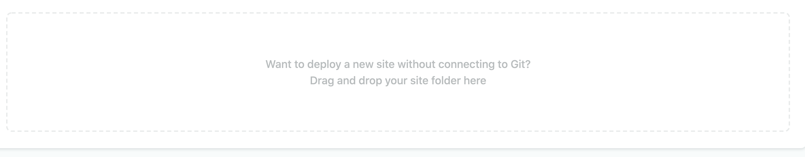

```{r setup, include = FALSE}
library(tidyverse)
library(ggthemes)
current_file <- knitr::current_input()
filter <- dplyr::filter
knitr::opts_chunk$set(
  fig.path = paste0("images/", fs::path_ext_remove(current_file), "/"),
  cache = FALSE, 
  message = FALSE,
  warning = FALSE, 
  fig.align = "center"
)
theme_set(theme_gdocs(base_size = 18) + 
            theme(axis.line.y = element_line(size = 1, 
                                             color = "black",
                                             linetype = "solid"),
                  plot.background = element_blank(),
                  plot.title.position = "plot"))

engage <- function() {
  "<span class='animated pulse' style='background-color:#027EB6;padding:10px;font-size:14pt;border:1pt solid black;color:white;font-weight:bold;display:inline-block;'>🥠 Engagement opportunity</span>"
}
```
```{r, include = FALSE, eval = F}
# times out
input <- fs::path_ext_set(current_file, "html")
pagedown::chrome_print(input = input, format = "pdf", wait = 20)
```
```{r titleslide, child="assets/titleslide.Rmd"}
```

---

class: middle nostripheader

# Housekeeping

* Blog post 1 instructions are available now and due **Fri 4 Sep 11.55PM** on Moodle.   


---

# <span class="fa-layers fa-fw orange"><i class="fas fa-file"></i><span class="fa-layers-text fa-inverse" data-fa-transform="shrink-11 down-3" style="font-weight:900;color:#e3e3e3;">Rmd</span></span> R Markdown


.grid[
.item[

`lecture-04suppA.Rmd`

.scroll-fit50[
````yaml
```{r, results="asis", echo = FALSE}
rmdeg <- readLines("lecture-04suppA.Rmd")
line_yaml_start <- which(rmdeg=="---")[1]
line_yaml_end <- which(rmdeg=="---")[2]
cat(rmdeg[line_yaml_start:line_yaml_end], sep = "\n")
```
````
````r
```{r, results="asis", echo = FALSE}
cat(rmdeg[(line_yaml_end + 1):length(rmdeg)], sep = "\n")
```
````
]]
.item[
`lecture-04suppA.html`

<iframe src="lecture-04suppA.html" height="100%" width="100%"></iframe>


]]

---

# <span class="fa-layers fa-fw green"><i class="fas fa-file"></i><span class="fa-layers-text fa-inverse" data-fa-transform="shrink-11 down-3" style="font-weight:900;color:#e3e3e3;">html</span></span> Sharing your HTML webpage

* You can share your HTML webpage using [RPubs](https://rpubs.com/).

<center>
<a href="https://rpubs.com/emitanaka/hello-world-etc5523"></a>
</center>
--

* There are a few caveats sharing via RPubs though:
  * The HTML webpage needs to be self-contained (so no external local file dependencies like css and js).
  * There is a banner on the top and the bottom.
  * The url has to be under the domain `https://rpubs.com`.
  

---

# <span class="fa-layers fa-fw green"><i class="fas fa-globe"></i><span class="fa-layers-text fa-inverse" data-fa-transform="shrink-11 down-3" style="font-weight:900;color:#e3e3e3;">html</span></span> R Markdown Website Example

* The [ETC5523 course website](https://cwd.numbat.space/) is built using a "simple" R Markdown website. 

<center>
<a href="https://cwd.numbat.space/"></a>
</center>

--

<Br>

* How is this different to a normal HTML output via `rmarkdown::html_document`?
--

* What is the difference between a **_website_** and a **_webpage_**? 


---

# <i class="fas fa-file-alt green"></i> Webpage vs Website  <i class="fas fa-book green"></i> 


# <i class="fas fa-file-alt"></i> Webpage 

* A _single_ document written in HTML.
--

<Br><Br>

# <i class="fas fa-book"></i> Website

* A collection of webpages.
--

* The webpages usually share a common **_navigation_** bar (or tab), and possibly a common **_footer_**.
--

* There are hyperlinks to other webpages that are nested under the same
  - domain, e.g. https://numbat.space/, or 
  - subdomain, e.g. https://cwd.numbat.space/.

---

class: transition middle


# R Markdown Website


---

class: transition middle


# Download 
# <a href="lecture-04-rmarkdown-website.zip" download style="color:orange"><i class="fas fa-file-archive"></i></a>

If you know this lecture content already, download this file and study the plots in Rmd documents instead.


---

# <span class="fa-layers fa-fw green"><i class="fas fa-globe"></i><span class="fa-layers-text fa-inverse" data-fa-transform="shrink-11 down-3" style="font-weight:900;color:#e3e3e3;">html</span></span> Making an R Markdown Website .font_small[Part 1/3]

.grid[
.item.border-right[
The minimum setup you need is a directory that contains:

```
├── index.Rmd
└── _site.yml
```

where `_site.yml` contains

```yaml
navbar:
  title: "My Website"
  left:
    - text: "Home"
      href: index.html
```
]
.item[

{{content}}

]

]

--

You can build the website then by:

* `rmarkdown::render_site()`
* Or go to RStudio IDE and look under the Build tab:

<center>

</center>


---

# <span class="fa-layers fa-fw green"><i class="fas fa-globe"></i><span class="fa-layers-text fa-inverse" data-fa-transform="shrink-11 down-3" style="font-weight:900;color:#e3e3e3;">html</span></span> Making an R Markdown Website .font_small[Part 2/3]

.grid[
.item.border-right[
By default the output is in `_site` folder:

```
├── index.Rmd
├── _site.yml
└── _site
    ├── index.html
    └── site_libs
```

You modify the output directory in the `_site.yml`


```yaml
*output_dir: "docs"
navbar:
  title: "My Website"
  left:
    - text: "Home"
      href: index.html
```
]
.item[
{{content}}
]
]

--

You can add more webpages:

```
├── index.Rmd
*├── post2.Rmd
├── _site.yml
└── _site
    ├── index.html
*   ├── post2.html
    └── site_libs
```

```yaml
output_dir: "docs"
navbar:
  title: "My Website"
  left:
    - text: "Home"
      href: index.html
*   - text: "Post"
*     href: post2.html
```

---

# <span class="fa-layers fa-fw green"><i class="fas fa-globe"></i><span class="fa-layers-text fa-inverse" data-fa-transform="shrink-11 down-3" style="font-weight:900;color:#e3e3e3;">html</span></span> Making an R Markdown Website .font_small[Part 3/3]

.grid[
.item.border-right[

You can include common elements 


`_site.yml`

```yaml
output_dir: "docs"
navbar:
  title: "My Website"
  left:
    - text: "Home"
      href: index.html
    - text: "Post"
      href: post2.html
*output:
*  html_document:
*    theme: cosmo
*    include:
*      after_body: footer.html
*    css: styles.css
```

]
.item[
{{content}}
]

]

--

Or have own `output` options which get merged with common options:

`post2.Rmd`
```yaml
---
output:
  html_document:
    theme: darkly
---

..content..
```

{{content}}

--

<br><br>
<center>
<span class="animated flash">LIVE DEMO</span>
</center>


---

class: transition middle

# For more information see <a href="https://bookdown.org/yihui/rmarkdown/rmarkdown-site.html" style="color:orange;">R Markdown: The Definitive Guide</a>

---

# <i class="fab fa-github black"></i> Sharing on the web with GitHub Pages


.grid[
.item.border-right[

1. If your GitHub username is called `username` then make a GitHub repo called `username.github.io`.
2. Or if you already have a `username.github.io`, then make a GitHub repo called say `myweb`.
* Push your directory to your Github repo.
* Go to your GitHub repo settings and enable "GitHub Pages". 
* Your website will be available with url:
  1. http://username.github.io/ or
  2. http://username.github.io/myweb
  
.font_small[Note: it may take 10 minutes or so to render the first time.]

]
.item[
* Directory structure to push to your GitHub repo:

Version 1
```
*├── index.html
├── ...
└── ...
```

Version 2
```
├── ...
└── docs
*   ├── index.html
    └── ...
```

{{content}}

]
]

--


<br>
<center>
<span class="animated flash">LIVE DEMO</span>
</center>

---

# <i class="fas fa-square-full" style="color:#00AD9F; transform: rotate(45deg);font-size:28pt;"></i> Sharing on the web with Netlify

* Go to https://app.netlify.com and log in
* Drag and drop your folder which contains the `index.html` to:

<center>

</center>

* Do go to `Site settings > Change site name` for a more sensible domain name. 


<br>
<center>
<span class="animated flash">LIVE DEMO</span>
</center>

---


class: nostripheader middle

# 🔨 Exercise

* Unzip <a href="lecture-04-rmarkdown-website.zip" download style="color:orange"><i class="fas fa-file-archive"></i></a> and rename `_post2.Rmd` to `post2.Rmd`
* Include `post2.Rmd` on the website. 
* Try including `_post1.Rmd`. Anything you notice?
* Get your website on a public domain.

<br>

*Please help each other.*

`r countdown::countdown(15, class = "clock")`

---

class: transition middle


## `distill::distill_article`

---

# 💧 Distill journal

.grid[
.item[
* [Distill](https://distill.pub/) is a scientific journal on machine learning established in March 2017.
* Traditional scientific articles are focused on a _PDF_ article.
* But Distill is _HTML based_ so you can incorporate interactive visualisations.

]
.item[
<center>

</center>

.font_small[Source: https://distill.pub/2019/visual-exploration-gaussian-processes/]
]
]


---

# <i class="fas fa-newspaper gray"></i> `distill` with R Markdown

* `distill` R-package (originally called `radix`) creates a HTML output that looks like Distill 
* You can get started at `RStudio > New Directory > Distill Website` (or `Distill Blog`)

<center>

</center>


---

# 📰 `distill::distill_article` .font_small.animated.flash[LIVE DEMO] <a href="lecture-04-suppB.Rmd" download style="color:orange"><i class="fas fa-file-alt font_small"></i></a>

<br>
<blockquote>
<ul>
<li>Reader-friendly typography that adapts well to mobile devices.</li>
<li>Features essential to technical writing like LaTeX math, citations, and footnotes.</li>
<li>Flexible figure layout options (e.g. displaying figures at a larger width than the article text).</li>
<li>Attractively rendered tables with optional support for pagination.</li>
</ul>
<br><br>

<footer>—Allaire, et al. (2018, Sept. 10). Distill for R Markdown. Retrieved from https://rstudio.github.io/distill</footer>
</blockquote>

---


class: nostripheader middle

# 📚 Resources

* [Distill for R Markdown: Creating a Website](https://rstudio.github.io/distill/website.html)
* [Building a blog with distill by Thomas Mock](https://themockup.blog/posts/2020-08-01-building-a-blog-with-distill/)
* [Teaching in Production by Alison Hill](https://rstudio-education.github.io/teaching-in-production/slides/#57)

---

class: transition middle


# `blogdown` 
# + 
#Hugo

---

#  Making a website with Hugo

* [Hugo](https://gohugo.io/) is a free, open-source _static_ site generator written under the hood with the [Go programming language](https://golang.org/)
* It is _lightning fast_ to build the website.
* It supports Markdown with Hugo's default rendering engine Blackfriday (instead of Pandoc).
* There are many [community contributed themes](https://themes.gohugo.io/):
<center>

</center>

---

#  Academic Hugo Theme

* [Academic](https://sourcethemes.com/academic/) is one of the most well-developed and hugely popular Hugo themes.
* To get started with command line use 
```{r, eval = FALSE}
blogdown::new_site(theme = "gcushen/hugo-academic")
```
* Or go to `RStudio > New Project > Website using blogdown` and change the theme to `gcushen/hugo-academic`.
* Or clone your week 4 GitHub classroom repo which contains the skeleton website for Academic Hugo. 

<br>
<center>
.flash.animated[LIVE DEMO]
</center>

---

# 🔨 The basics of making your blog

# Main Steps 

* Personalise the contents of `config.toml`.
* **Serve site**: 
  * Go to `Addins > Serve Site`
  * Or from the console type and push enter: `blogdown::serve_site()`
* **Making a new post**: go to `Addins > New Post` and fill out the details as needed.

--

<br>

There are many other features available but above are enough for you to get started.

---

# 🌎 Deploying your blog

.grid[
.item[
```
├── academic-hugo-template.Rproj
├── assets
├── config
├── config.toml
├── content
│   ├── authors
│   ├── home
│   └── post
├── index.Rmd
├── public
│   ├── ...
│   ├── index.html
│   └── ...
├── resources
├── static
└── themes
    └── hugo-academic
```

]
.item[

* Push your blogdown project to a GitHub repo.
* Go to https://app.netlify.com/ and select "New site from Git".
* Select your repo and deploy your site.
* By default, this deploys the **public** folder in your project folder. 
* <i class="fas fa-exclamation-triangle"></i> You should never change anything in the public folder. 

<br>

<center>
.animated.flash[LIVE DEMO]
</center>

]

]


---

class: nostripheader middle

# 📚 Resources

* [blogdown: Creating Websites with R Markdown by Xie, Thomas & Hill](https://bookdown.org/yihui/blogdown/)
* [Making Websites in R Markdown by Alison Hill](https://arm.rbind.io/slides/blogdown.html#1)

---

class: nostripheader middle

# 💡 Get started with making

* Your own profile website
  - add your bio
  - add your skillsets
  - add links to all your other profiles
  - add contact details
* Your own blog:
  - summarising what you have learnt
  - learning about a new R package
  - or anything else!


`r countdown::countdown(30, class = "clock")`


---

# <i class="fas fa-chalkboard-teacher bg-white animated bounceIn" style="padding:3px;border:1px dashed #0092EB; color: #0092EB;"></i> Today's main lessons 


<Br><br>

<i class="fas fa-check-circle green"></i> Make an R Markdown Website

<br>

<i class="fas fa-check-circle green"></i> Make a `distill` website, blog or article

<br>

<i class="fas fa-check-circle green"></i> Make a `blogdown`

<br>

<i class="fas fa-check-circle green"></i> How to deploy your website

--

<br>

Note: `blogdown` is considerably harder so stick with an R Markdown website if it's too much!


---

```{r endslide, child="assets/endslide.Rmd"}
```
