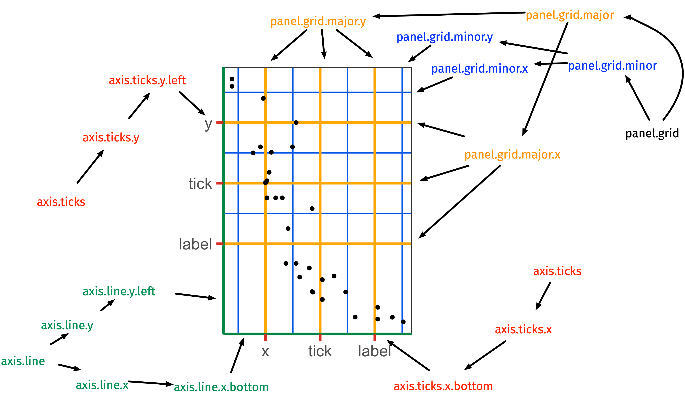
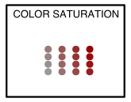
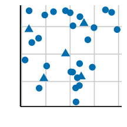
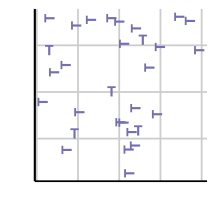
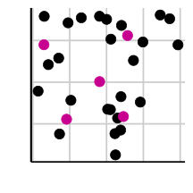

```{r setup, include = FALSE}
library(tidyverse)
library(ggthemes)
library(grid)
library(gridSVG)
library(vcd)
library(colorspace)
library(ozmaps)
library(ggnetwork)
library(knitr)
library(kableExtra)
library(palmerpenguins)
library(patchwork)

theme_original <- theme_get() 
# okay too difficult to revert back when theme in global during development

set.seed(2)
current_file <- knitr::current_input()
filter <- dplyr::filter
knitr::opts_chunk$set(
  fig.path = paste0("images/", fs::path_ext_remove(current_file), "/"),
  cache.path = "cache/",
  cache = FALSE, 
  message = FALSE,
  warning = FALSE, 
  echo = FALSE,
  fig.align = "center",
  dev = "svg",
  dev.args = list(bg = "transparent")
)
theme_docs <- theme_gdocs(base_size = 18) + 
            theme(axis.line.y = element_line(size = 1, 
                                             color = "black",
                                             linetype = "solid"),
                  plot.background = element_blank(),
                  plot.title.position = "plot")
```

```{r data}
ances_df <- tibble(perc = c(36.1, 33.5, 11.0, 9.3, 5.6, 4.5),
              bg = c("English", "Australian", "Irish", "Scottish", "Chinese", "Other")) %>% 
  mutate(bg = fct_reorder(bg, perc))
oz_sf <- ozmap_data("states")
```
```{r, include = FALSE, eval = F}
# times out
input <- fs::path_ext_set(current_file, "html")
pagedown::chrome_print(input = input, format = "pdf", wait = 20)
```
```{r titleslide, child="assets/titleslide.Rmd"}
```

```{css, echo = FALSE}
th {
  background-color: white;
  color: black;
  text-align: left;
  border-bottom: 2px solid black;
  border-top: 2px solid black;
}

tbody tr:last-child td {
  border-bottom: 2px solid black!important;
}

tbody tr:nth-child(even) {
  background-color: #D3D3D3;
}
```


---

# 🖼️ Why make data plots?

<Br>
<blockquote>
A picture is worth a thousand words.
<br>
<footer style="float:right">-Henrik Ibsen</footer>
&nbsp;
</blockquote>

* Data visualisation generally **_communicates information much quicker_** than numerical tables. 
--

* Data visualisation can also **_reveal unexpected structures in data_**; it is not surprising that data visualisation is one of the key tools in exploratory data analysis.
--

* Data plot is usually more **_eye-catching_** even if you lose accuracy of the information. .font_small[And yes, right is still a data plot. It's called a waffle plot.]

<center>
<div class="grid bg-blue white" style="height:95px;width:100%;border: 3px solid #006DAE;">
.item.center[
1 in 8 men are color blind.
]
.item.center[
<i class="fas fa-user" style="color:#ffcc66"></i> <i class="fas fa-user" style="color:#00cc00"></i> <i class="fas fa-user" style="color:#00cc00"></i> <i class="fas fa-user" style="color:#00cc00"></i> <i class="fas fa-user" style="color:#00cc00"></i> <i class="fas fa-user" style="color:#00cc00"></i> <i class="fas fa-user" style="color:#00cc00"></i> <i class="fas fa-user" style="color:#00cc00"></i>

<span style="font-size:14pt" ><i class="fas fa-user" style="color:#ffcc66"></i> Color blind
 <i class="fas fa-user" style="color:#00cc00"></i> Normal vision</span>
]

</div>
</center>


.font_small[Note I interchangeably use the terms data visualisation, plot, data plot, graphic, statistical graphic, and figure.]

---


```{r usages, include = FALSE, fig.height = 4.5, fig.width = 4.5}
ances_df %>% 
  dplyr::select(bg, perc) %>% 
  kable(col.names = c("Ancestry", "%")) %>% 
  kable_styling(full_width = FALSE) %>% 
  save_kable(file = "images/lecture-06/usage-table.png")

ances_df %>% 
  ggplot(aes(bg, perc)) + 
  geom_col() + 
  theme_docs +
  guides(x = guide_axis(n.dodge = 2)) 

ances_df %>% 
  mutate(bg = fct_reorder(bg, perc)) %>% 
  ggplot(aes(perc/100, bg)) + 
  geom_col() + 
    theme_docs +
  scale_x_continuous(labels = scales::percent) + 
  labs(x = "", y = "", title = "Ancestry distribution in Australia", caption = "Source: Australian Bureau of Statistics\n 2016 Census") + 
  theme(plot.title = element_text(size = 20, face = "bold"),
        plot.caption = element_text(size = 13, hjust = 1))

ances_df %>% 
  mutate(bg = fct_reorder(bg, perc),
         eng = bg=="English") %>% 
  ggplot(aes(perc/100, bg)) + 
  geom_col(aes(fill = eng)) + 
  theme_docs +
  scale_x_continuous(labels = scales::percent) + 
  labs(x = "", y = "", title = "Ancestry distribution in Australia", 
       subtitle = "English ancestory is the most common",
       caption = "Source: Australian Bureau of Statistics\n 2016 Census") + 
  guides(fill = FALSE) + 
  scale_fill_manual(values = c("#5A5A5A", "#006DAE"))+  
  theme(plot.title = element_text(size = 20, face = "bold"),
        plot.caption = element_text(size = 13, hjust = 1),
        plot.subtitle = element_text(face = "italic")) 
```

# 💬️ Communicating with data visualisation

* Effective data visualisation means to design your data plot to effectively use human visual system to improve cognition about a targeted information from the data.
* The **_design of your data plot_** depends on the **_usage plan_** is. 
* Below is presenting percentage of the reported ancestories from the Australian Bureau of Statistics 2016 Census.

--

Table | Internal | Informative | Data storytelling
--- | --- | --- | ---
| | | 

---

count: false

# 💬️ Communicating with data visualisation

* Effective data visualisation means to design your data plot to effectively use human visual system to improve cognition about a targeted information from the data.
* The **_design of your data plot_** depends on the **_usage plan_** is. 
* Below is presenting percentage of the reported ancestories from the Australian Bureau of Statistics 2016 Census.

Table | Internal | Informative | Data storytelling
--- | --- | --- | ---
| | | 

---

count: false

# 💬️ Communicating with data visualisation

* Effective data visualisation means to design your data plot to effectively use human visual system to improve cognition about a targeted information from the data.
* The **_design of your data plot_** depends on the **_usage plan_** is. 
* Below is presenting percentage of the reported ancestories from the Australian Bureau of Statistics 2016 Census.

Table | Internal | Informative | Data storytelling
--- | --- | --- | ---
| | | 

---

count: false

# 💬️ Communicating with data visualisation

* Effective data visualisation means to design your data plot to effectively use human visual system to improve cognition about a targeted information from the data.
* The **_design of your data plot_** depends on the **_usage plan_** is. 
* Below is presenting percentage of the reported ancestories from the Australian Bureau of Statistics 2016 Census.

Table | Internal | Informative | Data storytelling
--- | --- | --- | ---
| | | 


---

# ℹ️ Is communication with data plot about infographics?

.grid[
.item[
* **_Infographic_** is a collection of images, plots and text to present information on a topic in an easily understood manner.
{{content}}

]
.item.center[
<a href="https://www.aquamarinecare.com.au/home-care/family-looking-after-families/"></a>
]
]

--
* These days infographics are used for **_mass communication meant for the general public_**, i.e. with assumption of little technical knowledge from the reader. 
{{content}}
--
* These type of graphics may involve graphic designers, or at least special software for making infographics. 
* <i class="fas fa-exclamation-circle"></i> Making sophisticated infographics like on the right will _not_ be the focus of this lecture.

---

class: nostripheader middle

# What type of plot should you use?

---

# 🛒 Data Visualisation Catalogue .font_small[(non-exhaustive)]

```{r dummy-data, include = FALSE}
n1 <- 50
df1 <- tibble(x = runif(n1, 0, 10),
              y =  3 * x + rnorm(n1, 0, 10),
              z = rnorm(n1, 0, 2),
              g = sample(letters[1:4], size = n1, replace = TRUE))
df2 <- expand_grid(x = LETTERS[1:4], g = letters[1:3]) %>% 
  mutate(y = sample(10 * (1:10), size = 12, replace = TRUE),
         x = fct_reorder(x, y, function(x) -sum(x)))
theme1 <- theme_void() + 
  theme(plot.background = element_rect(fill = "#FFE2EC", color = NA),
        plot.margin = margin(10, 10, 10, 10),
        plot.title.position = "plot",
        plot.title = element_text(margin = margin(t = -4, b = 10),
                                  size = 9.5, face = "bold")
        ) 
# as(hex2RGB("#FFE2EC"), "polarLUV")
theme1A <- theme1 + theme(plot.background = element_rect(fill = hex(polarLUV(80, 16.77085, 346.3558)), color = NA))
theme2A <- theme1 + theme(plot.background = element_rect(fill = hcl2hex(66.02879, 31.95793, 80), color = NA))
theme2B <- theme1 + theme(plot.background = element_rect(fill = hcl2hex(66.02879, 31.95793, 88), color = NA))

theme2 <- theme1 + theme(plot.background = element_rect(fill = "#FFEDC8", color = NA))
theme3 <- theme1 + theme(plot.background = element_rect(fill = "#D7FBCD", color = NA))
theme4 <- theme1 + theme(plot.background = element_rect(fill = "#B6FEF5", color = NA))
theme5 <- theme1 + theme(plot.background = element_rect(fill = "#D5F4FF", color = NA))
theme6 <- theme1 + theme(plot.background = element_rect(fill = "#FFE5FF", color = NA))
theme7 <- theme1 + theme(plot.background = element_rect(fill = "#FFE2EC", color = NA))

w <- h <- 1.8
h1 <- 1.8
w1 <- 2.3

# generate 5 and discard the tails which are too white
reds <- sequential_hcl(n = 5, palette = "Reds 2")
yellows <- c("#6A3F00", "#97742F", "#BAA588", "#D4CCC3")
vis_spacing <- 'style="padding-left:20px;"'
vis_spacing1 <- 'style="padding-left:10px;"'
cols <- c("#", "#BBDEB1", "#99E2D8", "#B8D8F8", "#EDC8F5", "#FFC5D0")

grid_setup <- function(label) {
  grid.newpage()
  grid.rect(gp = gpar(lty = "solid", lwd = 3, fill = "white"), 
              width = unit(0.9, "npc"), 
              height = unit(0.9, "npc"))
  grid.text(label, x = 0.1, y = 0.9, 
            gp = gpar(fontsize = 13), just = c("left", "top"))
  pushViewport(plotViewport(c(2, 3, 4, 3)))
}
```


```{r vis-barplot-horizontal, include = FALSE, fig.height = h, fig.width = w}
df2 %>% 
  group_by(x) %>% 
  summarise(y = sum(y)) %>% 
  ggplot(aes(x, y)) +
  geom_col(fill = reds[1]) +
  theme1A +
  theme(axis.line.y = element_line(color = "black", size = 1),
        axis.ticks.y = element_line(color = "black", linetype = "solid", size = 1, lineend = NULL),
        axis.ticks.length.y = unit(0.3, "lines")) +
  ggtitle("BARPLOT\n(HORIZONTAL)") 
```
```{r vis-barplot-vertical, include = FALSE, fig.height = h, fig.width = w}
df2 %>% 
  group_by(x) %>% 
  summarise(y = sum(y)) %>% 
  ggplot(aes(y, x)) +
  geom_col(fill = reds[1]) +
  theme1A +
  theme(axis.line.x = element_line(color = "black", size = 1),
        axis.ticks.x = element_line(color = "black", linetype = "solid", size = 1, lineend = NULL),
        axis.ticks.length.x = unit(0.3, "lines")) +
  ggtitle("BARPLOT\n(VERTICAL)")
```
```{r vis-piechart, include = FALSE, fig.height = h, fig.width = w}
df2 %>% 
  group_by(x) %>% 
  summarise(y = sum(y)) %>% 
  ggplot(aes("", y, fill = x)) +
  geom_col(position = "fill") +
  theme1A +
  guides(fill = FALSE) +
  ggtitle("PIE CHART") + 
  coord_polar("y") +
  scale_fill_manual(values = reds[1:4]) +
  theme(plot.margin = margin(t=20, b=20, l=17, r=17),
        plot.title = element_text(margin = margin(t = -13, l = -20)))
```
```{r vis-stacked-barplot, include = FALSE, fig.height = h, fig.width = w}
ggplot(df2, aes(x, y, fill = g)) +
  geom_col() +
  theme1 +
  guides(fill = FALSE) +
  theme(axis.line.y = element_line(color = "black", size = 1),
        axis.ticks.y = element_line(color = "black", linetype = "solid", size = 1, lineend = NULL),
        axis.ticks.length.y = unit(0.3, "lines")) +
  ggtitle("STACKED BARPLOT") + 
  scale_fill_manual(values = reds[1:4])
```
```{r vis-grouped-barplot, include = FALSE, fig.height = h, fig.width = w}
ggplot(df2, aes(x, y, fill = g)) +
  geom_col(position = "dodge") +
  theme1 +
  guides(fill = FALSE) +
  theme(axis.line.y = element_line(color = "black", size = 1),
        axis.ticks.y = element_line(color = "black", linetype = "solid", size = 1, lineend = NULL),
        axis.ticks.length.y = unit(0.3, "lines")) +
  ggtitle("GROUPED BARPLOT") + 
  scale_fill_manual(values = reds[1:4])
```
```{r vis-stacked-percentage-barplot, include = FALSE, fig.height = h, fig.width = w}
ggplot(df2, aes(x, y, fill = g)) +
  geom_col(position = "fill") +
  theme1 +
  guides(fill = FALSE) +
  theme(axis.line.y = element_line(color = "black", size = 1),
        axis.ticks.y = element_line(color = "black", linetype = "solid", size = 1, lineend = NULL),
        axis.ticks.length.y = unit(0.3, "lines")) +
  ggtitle("STACKED PERCENTAGE\nBARPLOT") + 
  scale_fill_manual(values = reds[1:4])
```
```{r vis-histogram, include = FALSE, fig.height = h, fig.width = w}
ggplot(faithful, aes(eruptions)) +
  geom_histogram(fill = "#006400", bins = 10, color = "white") + 
  theme3 +
  ggtitle("HISTOGRAM") + 
  theme(axis.line = element_line(color = "black", size = 1),
        axis.ticks = element_line(color = "black", linetype = "solid", size = 1, lineend = NULL),
        axis.ticks.length = unit(0.3, "lines"))
```
```{r vis-density, include = FALSE, fig.height = h, fig.width = w}
ggplot(faithful, aes(eruptions)) +
  geom_density(fill = "#006400", color = NA) + 
  theme3 +
  ggtitle("DENSITY PLOT\n(FILLED)") + 
  theme(axis.line = element_line(color = "black", size = 1),
        axis.ticks = element_line(color = "black", linetype = "solid", size = 1, lineend = NULL),
        axis.ticks.length = unit(0.3, "lines"))
```
```{r vis-boxplot, include = FALSE, fig.height = h, fig.width = w}
ggplot(faithful, aes(eruptions, "")) +
  geom_boxplot(color = "#006400", width = 0.3) + 
  theme3 +
  ggtitle("BOXPLOT") + 
  theme(axis.line.x = element_line(color = "black", size = 1),
        axis.ticks.x = element_line(color = "black", linetype = "solid", size = 1, lineend = NULL),
        axis.ticks.length.x = unit(0.3, "lines"))
```
```{r vis-violin, include = FALSE, fig.height = h, fig.width = w}
ggplot(faithful, aes(eruptions, "")) +
  geom_violin(fill = "#006400", color = "#006400") + 
  theme3 +
  ggtitle("VIOLIN PLOT") + 
  theme(axis.line.x = element_line(color = "black", size = 1),
        axis.ticks.x = element_line(color = "black", linetype = "solid", size = 1, lineend = NULL),
        axis.ticks.length.x = unit(0.3, "lines"))
```
```{r vis-dot, include = FALSE, fig.height = h, fig.width = w}
ggplot(faithful, aes(eruptions)) +
  geom_dotplot(color = "#006400") + 
  theme3 +
  ggtitle("DOT PLOT") + 
  theme(axis.line.x = element_line(color = "black", size = 1),
        axis.ticks.x = element_line(color = "black", linetype = "solid", size = 1, lineend = NULL),
        axis.ticks.length.x = unit(0.3, "lines"))
```
```{r vis-beeswarm, include = FALSE, fig.height = h, fig.width = w}
ggplot(faithful, aes("", eruptions)) +
  ggforce::geom_sina(color =  "#006400", alpha = 0.5) + 
  coord_flip() +
  theme3 +
  ggtitle("SINA PLOT") + 
  theme(axis.line.x = element_line(color = "black", size = 1),
        axis.ticks.x = element_line(color = "black", linetype = "solid", size = 1, lineend = NULL),
        axis.ticks.length.x = unit(0.3, "lines"))
```
```{r vis-scatter, include = FALSE, fig.height = h, fig.width = w}
df_scatter <- diamonds %>% 
  sample_n(80)
ggplot(df_scatter, aes(carat, price)) +
  geom_point(color = yellows[1]) + 
  theme2A +
  ggtitle("SCATTER PLOT") + 
  theme(axis.line = element_line(color = "black", size = 1),
        axis.ticks = element_line(color = "black", linetype = "solid", size = 1, lineend = NULL),
        axis.ticks.length = unit(0.3, "lines"))
```
```{r vis-bubble, include = FALSE, fig.height = h, fig.width = w}
ggplot(df_scatter, aes(carat, price, size = depth)) +
  geom_point(color = yellows[1], alpha = 0.3) + 
  theme2 +
  ggtitle("BUBBLE CHART") + 
  theme(axis.line = element_line(color = "black", size = 1),
        axis.ticks = element_line(color = "black", linetype = "solid", size = 1, lineend = NULL),
        axis.ticks.length = unit(0.3, "lines")) + 
  guides(size = FALSE)
```
```{r vis-hex, include = FALSE, fig.height = h, fig.width = w}
ggplot(diamonds, aes(carat, price)) +
  geom_hex(bins = 8) + 
  theme2B +
  ggtitle("HEX PLOT") + 
  theme(axis.line = element_line(color = "black", size = 1),
        axis.ticks = element_line(color = "black", linetype = "solid", size = 1, lineend = NULL),
        axis.ticks.length = unit(0.3, "lines")) + 
  scale_fill_continuous_sequential(h1 = 42, c1 = 45, c2 = 45, l1 = 30, l2 = 60) +
  guides(fill = FALSE)
```
```{r vis-line, include = FALSE, fig.height = h, fig.width = w}
tsibble::as_tsibble(nhtemp) %>% 
  ggplot(aes(index, value)) +
  geom_line(color = "#151B8D") +
  theme5 +
  ggtitle("LINE PLOT") + 
  theme(axis.line = element_line(color = "black", size = 1),
        axis.ticks = element_line(color = "black", linetype = "solid", size = 1, lineend = NULL),
        axis.ticks.length = unit(0.3, "lines")) 
```
```{r vis-heatmap, include = FALSE, fig.height = h, fig.width = w}
ToothGrowth %>% 
  mutate(dosef = factor(dose)) %>% 
  group_by(dosef, supp) %>% 
  summarise(mlen = mean(len)) %>% 
  ggplot(aes(dosef, supp, fill = mlen)) +
  geom_tile(color = "black", size = 1.2) +
  theme6 +
  ggtitle("HEATMAP") + 
  guides(fill = FALSE) + 
  scale_fill_continuous_sequential(palette = "Purples 3")
```
```{r vis-map, include = FALSE, fig.height = h, fig.width = w}
oz_sf %>% 
  mutate(value = rnorm(n())) %>% 
  ggplot(aes(fill = value)) + 
  geom_sf() + 
  theme7 + 
  ggtitle("CHOROPLEPH MAP") + 
  guides(fill = FALSE) + 
  theme(plot.margin = margin(t=20, b=20, l=7, r=7),
        plot.title = element_text(margin = margin(t = -10, b = 10))) + 
  scale_fill_continuous_sequential(palette = "Reds 3")
```
```{r vis-volchart, include = FALSE, fig.height = h, fig.width = w}
grid.newpage()
grid.rect(gp = gpar(lwd = 0, fill = "#FFE2EC"), 
              width = unit(1, "npc"), 
              height = unit(1, "npc"))
grid.text("VOLUME CHART", x = 0.1, y = 0.9, 
            gp = gpar(fontsize = 10, fontface = "bold"), just = c("left", "top"))
pushViewport(plotViewport(c(2, 3, 4, 3)))
# stick 1
grid.polyline(x = c(0, 0, 0.3, 0.3, 0),
             y = c(0, 0.3, 0.3, 0, 0),
             gp=gpar(lwd = 3))
grid.polyline(x = c(0.3, 0.4, 0.4, 0.1, 0),
             y = c(0, 0.1, 0.4, 0.4, 0.3),
             gp=gpar(lwd = 3))
grid.polyline(x = c(0.3, 0.4), y = c(0.3, 0.4),
             gp=gpar(lwd = 3))
# stick 2
grid.polyline(x = c(0.7, 0.7, 1, 1, 0.7),
             y = c(0, 0.7, 0.7, 0, 0),
             gp=gpar(lwd = 3))
grid.polyline(x = c(1, 1.3, 1.3, 1, 0.7),
             y = c(0, 0.4, 1.1, 1.1, 0.7),
             gp=gpar(lwd = 3))
grid.polyline(x = c(1, 1.3), y = c(0.7, 1.1),
             gp=gpar(lwd = 3))

```

.grid[.item.center[


]]

---


## https://www.data-to-viz.com/

<iframe src="https://www.data-to-viz.com/" width = "100%", height = "550px"></iframe>

---

## https://www.r-graph-gallery.com/

<iframe src="https://www.r-graph-gallery.com/" width = "100%", height = "550px"></iframe>

---

<a href="https://clauswilke.com/dataviz/directory-of-visualizations.html"><h2 style="font-size:24pt!important;"> https://clauswilke.com/dataviz/directory-of-visualizations.html</h2></a>

<iframe src="https://clauswilke.com/dataviz/directory-of-visualizations.html" width = "100%", height = "550px"></iframe>

---

# <i class="fas fa-project-diagram blue"></i> Composite plots

* Your data plot may be made from **multiple plot types**:

```{r box-plus-violin, fig.height = 2.5}
ggplot(penguins, aes(species, bill_length_mm)) + 
  geom_violin() + geom_boxplot(width = 0.1) +
  labs(x = "Species", y = "Bill length (mm)") + 
  theme_docs
```

* Your data plot may be composed of **multiple subplots**:

```{r patchwork, fig.height = 2.5, fig.width = 10}
g1 <- ggplot(penguins, aes(species, bill_length_mm, fill = species)) +
  geom_violin() + 
  scale_fill_discrete_qualitative() + 
  theme_docs +
  guides(fill = FALSE) + 
  labs(x = "", y = "Bill length (mm)")
g2 <- ggplot(penguins, aes(bill_depth_mm, bill_length_mm)) + 
  geom_point(aes(color = species)) + 
  theme_docs +
  scale_color_discrete_qualitative() + 
  labs(x = "Bill depth (mm)", y = "") + 
  theme(axis.text.y = element_blank())
g1 + g2 + plot_layout(guides = "collect")
```

---

class: nostripheader middle

# How to make the data plots?

--
* There are many packages that make statistical packages in R.
--

* One of the most popular R-package is `ggplot2`.
--

* Why is it so popular? 

---

# The `ggplot` object

<br>

.info-box[

* .monash-blue[**Modifiable**]: `ggplot` object can be modified
* .monash-blue[**Generalisable**]: `ggplot2` uses a cohesive and complex system under the hood to make many kinds of plots
* .monash-blue[**Extensible**]: the system can be extended to make specialised plots or add more features if the same "grammar" is adopted

]

--

Most importantly, your graphical output is easily **reproducible**!

--

<br>

Imagine all the time spent manually making graphs (via photoshop or otherwise) only to repeat it again when data are updated. Not only are you less prone to error, you save time!


---


# `ggrepel` 📦 .font_small[one of my favorites!]

.grid[.item[
```{r, fig.height = 4.5, fig.width = 6}
mtcars_df <- mtcars %>% rownames_to_column("car")
ggplot(mtcars_df, aes(wt, mpg)) + 
  geom_point(size = 2, color = "red") + 
  geom_text(aes(label = car)) +
  ggtitle("geom_text()") +
  labs(x = "Weight (1000lbs)", y = "Miles per gallon") +
  theme_docs
```
{{content}}
]
.item[
```{r, fig.height = 4.5, fig.width = 6}
library(ggrepel)
set.seed(1)
ggplot(mtcars_df, aes(wt, mpg)) + 
  geom_point(size = 2, color = "red") + 
  geom_text_repel(aes(label = car))+
  ggtitle("geom_text_repel()") +
  labs(x = "Weight (1000lbs)", y = "Miles per gallon") + 
  theme_docs
```
]
]


.footnote[
Kamil Slowikowski (2020). ggrepel: Automatically Position
  Non-Overlapping Text Labels with 'ggplot2'. R package version 0.8.2.
  https://CRAN.R-project.org/package=ggrepel
]

--

There are many [extension packages](https://exts.ggplot2.tidyverse.org/)!

---

class: middle nostripheader

# Some tips about `theme` in `ggplot2`

```{r reset-theme}
theme_set(theme_original)
```


---

class: center

# `theme`: modify the *look* of texts


.font_large[`element_text()`]

---

class: font_small

# `element_text()`

<div class="grid" style="grid: 1fr / 1fr 1fr;">

.item[ 

```{r ele-text, eval = F, echo = T}
ggplot(diamonds, aes(carat, price)) + 
  geom_hex() +
 labs(title = "Diamond") +
 theme(axis.title.x = element_text(size = 30,
                                 color = "red",
                                 face = "bold",
                                 angle = 10,
                                 family = "Fira Code"),
       legend.title = element_text(size = 25,
                                   color = "#ef42eb", 
                                   margin = margin(b = 5)),
       plot.title = element_text(size = 35,
                                 face = "bold",
                                 family = "Nunito",
                                 color = "blue"
                                ))
```

]

.item[ 

```{r ele-text, echo = F, fig.width = 3.8, fig.height = 4.5}
```

]

</div>

---

class: center

# `theme`: modify the *look* of the lines




.font_large[`element_line()`]

---

class: font_small

# `element_line()`


<div class="grid" style="grid: 1fr / 1fr 1fr;">

.item[ 

```{r ele-line, eval = F, echo = T}
ggplot(penguins, aes(bill_length_mm, bill_depth_mm)) + 
  geom_point() +
  theme(axis.line.y = element_line(color = "black",
                                  size = 1.2,
                                  arrow = grid::arrow()),
       axis.line.x = element_line(linetype = "dashed", 
                                  color = "brown",
                                  size = 1.2),
       axis.ticks = element_line(color = "red", size = 1.1),
       axis.ticks.length = unit(3, "mm"),
       panel.grid.major = element_line(color = "blue", 
                                       size = 1.2),
       panel.grid.minor = element_line(color = "#0080ff",
                                       size = 1.2,
                                       linetype = "dotted"))
```


] 

.item[ 

```{r ele-line, echo = F, fig.width = 3.2, fig.height = 4.5}
```


]

</div>

---

class: center

# `theme`: modify the *look* of the <br>rectangular regions


.font_large[`element_rect()`]


---

class: font_small

# `element_rect()`


<div class="grid" style="grid: 1fr / 1fr 1fr;">

.item[ 

```{r ele-rect, eval = F, echo = T}
ggplot(penguins, aes(bill_length_mm, bill_depth_mm)) + 
 geom_point(aes(color = species)) +
 theme(
  legend.background = element_rect(fill = "#fff6c2", 
                                  color = "black",
                               linetype = "dashed"),
  legend.key = element_rect(fill = "grey", color = "brown"),
  panel.background = element_rect(fill = "#005F59",
                          color = "red", size = 3),
  panel.border = element_rect(color = "black", 
                              fill = "transparent",
                    linetype = "dashed", size = 3),
  plot.background = element_rect(fill = "#a1dce9",
                                color = "black",
                                 size = 1.3),
  legend.position = "bottom")
```


] 

.item[ 

```{r ele-rect, echo = F, fig.width = 3.2, fig.height = 4.5}
```

]

</div>

---


# Reproducible publication ready plots

.grid[
.item[
```{r pro-plot1, eval = F, echo = T}
ggplot(mtcars_df, 
       aes(wt, mpg, shape = factor(vs), color = hp)) + 
 geom_point(size = 3) 
```

]
.item[
```{r pro-plot1, echo = F, fig.width = 4, fig.height = 6}
```

]
]

---

count: false


# Reproducible publication ready plots

.grid[
.item[
```{r pro-plot2, eval = F, echo = T}
ggplot(mtcars_df, 
       aes(wt, mpg, shape = factor(vs), color = hp)) + 
 geom_point(size = 3) + 
 scale_color_continuous_sequential(palette = "Dark Mint") + 
 scale_shape_discrete(labels = c("V-shaped", "Straight")) 
```

]
.item[
```{r pro-plot2, echo = F, fig.width = 4, fig.height = 6}
```

]
]

---

count: false


# Reproducible publication ready plots

.grid[
.item[
```{r pro-plot3, eval = F, echo = T}
ggplot(mtcars_df, 
       aes(wt, mpg, shape = factor(vs), color = hp)) + 
 geom_point(size = 3) + 
 scale_color_continuous_sequential(palette = "Dark Mint") + 
 scale_shape_discrete(labels = c("V-shaped", "Straight")) + 
 labs(x = "Weight (1000 lbs)", y = "Miles per gallon",
      title = "Motor Trend Car Road Tests",
      shape = "Engine", color = "Horsepower") 
```

]
.item[
```{r pro-plot3, echo = F, fig.width = 4, fig.height = 6}
```

]
]

---

count: false


# Reproducible publication ready plots

.grid[
.item[
```{r pro-plot4, eval = F, echo = T}
ggplot(mtcars_df, 
       aes(wt, mpg, shape = factor(vs), color = hp)) + 
 geom_point(size = 3) + 
 scale_color_continuous_sequential(palette = "Dark Mint") + 
 scale_shape_discrete(labels = c("V-shaped", "Straight")) + 
 labs(x = "Weight (1000 lbs)", y = "Miles per gallon",
      title = "Motor Trend Car Road Tests",
      shape = "Engine", color = "Horsepower") +
 theme(text = element_text(size = 18))
```

]
.item[
```{r pro-plot4, echo = F, fig.width = 4, fig.height = 6}
```

]
]

---

count: false


# Reproducible publication ready plots

.grid[
.item[
```{r pro-plot5, eval = F, echo = T}
ggplot(mtcars_df, 
       aes(wt, mpg, shape = factor(vs), color = hp)) + 
 geom_point(size = 3) + 
 scale_color_continuous_sequential(palette = "Dark Mint") + 
 scale_shape_discrete(labels = c("V-shaped", "Straight")) + 
 labs(x = "Weight (1000 lbs)", y = "Miles per gallon",
      title = "Motor Trend Car Road Tests",
      shape = "Engine", color = "Horsepower") +
 theme(text = element_text(size = 18),
       rect = element_rect(fill = "black")) 
```

]
.item[
```{r pro-plot5, echo = F, fig.width = 4, fig.height = 6}
```

]
]

---

count: false


# Reproducible publication ready plots

.grid[
.item[
```{r pro-plot6, eval = F, echo = T}
ggplot(mtcars_df, 
       aes(wt, mpg, shape = factor(vs), color = hp)) + 
 geom_point(size = 3) + 
 scale_color_continuous_sequential(palette = "Dark Mint") + 
 scale_shape_discrete(labels = c("V-shaped", "Straight")) + 
 labs(x = "Weight (1000 lbs)", y = "Miles per gallon",
      title = "Motor Trend Car Road Tests",
      shape = "Engine", color = "Horsepower") +
 theme(text = element_text(size = 18, color = "white"),
       rect = element_rect(fill = "black"))
```

]
.item[
```{r pro-plot6, echo = F, fig.width = 4, fig.height = 6}
```

]
]

---

count: false


# Reproducible publication ready plots

.grid[
.item[
```{r pro-plot7, eval = F, echo = T}
ggplot(mtcars_df, 
       aes(wt, mpg, shape = factor(vs), color = hp)) + 
 geom_point(size = 3) + 
 scale_color_continuous_sequential(palette = "Dark Mint") + 
 scale_shape_discrete(labels = c("V-shaped", "Straight")) + 
 labs(x = "Weight (1000 lbs)", y = "Miles per gallon",
      title = "Motor Trend Car Road Tests",
      shape = "Engine", color = "Horsepower") +
 theme(text = element_text(size = 18, color = "white"),
       rect = element_rect(fill = "black"),
       panel.background = element_rect(fill = "black"),
       legend.key = element_rect(fill = "black")) 
```

]
.item[
```{r pro-plot7, echo = F, fig.width = 4, fig.height = 6}
```

]
]

---

count: false


# Reproducible publication ready plots

.grid[
.item[
```{r pro-plot8, eval = F, echo = T}
ggplot(mtcars_df, 
       aes(wt, mpg, shape = factor(vs), color = hp)) + 
 geom_point(size = 3) + 
 scale_color_continuous_sequential(palette = "Dark Mint") + 
 scale_shape_discrete(labels = c("V-shaped", "Straight")) + 
 labs(x = "Weight (1000 lbs)", y = "Miles per gallon",
      title = "Motor Trend Car Road Tests",
      shape = "Engine", color = "Horsepower") +
 theme(text = element_text(size = 18, color = "white"),
       rect = element_rect(fill = "black"),
       panel.background = element_rect(fill = "black"),
       legend.key = element_rect(fill = "black")) + 
  guides(shape = 
      guide_legend(override.aes = list(color = "white")))
```

]
.item[
```{r pro-plot8, echo = F, fig.width = 4, fig.height = 6}
```

]
]

---

count: false


# 

.grid[
.item[
```{r pro-plot9, eval = F, echo = T}
ggplot(mtcars_df, 
       aes(wt, mpg, shape = factor(vs), color = hp)) + 
 geom_point(size = 3) + 
 scale_color_continuous_sequential(palette = "Dark Mint") + 
 scale_shape_discrete(labels = c("V-shaped", "Straight")) + 
 labs(x = "Weight (1000 lbs)", y = "Miles per gallon",
      title = "Motor Trend Car Road Tests",
      shape = "Engine", color = "Horsepower") +
 theme(text = element_text(size = 18, color = "white"),
       rect = element_rect(fill = "black"),
       panel.background = element_rect(fill = "black"),
       legend.key = element_rect(fill = "black"),
       axis.text = element_text(color = "white")) + 
  guides(shape = 
      guide_legend(override.aes = list(color = "white")))
```

]
.item[
```{r pro-plot9, echo = F, fig.width = 4, fig.height = 6}
```

]
]

---

count: false


# Reproducible publication ready plots

.grid[
.item[
```{r pro-plot10, eval = F, echo = T}
ggplot(mtcars_df, 
       aes(wt, mpg, shape = factor(vs), color = hp)) + 
 geom_point(size = 3) + 
 scale_color_continuous_sequential(palette = "Dark Mint") + 
 scale_shape_discrete(labels = c("V-shaped", "Straight")) + 
 labs(x = "Weight (1000 lbs)", y = "Miles per gallon",
      title = "Motor Trend Car Road Tests",
      shape = "Engine", color = "Horsepower") +
 theme(text = element_text(size = 18, color = "white"),
       rect = element_rect(fill = "black"),
       panel.background = element_rect(fill = "black"),
       legend.key = element_rect(fill = "black"),
       axis.text = element_text(color = "white"),
       plot.title.position = "plot") + 
  guides(shape = 
      guide_legend(override.aes = list(color = "white")))
```

]
.item[
```{r pro-plot10, echo = F, fig.width = 4, fig.height = 6}
```

]
]


---

count: false


# Reproducible publication ready plots

.grid[
.item[
```{r pro-plot, eval = F, echo = T}
ggplot(mtcars_df, 
       aes(wt, mpg, shape = factor(vs), color = hp)) + 
 geom_point(size = 3) + 
 scale_color_continuous_sequential(palette = "Dark Mint") + 
 scale_shape_discrete(labels = c("V-shaped", "Straight")) + 
 labs(x = "Weight (1000 lbs)", y = "Miles per gallon",
      title = "Motor Trend Car Road Tests",
      shape = "Engine", color = "Horsepower") +
 theme(text = element_text(size = 18, color = "white"),
       rect = element_rect(fill = "black"),
       panel.background = element_rect(fill = "black"),
       legend.key = element_rect(fill = "black"),
       axis.text = element_text(color = "white"),
       plot.title.position = "plot",
       plot.margin = margin(10, 10, 10, 10)) + 
 guides(shape = 
      guide_legend(override.aes = list(color = "white")))
```

]
.item.animated.tada.delay-2s[
```{r pro-plot, echo = F, fig.width = 4, fig.height = 6}
```

]
]

---


# Combining plots with `patchwork` 📦 

```{r, fig.height = 2.3, fig.width = 10, echo = TRUE}
library(patchwork)
g1 <- ggplot(penguins, aes(bill_length_mm, body_mass_g, color = species)) + 
  geom_point() + theme_bw(base_size = 14) + 
  labs(tag = "(A)", x = "Bill length (mm)", y = "Body mass (g)", color = "Species")
g2 <- ggplot(penguins, aes(bill_length_mm, bill_depth_mm, color = species)) +
  geom_point() + theme_bw(base_size = 14) + 
  labs(tag = "(B)", x = "Bill length (mm)", y = "Bill depth (mm)", color = "Species")
g1 + g2 + plot_layout(guides = "collect") #<<
```


.footnote[
Thomas Lin Pedersen (2020). patchwork: The Composer of Plots. R package
  version 1.0.1. https://CRAN.R-project.org/package=patchwork
]


---

class: nostripheader middle

# Why is 3D pie chart considered a "bad plot"?

```{r pie3d, fig.height = 5, fig.width = 5}
par(bg = 'transparent', fg = 'black')
plotrix::pie3D(ances_df$perc, labels = ances_df$bg, explode = 0.1, radius = 0.8, start = 4)
```

--


---

class: nostripheader middle

# What about 2D pie charts?

--

```{r pie-doc, echo = TRUE, eval = FALSE}
help("pie")
```
--

<blockquote>
Pie charts are a very bad way of displaying information. The eye is good at judging linear measures and bad at judging relative areas. A bar chart or dot chart is a preferable way of displaying this type of data.
</blockquote>

--

* This comes from empirical research of Cleveland & McGill (1984) among others.

```{r pie-vs-bar, fig.height = 1.8, fig.width = 10}
g1 <- ggplot(ances_df, aes(perc/100, bg, fill = bg)) + 
  geom_col() + 
  labs(x = "", y = "", fill = "Ancestry", title = "Barplot")+
  scale_x_continuous(labels = scales::percent) +
  scale_fill_discrete_qualitative()+
  guides(fill = FALSE) +
  theme(plot.title.position = "plot") 

g2 <- ggplot(ances_df, aes("", perc/100, fill = bg)) + 
  geom_col() + labs(x = "", y = "", fill = "Ancestry", title = "Stacked barplot") +
  scale_y_continuous(labels = scales::percent) +
  scale_fill_discrete_qualitative()+
  guides(fill = FALSE) +
  theme(axis.ticks.x = element_blank(), 
        plot.title.position = "plot")

g3 <- ggplot(ances_df, aes("", perc, fill = bg)) + 
  geom_col() + 
  coord_polar("y") + labs(x = "", y = "", fill = "Ancestry", title = "Pie chart") +
  theme_void() +
  theme(plot.title.position = "plot") +
  scale_fill_discrete_qualitative() +
  guides(fill = guide_legend(ncol = 2))


g1 + plot_spacer() + g2 + plot_spacer() + g3 + 
  plot_spacer() + plot_layout(guides = "collect", nrow = 1) +
  guide_area()

```


.footnote.font_small[
Cleveland, William S., and Robert Mc Gill. (1984) “Graphical Perception: Theory, Experimentation, and Application to the Development of Graphical Methods.” https://www.jstor.org/stable/pdf/2288400.pdf.
]


---

#  Elementary Perceptual Tasks .font_small[(non-exhaustive)]

```{r task-position-common-scale, include = FALSE, fig.height = h1, fig.width = w1}
grid_setup("POSITION\nCOMMON SCALE")
pushViewport(dataViewport(c(0, 1), c(0, 2)))
grid.yaxis(at = 0:2)
grid.points(c(0.2, 0.2), c(1.2, 0.3), pch = 19)
```
```{r task-position-non-aligned-scale, include = FALSE, fig.height = h1, fig.width = w1}
grid_setup("POSITION\nNON-ALIGNED SCALE")
pushViewport(viewport(layout = grid.layout(1, 2, widths = unit(0.5, "npc"),
                         heights = unit(1, "npc")), name = "row1-col2"),
             viewport(layout.pos.col = 1, layout.pos.row = 1),
             dataViewport(c(0, 1), c(0, 2), extension = 0))
grid.yaxis(at = 0:2)
grid.rect(y = 0, x = 0.2, just = "bottom", gp = gpar(fill = "black"), 
              width = unit(2, "mm"), 
              height = 0.5)
seekViewport("row1-col2")
pushViewport(viewport(layout.pos.col = 2, layout.pos.row = 1),
             plotViewport(c(0, 1, 0, 0)),
             dataViewport(c(0, 1), c(0, 5), extension = 0))
grid.yaxis(at = 0:5)
grid.rect(y = 0, x = 0.25, just = "bottom", gp = gpar(fill = "black"), 
              width = unit(2, "mm"), 
              height = 0.5)
```
```{r task-length, include = FALSE, fig.height = h1, fig.width = w1}
grid_setup("LENGTH")
grid.lines(x = c(0.5, 0.5), y = c(0, 0.8), gp = gpar(lwd = 3))
grid.lines(x = c(0.3, 0.3), y = c(0, 0.4), gp = gpar(lwd = 3))
```


```{r task-direction, include = FALSE, fig.height = h1, fig.width = w1}
grid_setup("DIRECTION")
grid.lines(x = c(0.5, 0.6), y = c(0.2, 0.8), gp = gpar(lwd = 3), 
           arrow = arrow())
grid.lines(x = c(0.3, 0), y = c(0.2, 0.7), gp = gpar(lwd = 3),
           arrow = arrow())
```

```{r task-angle, include = FALSE, fig.height = h1, fig.width = w1}
grid_setup("ANGLE")
grid.lines(x = c(0.8, 1), y = c(0.2, 0.8), gp = gpar(lwd = 3))
grid.lines(x = c(0.8, 0.6), y = c(0.2, 0.8), gp = gpar(lwd = 3))
grid.lines(x = c(0.3, 0.4), y = c(0.2, 0.8), gp = gpar(lwd = 3))
grid.lines(x = c(0.3, 0.3), y = c(0.2, 0.8), gp = gpar(lwd = 3))
```
```{r task-area, include = FALSE, fig.height = h1, fig.width = w1}
grid_setup("AREA")
grid.circle(gp = gpar(fill = "black"))
grid.circle(gp = gpar(fill = "black"), x = 0, y = 0.9, r = 0.1)
```
```{r task-volume, include = FALSE, fig.height = h1, fig.width = w1}
grid_setup("VOLUME")
# stick 1
grid.polyline(x = c(0, 0, 0.3, 0.3, 0),
             y = c(0, 0.3, 0.3, 0, 0),
             gp=gpar(lwd = 3))
grid.polyline(x = c(0.3, 0.4, 0.4, 0.1, 0),
             y = c(0, 0.1, 0.4, 0.4, 0.3),
             gp=gpar(lwd = 3))
grid.polyline(x = c(0.3, 0.4), y = c(0.3, 0.4),
             gp=gpar(lwd = 3))
# stick 2
grid.polyline(x = c(0.5, 0.5, 0.8, 0.8, 0.5),
             y = c(0.1, 0.8, 0.8, 0.1, 0.1),
             gp=gpar(lwd = 3))
grid.polyline(x = c(0.8, 0.9, 0.9, 0.6, 0.5),
             y = c(0.1, 0.2, 0.9, 0.9, 0.8),
             gp=gpar(lwd = 3))
grid.polyline(x = c(0.8, 0.9), y = c(0.8, 0.9),
             gp=gpar(lwd = 3))
```
```{r task-curvature, include = FALSE, fig.height = h1, fig.width = w1}
grid_setup("CURVATURE")
grid.bezier(c(0.5, 0.5, 0.8, 0.8), c(0.4, 0.8, 0.8, 0.4),
            gp = gpar(lwd = 3))
grid.bezier(c(0.2, 0.2, 0.4, 0.4), c(0.2, 0.4, 0.4, 0.2),
            gp = gpar(lwd = 3))
```
```{r task-texture, include = FALSE, fig.height = h1, fig.width = w1}
grid_setup("TEXTURE")
grid.rect(0.1, 0.3, name = "rect1", width = 0.5, height = 0.4,
          gp = gpar(lwd = 3))
grid.rect(0.5, 0.95, name = "rect2", width = 0.3, height = 0.4,
          gp = gpar(lwd = 3))
grid.rect(0.95, 0.3, name = "rect3", width = 0.3, height = 0.5,
          gp = gpar(lwd = 3))
pat1 <- pattern(linesGrob(gp=gpar(lwd=5)),
  width = unit(0.04, "npc"), height = unit(0.04, "npc"),
  dev.width = 0.5, dev.height = 0.4)
pat2 <- pattern(linesGrob(c(0, 3), c(0, 3), gp=gpar(lwd=5)),
  width = unit(0.1, "npc"), height = unit(0.1, "npc"),
  dev.width = 0.3, dev.height = 0.4)
pat3 <- pattern(circleGrob(r = 0.3, gp=gpar(fill="black")),
  dev.width = 0.05, dev.height = 0.08)
grid.patternFill("rect1", pattern = pat1)
grid.patternFill("rect2", pattern = pat2)
grid.patternFill("rect3", pattern = pat3)
# pattern only shows up if below is done
grid.export(here::here("lectures/images/lecture-06/task-texture.svg"))
```
```{r task-shape, include = FALSE, fig.height = h1, fig.width = w1}
grid_setup("SHAPE")
grid.points(x = rep((1:4)/4.5, each = 4), y = rep((1:4)/4.5, times = 4), pch = c(1:16),
            size = unit(0.75, "char"))
```
```{r task-color-hue, include = FALSE, fig.height = h1, fig.width = w1}
grid_setup("COLOR HUE")
grid.points(x = rep((1:4)/4.5, each = 4), y = rep((1:4)/4.5, times = 4), 
            size = unit(1, "char"), pch = 16,
            gp = gpar(col = hcl2hex(seq(0, 360, length.out = 16), 100, 60)))
```
```{r task-color-chroma, include = FALSE, fig.height = h1, fig.width = w1}
grid_setup("COLOR CHROMA")
grid.points(x = rep((1:4)/4.5, each = 4), y = rep((1:4)/4.5, times = 4), 
            size = unit(1, "char"), pch = 16,
            gp = gpar(col = hcl2hex(0, seq(0, 360, length.out = 16), 60)))
```
```{r task-color-luminance, include = FALSE, fig.height = h1, fig.width = w1}
grid_setup("COLOR LUMINANCE")
grid.points(x = rep((1:4)/4.5, each = 4), y = rep((1:4)/4.5, times = 4), 
            size = unit(1, "char"), pch = 16,
            gp = gpar(col = hcl2hex(0, 35, seq(0, 100, length.out = 16))))
```
```{r task-color-saturation, include = FALSE, fig.height = h1, fig.width = w1}
grid_setup("COLOR SATURATION")
grid.points(x = rep((1:4)/4.5, each = 4), y = rep((1:4)/4.5, times = 4), 
            size = unit(1, "char"), pch = 16,
            gp = gpar(col = hex(HSV(0, seq(0, 1, length.out = 16), 0.6))))
```
```{r task-color-shade, include = FALSE, fig.height = h1, fig.width = w1}
grid_setup("COLOR SHADE")
grid.points(x = rep((1:4)/4.5, each = 4), y = rep((1:4)/4.5, times = 4), 
            size = unit(1, "char"), pch = 16,
            gp = gpar(col = hex(HSV(0, 0.6, seq(0, 1, length.out = 16)))))
```


.grid[
.item.center[


{{content}}


]]

--


---

# Retrieving information from graphs

Of the 10 elementary perception tasks, Cleveland & McGill (1984) found the accuracy ranked as followed:

.scroll-500[

Accuracy Order <br> (from most to least) | Elementary perception tasks  | Example plots<br>(plots can have multiple elementary perception tasks)
--- | --- | ---
1 |  |  
2 |  | 
3 |    | 
4 |  | 
5 |   | 
6 |   |  
]
<center>
scroll<br>
<i class="fas fa-angle-double-down"></i>
</center>

<div style="position:absolute;bottom:10px;left:10px;font-size:10pt;">
This and next few slides inspired by data visualisation workshop with Di Cook ✨
</div>

---

# Preattentive processing

* Viewers can notice certain features are absent or present without focussing their attention on particular regions.
* Which plot helps you to distinguish the data points?

```{r preattentive, fig.height=3, fig.width = 3, include = FALSE}
n <- 30
df2 <- tibble(x = runif(n), y = runif(n),
              type = sample(c(TRUE, FALSE), 
                             replace = TRUE, size = n,
                            prob = c(0.1, 0.9)))
ggplot(df2, aes(x, y)) + 
  geom_point(aes(shape = type), 
             color = "#006DAE", size = 5) + 
  theme_docs + labs(x = "", y = "") + 
  guides(shape = FALSE) +
  theme(axis.text = element_blank())

ggplot(df2, aes(x, y)) + 
  geom_text(aes(angle = ifelse(type, 0, 90), label = "T"), 
             color = "#746FB2", size = 5, fontface = "bold") + 
  theme_docs + labs(x = "", y = "") + 
  guides(angle = FALSE) +
  theme(axis.text = element_blank())

ggplot(df2, aes(x, y)) + 
  geom_point(aes(color = type), size = 5) + 
  theme_docs + labs(x = "", y = "") + 
  guides(color = FALSE) +
  scale_color_manual(values = c("black", "#C8008F")) +
  theme(axis.text = element_blank())
```


{{content}}


.footnote[
Healey, Christopher G., and James T. Enns (2012) “Attention and Visual Memory in Visualization and Computer Graphics.” IEEE Transactions on Visualization and Computer Graphics 18 (7): 1170–88.
]

--



---

# Proximity

* By placing elements closer together, it makes it easier for you to group elements together as well as make comparisons.
--

* Which plot is better to compare gender frequency by hair color?

```{r gesalt-proximity, fig.height = 2.3}
df3 <- as.data.frame(HairEyeColor) %>% 
  mutate(Hair = fct_reorder(Hair, Freq, function(x) mean(x, na.rm = TRUE)))
g1 <- ggplot(df3, aes(Hair, Freq, fill = Sex)) + 
  geom_col(position = "dodge") + 
  scale_fill_discrete_qualitative()  +
  theme(plot.title.position = "plot") +
  labs(y = "Frequency")
g2 <- ggplot(df3, aes(Sex, Freq, fill = Hair)) + 
  geom_col(position = "dodge") + 
  scale_fill_discrete_qualitative() + 
  theme(plot.title.position = "plot")+
  labs(y = "Frequency")
g1 + g2 + plot_annotation(title = "Survey of Hair Color and Gender of Statistics Students")
```
--

* Which plot is easier to understand the color labels?
```{r proximity-labels, fig.height = 2.1, fig.width = 10}
dfp <- penguins %>% 
  group_by(year, species) %>% 
  summarise(mean_bill_length = mean(bill_length_mm, na.rm = T)) %>% 
  ungroup() 
g1 <- ggplot(dfp, aes(as.factor(year), mean_bill_length, color = species, group = species)) + 
  geom_line(size = 1.3) +
  scale_color_manual(values = c("darkorange", "purple", "cyan4")) + labs(x = "Year", y = "Mean bill length (mm)", color = "Species")
g2 <- dfp %>% 
  ggplot(aes(as.factor(year), mean_bill_length, color = species, group = species)) + 
  geom_line(size = 1.3) +
  scale_color_manual(breaks = c("Chinstrap", "Gentoo", "Adelie"),
                     values = c("purple", "cyan4", "darkorange")) + labs(x = "Year", y = "Mean bill length (mm)", color = "Species")
g3 <- ggplot(dfp, aes(year, mean_bill_length, color = species, group = species)) + 
  geom_line(size = 1.3) +
  scale_color_manual(values = c("darkorange", "purple", "cyan4")) + labs(x = "Year", y = "Mean bill length (mm)") +
  guides(color = FALSE) +
  geom_text_repel(data = filter(dfp, year == "2009"),
            aes(color = species, label = species),
            nudge_x = 1, xlim = c(2009.1, Inf)) + 
  scale_x_continuous(breaks = c(2007:2009),limits = c(2006, 2010.7))
g1 + g2 + g3 +  plot_annotation(title = "Palmer penguins")
```


---

class: transition middle animated slideInLeft

# Color space

.footnote.monash-bg-blue[
Zeileis, Fisher, Hornik, Ihaka, McWhite,
Murrell, Stauffer, Wilke (2019). colorspace: A
Toolbox for Manipulating and Assessing Colors and
Palettes. *arXiv 1903.06490*

Zeileis, Hornik, Murrell (2009). Escaping RGBland:
Selecting Colors for Statistical Graphics.
_Computational Statistics & Data Analysis_ 53(9)
3259-3270
]

---

class: font_smaller center

# Qualitative palettes

designed for categorical variable with no particular ordering 


```{r, fig.height = 4, fig.width = 8, echo = TRUE}
colorspace::hcl_palettes("Qualitative", plot = "TRUE", n = 7)
```

---


class: font_smaller center

# Sequential palettes

designed for ordered categorical variable or number going from low to high (or vice-versa) 


```{r, fig.height = 4, fig.width = 10, echo = TRUE}
colorspace::hcl_palettes("Sequential", plot = "TRUE", n = 7)
```

---

class: font_smaller center

# Diverging palettes

designed for ordered categorical variable or number going from low to high (or vice-versa) with a neutral value in between


```{r, fig.height = 4, fig.width = 8, echo = TRUE}
colorspace::hcl_palettes("Diverging", plot = "TRUE", n = 7)
```

---

class: nostripheader rgb-slider-wrap center white

# RGB color space

made for screen projection

 <br><br>
  <div class="col-sliders">
      <div>
          <label for="red">Red</label>
          <input type="number" id="redNum">
          <input value="0" type="range" min="0" max="255" id="red">
      </div>
      <div>
          <label for="green">Green</label>
          <input type="number" id="greenNum">
          <input value="109" type="range" min="0" max="255" id="green">
      </div>
      <div>
          <label for="blue">Blue</label>
          <input type="number" id="blueNum">
          <input  value="174" type="range" min="0" max="255" id="blue">
      </div>
  </div>

.footnote.bg-transparent[
Code adapted from https://github.com/Golobro/rgbcolorslider
]

---

class: nostripheader hcl-slider-wrap center white

# HCL color space

made for human visual system

 <br><br>
  <div class="col-sliders">
      <div>
          <label for="hue">Hue</label>
          <input type="number" id="hueNum">
          <input value="268" type="range" min="0" max="360" id="hue">
      </div>
      <div>
          <label for="chroma">Chroma</label>
          <input type="number" id="chromaNum">
          <input value="42" type="range" min="0" max="180" id="chroma">
      </div>
      <div>
          <label for="luminance">Luminance</label>
          <input type="number" id="luminanceNum">
          <input  value="44" type="range" min="0" max="100" id="luminance">
      </div>
  </div>

.footnote.bg-transparent[
Color conversion using https://github.com/gka/chroma.js
]

---

# `colorspace` 📦 .font_small.animated.flash[LIVE DEMO]

.center[
Interactively choose/create a palette using the HCL color space. 
]

```{r, eval = FALSE, echo = TRUE}
library(colorspace)
hcl_wizard() # OR choose_palette()
```

<center>
<br>

Choose your palette > Export > R > Copy the command 

</center>

---

class: font_smaller

# Registering your own palette

.grid[
.item[
```{r register-palette, echo = TRUE}
library(colorspace)
# register your palette
sequential_hcl(n = 7, 
               h = c(300, 200), 
               c = c(60, 0), 
               l = c(25, 95), 
               power = c(2.1, 0.8), 
               register = "my-set")
# now generate from your palette
sequential_hcl(n = 3, 
               palette = "my-set")
```

]
.item[

{{content}}

]
]

--

```{r own-palette, fig.height = 1.4, echo = TRUE, fig.width = 5}
hcl_palettes(n = 5, palette = "my-set", plot = T)
```
<br>
Combining with `ggplot`:
```{r my-palette, fig.height = 1.5, echo = TRUE, fig.width = 5}
ggplot(penguins, 
       aes(bill_length_mm, fill = species)) + 
 geom_density(alpha = 0.6) + 
  # notice here you don't need to specify the n!
 scale_fill_discrete_sequential(palette = "my-set")
```

---

class: font_smaller

# Match your color with the story
<center>

</center>

```{r, fig.height = 2, echo = TRUE}
g <- ggplot(penguins, aes(bill_length_mm, fill = species)) + 
  geom_density(alpha = 0.6) + 
  scale_fill_manual(
   breaks = c("Adelie", "Chinstrap", "Gentoo"), # optional but makes it more robust
   values = c("darkorange", "purple", "cyan4"))
g
```

.footnote[
Art by Allison Horst. 
]

---

class: font_smaller

# Check that it's colour blind friendly! 
```{r, echo = TRUE}
cols <- c("darkorange", "purple", "cyan4")
```

.grid[
.item50.border-right[
```{r, fig.height = 2, fig.width = 5, echo = TRUE}
g # original
g + scale_fill_manual(values = deutan(cols))
```

]
.item50[
```{r, fig.height = 2, fig.width = 5, echo = TRUE}
g + scale_fill_manual(values = protan(cols))
g + scale_fill_manual(values = tritan(cols))
```
]

]

---

```{r endslide, child="assets/endslide.Rmd"}
```
