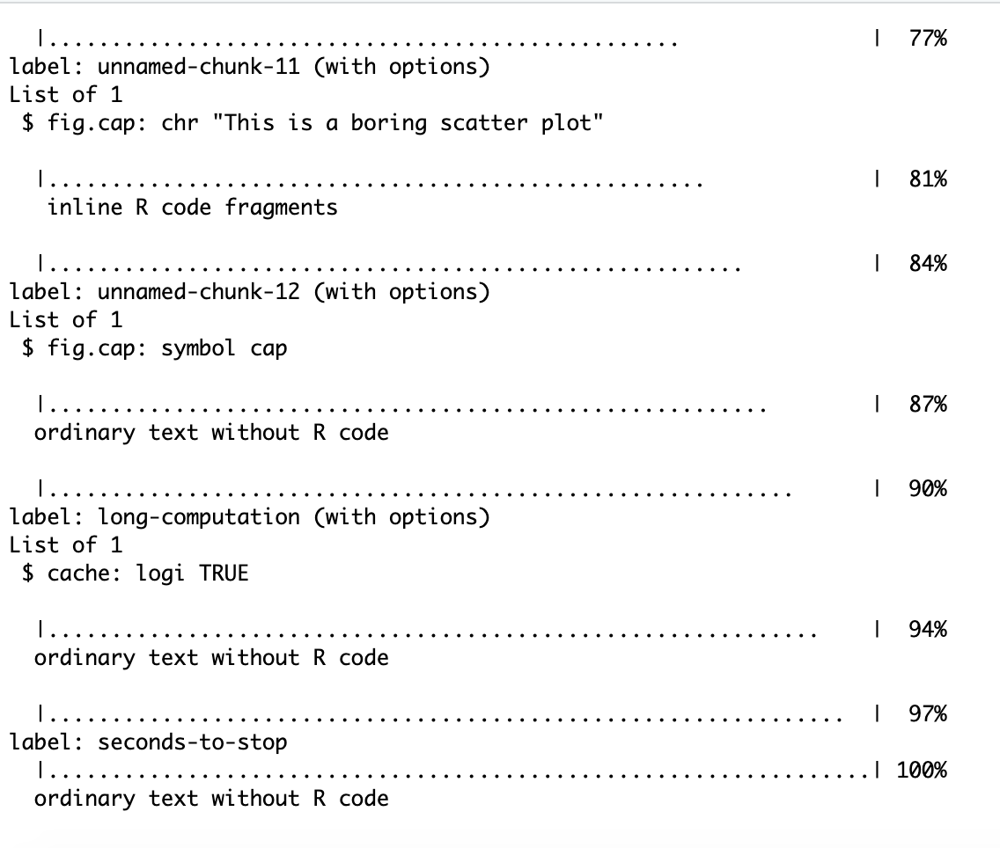

**<span style="color:red">Please do [Preparation](#preparation) *before* the tutorial!</span>**

## `r emo::ji("target")` Objectives

- review of some R markdown chunk options
- understand chunk names better
- programmatically make parameterised letters


## `r emo::ji("wrench")` Preparation  

   
1. Download <a href="tutorial-01-suppA.Rmd" download>`tutorial-01-suppA.Rmd`</a>, <a href="tutorial-01-suppB.Rmd" download>`tutorial-01-suppB.Rmd`</a> and <a href="tutorial-01-suppC.Rmd" download>`tutorial-01-suppC.Rmd`</a> by clicking on the names.

1. Install R-packages
```{r, eval = FALSE}
install.packages(c("rmarkdown", "bookdown", "linl"))
```
    
## 🎛️ Exercise 1A

**Case study `include = FALSE`: loading `tidyverse`** 

If you try to load the `tidyverse` package, you get many messages.


```{r pkg-load}
library(tidyverse)
```

In writing your report, you probably do not want to

1. print the R code; and
1. print all the peripheral messages.


`r emo::ji("wrench")` [Open `tutorial-01-suppA.Rmd` and modify the `pkg-load` chunk to hide the code and message outputs.]{.question}

## 📛 Exercise 1B

**Naming your chunks**

### Chunk label / names

Avoid spaces and periods in chunk labels as they can cause issues in TeX documents. Instead of using spaces or periods, you are recommended to use "-" as a separator instead, e.g. `clean-data`. You should never label your chunk with a prefix `unnamed-chunk-` as these prefix are used by unlabelled chunks.

Chunk labels is written straight after the engine. E.g. `{r clean-data}` has the chunk label/name `clean-data`.


### Why name chunks?

#### Unnamed chunks

If you do not name a chunk, the chunk will be automatically labelled with a prefix `unnamed-chunk-` to the corresponding unnamed chunk number. E.g. the first unnamed chunk will be labelled `unnamed-chunk-1` then the second unnamed chunk `unnamed-chunk-2` and so on. 

If you later decide to enter a new unnamed chunk between `unnamed-chunk-1` and `unnamed-chunk-2` then the inserted new chunk will now instead become `unnamed-chunk-2` while the previous `unnamed-chunk-2` will become `unnamed-chunk-3`.


Open `tutorial-01-suppB.Rmd` and do the following.

`r emo::ji("wrench")` [Replace [[TODO]] with their corresponding chunk name.]{.question} E.g. `unnamed-chunk-1` has been done for you.

`r emo::ji("wrench")` [Now insert an unnamed chunk between these chunks with code `knitr::opts_current$get("label")` and knit.]{.question}

`r emo::ji("question")` [What do you notice with the chunk names?]{.question}


#### Chunk names make it easier to debug

When you do not name your chunks, it makes it harder to locate the chunk. This can affect debugging of your code. 

```{r rmd-job-img, echo = FALSE, out.width = "500px"}

```

E.g. you may have noticed that when you knit your document, you get an output like this. If there's an error in your code, you can tell which chunk it is from the label if it has one. 


#### Chunk name relates to the exported figure name

Knit `tutorial-01-suppB.Rmd`. 

`r emo::ji("question")` [Where did  `red-plot-1.png`, `unnamed-chunk-3-1.png` (or `unnamed-chunk-5-1.png`) and `unnamed-chunk-4-1.png`  in the `images/tutorial01` folder come from?]{.question}

`r emo::ji("question")` [What happens when you have multiple plot outputs in one chunk?]{.question}


### Reference labels

Instead of repeating chunk code, you may like to `ref.label` the name of the chunk that you want to repeat. This is particularly useful if you want to show the computation code but want to delay showing the chunk output. Chunks that have `ref.label` should be empty.

E.g. the chunk below uses `ref.label = "red-plot"` to insert code from the chunk named `red-plot` (found in `tutorial-01-suppB.Rmd`) but `eval = FALSE` so it will not show the plot. 

````md
```{r, ref.label = 'red-plot', eval = FALSE}`r ''`
```
````


You can choose to show the plot later with a chunk option `ref.label = "red-plot"` and `echo = FALSE` (to hide code) as below.

````md
```{r, ref.label = 'red-plot', echo = FALSE}`r ''`
```
````

When you have only a single `ref.label` then a shorthand is to create an empty chunk with the chunk label as the same as input for `ref.label`. E.g. below chunk is the same as the options `ref.label = "red-plot", eval = FALSE`.

````md
```{r red-plot, eval = FALSE}`r ''`
```
````

You can reference multiple chunks by supplying a character vector of chunk labels. E.g. below we have `ref.label = c("red-plot", "simple-cache-output")`.

````md
```{r, ref.label = c("red-plot", "simple-cache-output")}`r ''`
```
````

It's a good idea to name your chunks although you may be lazy to do this like me. The [namer](https://github.com/lockedata/namer) package attempts to make this easier.


## ✉️ Exercise 1C

**Personalised letters**


1. [Open `tutorial-01-suppC.Rmd` and compile it.]{.question}
2. [Collect and make note of (1) the names, (2) likes, and (3) what they want to learn in this course from your fellow peers.]{.question}
3. [Replace the data below with information of people you met in this tutorial.]{.question} (You should get data of a minimum of 3 people).

```{r participants, message = FALSE}
library(tidyverse)
dat <- tribble(~first_name, ~last_name, ~likes, ~wants_to_learn,
               "Lisa", "Simpson", "reading books", "how to build interactive apps that help collect data on her family",
               "Maggie", "Simpson", "sucking on a pacifier", "how much milk is optimal for growth"
               ) %>% 
   mutate(collected_by = "Bart Simpson")
dat
```

4. I want to replace the generic letter with a personalised letter by replacing "Dear Student" with "Dear [their first name] [their last name]" and I want to include something about what you got to know about them. Manually changing the names is a lot of work. [Could you programmatically generate the letters using R and R Markdown?]{.question} Hint: `?rmarkdown::render`.
5. [Upload your letter [here](https://www.dropbox.com/request/n8aolXPsqLpgQ3viVb6W).]{.question} Note: we use these uploads as proof of your engagement in the course so make sure you use your name that corresponds to our records.
