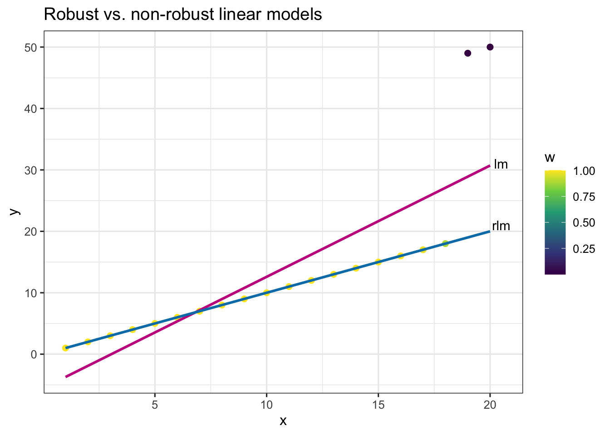

**<span style="color:red">Please do [Preparation](#preparation) *before* the tutorial!</span>**

## `r emo::ji("target")` Objectives

- embed HTML widgets in R Markdown documents using `htmlwidgets`, inspect the resulting HTML file and make some CSS changes
- implement a simple cross-widget interactions using `crosstalk` and think of how the widgets are interacting
- understand why certain questions are hard to answer 
- create a minimum reproducible example


## `r emo::ji("wrench")` Preparation  

   

1. Install R-packages
```{r, eval = FALSE}
install.packages(c("broom", "DT", "kableExtra", "palmerpenguins"))
```
    
## 🌐️ Exercise 3A

**Working with robust linear models**

Consider the artificial data in the object `df`. There are  two obvious outliers. [Which observations are the outliers?]{.question}

```{r, message = FALSE, warning = FALSE}
library(tidyverse)
library(broom)
library(palmerpenguins)
library(MASS) # needed for rlm
df <- tibble(x = 1:20, y = c(1:18, 49:50))
ggplot(df, aes(x, y)) + 
  geom_point(size = 2) + theme_bw(base_size = 12)
```
A simple linear model where parameters are estimated using least squares estimate are not robust to outliers. Below we fit two models: (1) a linear model with least square estimates contained in `fit_lm` and (2) a robust linear model contained in `fit_rlm`. To explain briefly, a robust linear model down-weights the contribution of the observations that are outlying observations to estimate parameters.

```{r}
fit_lm <- lm(y ~ x, data = df) 
fit_rlm <- rlm(y ~ x, data = df) 
```

[What is the class of `fit_rlm`?]{.question} Study the object structure of both `fit_lm` and `fit_rlm`. [How are the structures different between `fit_lm` and `fit_rlm`?]{.question}

Below the `augment` method from the `broom` package extracts some model-related values but it does not return the weights from the iterated re-weighted least squares. [Modify the `augment` method for the appropriate class so that the code below gets the desired output.]{.question}

```{r}
# modify augment method to the desired output
dfa <- augment(fit_rlm)
```

<details><summary>Open here for the desired output for `dfa`</summary>

```
dfa
# A tibble: 20 x 7
       y     x .fitted     .resid      .hat .sigma         w
   <int> <int>   <dbl>      <dbl>     <dbl>  <dbl>     <dbl>
 1     1     1   0.999  0.000546  0.206      10.3  1        
 2     2     2   2.00   0.000452  0.172      10.3  1        
 3     3     3   3.00   0.000358  0.143      10.3  1        
 4     4     4   4.00   0.000263  0.118      10.3  1        
 5     5     5   5.00   0.000169  0.0974     10.3  1        
 6     6     6   6.00   0.0000749 0.0808     10.3  1        
 7     7     7   7.00  -0.0000193 0.0685     10.3  1        
 8     8     8   8.00  -0.000114  0.0603     10.3  1        
 9     9     9   9.00  -0.000208  0.0564     10.3  1        
10    10    10  10.0   -0.000302  0.0566     10.3  1        
11    11    11  11.0   -0.000396  0.0611     10.3  1        
12    12    12  12.0   -0.000490  0.0698     10.3  1        
13    13    13  13.0   -0.000585  0.0827     10.3  1        
14    14    14  14.0   -0.000679  0.0998     10.3  1        
15    15    15  15.0   -0.000773  0.121      10.3  1        
16    16    16  16.0   -0.000867  0.147      10.3  1        
17    17    17  17.0   -0.000961  0.172      10.3  0.977    
18    18    18  18.0   -0.00106   0.187      10.3  0.890    
19    49    19  19.0   30.0       0.0000184   7.28 0.0000742
20    50    20  20.0   30.0       0.0000216   7.28 0.0000742
```
</details>

<br>

Once the above is done, you can the code below to get the plot seen at the end of this question. [What do you think the `w` is doing?]{.question}

```{r, eval = FALSE}
ggplot(dfa, aes(x, y, color = w)) + 
  geom_point(size = 2) + 
  geom_smooth(method = "lm", se = FALSE, color = "#C8008F") +
  geom_smooth(method = "rlm", se = FALSE, color = "#027EB6") + 
  annotate("text", x = 20.5, y = c(21, 31), 
           label = c("rlm", "lm")) + 
  theme_bw(base_size = 12) + 
  labs(title = "Robust vs. non-robust linear models") + 
  scale_color_continuous(type = "viridis")
```
```{r, echo = FALSE}

```

[Publish your Rmd HTML output for this question to RPub and submit the url of your link to Moodle.]{.question}


## 🐧 Exercise 3B

**Reporting regression tables and summary statistics**

You can easily get summary statistics and regression tables using the `stargazer` R-package but here you will [reproduce similar tables from `stargazer` in <a href="tutorial-03-suppB.pdf" download>`tutorial-03-suppB.pdf`</a> by "hand" using the data `palmerpenguins::penguins`; `knitr::kable` and `kableExtra` R-package (use of `broom` optional); and respecting the standard guidelines of presentation for tables.]{.question} Note: the stargazer table doesn't necessary respect standard guidelines of presentation for tables. The regression models in consideration are given as `lm1` and `rlm1` below.

```{r}
library(palmerpenguins)
lm1 <- lm(bill_length_mm ~ species + bill_depth_mm + flipper_length_mm + body_mass_g + sex, data = penguins)
rlm1 <- rlm(bill_length_mm ~ . , data = penguins)
```


## 🔧 Exercise 3C

**Interactive data tables**

Produce the same table that you find below using `DT`:

<iframe src="tutorial-03-suppC.html" width="100%" height = "600px">
